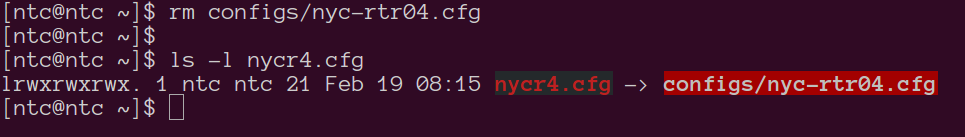

## Lab 4 - Copying, moving and deleting files

In this lab you will learn how to copy files and directories, move them permanently and how to delete them.

> **NOTE: At any point, typing the command `clear` or pressing the key combination "CTRL-l" will clear the screen.**
> **NOTE: Using the `UP` and `DOWN` arrow allows you to cycle through the previous commands typed.**


### Task 1 - Copying files and directories

##### Step 1 

Copy the `ospf_config_guide.txt` file from the home directory into `dc_sites` and every sub-directory within.


```
[ntc@ntc ~]$ cp ospf_config_guide.txt dc_sites/
[ntc@ntc ~]$ 

```

```

[ntc@ntc ~]$ cp ospf_config_guide.txt dc_sites/USA/
[ntc@ntc ~]$ 

```

```

[ntc@ntc ~]$ cp ospf_config_guide.txt dc_sites/USA/ATL/
[ntc@ntc ~]$ 

```

```

[ntc@ntc ~]$ cp ospf_config_guide.txt dc_sites/USA/ATL/alpha_dc/
[ntc@ntc ~]$ 

```

```

[ntc@ntc ~]$ tree dc_sites
dc_sites
├── ospf_config_guide.txt
└── USA
    ├── ospf_config_guide.txt
    └── ATL
        ├── ospf_config_guide.txt
        └── alpha_dc
            └── ospf_config_guide.txt

3 directories, 5 files
[ntc@ntc ~]$ 

```


##### Step 2

Try using the `cp` command to make a backup of the `dc_sites` directory. Call it `dc_sites-backup`.

```
[ntc@ntc ~]$ cp dc_sites dc_sites-backup
cp: omitting directory ‘dc_sites’
[ntc@ntc ~]$ 
```
While copying a directory, you have to use the `-r` flag to instruct the shell to copy the contents of the directories "recursively". Go ahead and make the backup using the `cp -r` command:

```
[ntc@ntc ~]$ cp -r dc_sites dc_sites-backup
[ntc@ntc ~]$ 

```

```
[ntc@ntc ~]$ ls -ltr
total 12
drwxrwxr-x. 3 ntc ntc  51 Jan 22 19:56 configs
drwxrwxr-x. 3 ntc ntc  45 Jan 23 17:02 VirtualBoxVMs
-rw-rw-r--. 1 ntc ntc   0 Jan 25 16:01 test
-rw-rw-r--. 1 ntc ntc   0 Jan 25 16:06 error
-rw-rw-r--. 1 ntc ntc 225 Jan 25 16:11 output
-rw-rw-r--. 1 ntc ntc  92 Jan 25 17:20 ospf_config_guide.txt
-rw-rw-r--. 1 ntc ntc   2 Jan 25 18:00 file_count.txt
drwxrwxr-x. 3 ntc ntc  71 Jan 25 18:09 dc_sites
drwxrwxr-x. 3 ntc ntc  71 Jan 26 10:44 dc_sites-backup

```


##### Step 3
Rename the `ospf_config_guide.txt` file within all the subdirectories of `dc_sites` to the format `$directoryName-ospf_config_guide.txt`. Use the `mv` command to accomplish this.

```
[ntc@ntc ~]$ cd dc_sites
[ntc@ntc dc_sites]$ ls
directory_listing.txt  ospf_config_guide.txt  USA
[ntc@ntc dc_sites]$ mv ospf_config_guide.txt dc_sites-ospf_config_guide.txt
[ntc@ntc dc_sites]$ 

```

```

[ntc@ntc dc_sites]$ mv USA/ospf_config_guide.txt USA/USA-ospf_config_guide.txt
[ntc@ntc dc_sites]$ 

```

```

[ntc@ntc dc_sites]$ mv USA/ATL/ospf_config_guide.txt USA/ATL/ATL-ospf_config_guide.txt
[ntc@ntc dc_sites]$ 

```

```

[ntc@ntc dc_sites]$ mv USA/ATL/alpha_dc/ospf_config_guide.txt USA/ATL/alpha_dc/alpha_dc-ospf_config_guide.txt
[ntc@ntc dc_sites]$ 

```


```
[ntc@ntc dc_sites]$ tree
.
├── USA
│   ├── USA-ospf_config_guide.txt
│   └── ATL
│       ├── ATL-ospf_config_guide.txt
│       └── alpha_dc
│           └── alpha_dc-ospf_config_guide.txt
└── dc_sites-ospf_config_guide.txt

3 directories, 5 files
[ntc@ntc dc_sites]$ 
```


##### Step 4

Use the `rm` command to delete the `$directoryName-ospf_config_guide.txt` file from each subdirectory of `dc_sites`.

```
[ntc@ntc dc_sites]$ pwd
/home/ntc/dc_sites
[ntc@ntc dc_sites]$ rm dc_sites-ospf_config_guide.txt 
[ntc@ntc dc_sites]$ 
[ntc@ntc dc_sites]$ rm USA/USA-ospf_config_guide.txt 
[ntc@ntc dc_sites]$ 
[ntc@ntc dc_sites]$ rm USA/ATL/ATL-ospf_config_guide.txt 
[ntc@ntc dc_sites]$ 
[ntc@ntc dc_sites]$ rm USA/ATL/alpha_dc/alpha_dc-ospf_config_guide.txt 
[ntc@ntc dc_sites]$ 

```

> On some implementations you might be prompted with a "Are you sure you want to delete this file" prompt.


```
[ntc@ntc dc_sites]$ tree
.
└── USA
    └── ATL
        └── alpha_dc

3 directories, 1 file
[ntc@ntc dc_sites]$ 

```

##### Step 5

Similar to the recursive copy, use the `-r` flag with the `rm` command to remove the `dc_sites-backup` directory and all files within it.

```
[ntc@ntc ~]$ rm -r dc_sites-backup
[ntc@ntc ~]$ ls -ltr
total 12
drwxrwxr-x. 3 ntc ntc  51 Jan 22 19:56 configs
drwxrwxr-x. 3 ntc ntc  45 Jan 23 17:02 VirtualBoxVMs
-rw-rw-r--. 1 ntc ntc   0 Jan 25 16:01 test
-rw-rw-r--. 1 ntc ntc   0 Jan 25 16:06 error
-rw-rw-r--. 1 ntc ntc 225 Jan 25 16:11 output
-rw-rw-r--. 1 ntc ntc  92 Jan 25 17:20 greetings.txt
-rw-rw-r--. 1 ntc ntc   2 Jan 25 18:00 file_count.txt
drwxrwxr-x. 3 ntc ntc  50 Jan 26 11:03 dc_sites
[ntc@ntc ~]$ 

```

> A commonly used pattern is the `rm -fr` command. The `f` will forcibly remove all files and recursively, in combination with `r`. 

This is a very powerful command and needs careful consideration before using. [rm -fr](https://media2.giphy.com/media/7cxkulE62EV2/giphy.gif)


### Task 2 - Working with links: hard links

Links in Linux allow us to use different names to identify the same file. This is done internally by the use of `inodes`.
The 2 types of links available in Linux are symbolic or soft links and hard links. 

*Properties of soft links:*
1. Can map across file system boundaries
2. Allows linking directories
3. On removal of original file, soft links are broken

*Properties of hard links:*
1. Can map only within the same file system
2. Allows linking of files only
3. On removal of original file, the link retains the file contents

##### Step 1 

Use the `ls -l` command to list the `rc*` files in `/etc/`. Here we can see an example of the usage of links.

```
[ntc@ntc etc]$ ls -ltr rc*
lrwxrwxrwx.  1 root root  13 Feb  8 11:18 rc.local -> rc.d/rc.local
lrwxrwxrwx.  1 root root  10 Feb  8 11:18 rc0.d -> rc.d/rc0.d
lrwxrwxrwx.  1 root root  10 Feb  8 11:18 rc1.d -> rc.d/rc1.d
lrwxrwxrwx.  1 root root  10 Feb  8 11:18 rc2.d -> rc.d/rc2.d
lrwxrwxrwx.  1 root root  10 Feb  8 11:18 rc3.d -> rc.d/rc3.d
lrwxrwxrwx.  1 root root  10 Feb  8 11:18 rc4.d -> rc.d/rc4.d
lrwxrwxrwx.  1 root root  10 Feb  8 11:18 rc5.d -> rc.d/rc5.d
lrwxrwxrwx.  1 root root  10 Feb  8 11:18 rc6.d -> rc.d/rc6.d

rc.d:
total 4
drwxr-xr-x. 2 root root  45 Jan 25 10:59 rc6.d
drwxr-xr-x. 2 root root  45 Jan 25 10:59 rc5.d
drwxr-xr-x. 2 root root  45 Jan 25 10:59 rc4.d
drwxr-xr-x. 2 root root  45 Jan 25 10:59 rc3.d
drwxr-xr-x. 2 root root  45 Jan 25 10:59 rc2.d
drwxr-xr-x. 2 root root  45 Jan 25 10:59 rc1.d
drwxr-xr-x. 2 root root  45 Jan 25 10:59 rc0.d
-rw-r--r--. 1 root root 473 Jan 31 15:53 rc.local
drwxr-xr-x. 2 root root  70 Feb  8 11:18 init.d

```

Note the file permissions listed for the file in the `/etc` directory : `lrwxrwxrwx`. The `l` here indicates a link.


##### Step 2

Create a hard link for `./configs/nyc-rtr05.cfg` called `nycr5.cfg` within your home directory

```
[ntc@ntc ~]$ ln configs/nyc-rtr05.cfg nycr5.cfg
```


##### Step 3
Use `ls -l` to view the timestamp of the source file and the destination file


```
[ntc@ntc ~]$ ls -ltr nycr5.cfg 
-rw-rw-r--. 2 ntc ntc 4059 Feb 17 19:25 nycr5.cfg
[ntc@ntc ~]$ ls -ltr configs/nyc-rtr05.cfg 
-rw-rw-r--. 2 ntc ntc 4059 Feb 17 19:25 configs/nyc-rtr05.cfg
[ntc@ntc ~]$ 

```

In spite of being just created, nycr1.cfg has the same timestamp as nyc-rtr01.cfg. In other words they are both essentially the same file.


##### Step 4

Even though there is no visual indicator that the 2 names refer to the same file, they are. Test this by modifying the source file. Use the `echo` command and redirection to replace the contents of `configs/nyc-rtr05.cfg` with "NYC RTR05 HAS BEEN DECOMMED"


```
[ntc@ntc ~]$ echo "NYC RTR05 HAS BEEN DECOMMED" > configs/nyc-rtr05.cfg 
[ntc@ntc ~]$ 

```


##### Step 5

Now cat the contents of the linked file `./nycr5.cfg`

```
[ntc@ntc ~]$ cat nycr5.cfg 
NYC RTR05 HAS BEEN DECOMMED
[ntc@ntc ~]$ 

```
Changes to the original file are reflected in the link.


##### Step 6

Challenge: What happens if you change contents of the linked file? Does it affect the original?


##### Step 7

With hard links, both the original and linked file are pointing to the same `inode`, a datastructure that stores the metadata of any given file or directory. Each inode is identified by a number. You can see this by issuing the `ls -i` command against the file.

Use the `ls -i` command to print the inode of `configs/nyc-rtr05.cfg` and `./nycr5.cfg`


```
[ntc@ntc ~]$ ls -i configs/nyc-rtr05.cfg 
116 configs/nyc-rtr05.cfg
[ntc@ntc ~]$ ls -i nycr5.cfg 
116 nycr5.cfg
[ntc@ntc ~]$ 

```

They are identical. 


##### Step 8

Bonus: Use the `stat` command against a file or directory to look at the meta-data that is stored in an inode. Try this against different files in your directory.


    
##### Step 9


Finally delete the original file using the `rm` command and observe that the hard linked file has not been removed and still contains the data.

```
[ntc@ntc ~]$ rm configs/nyc-rtr05.cfg 
[ntc@ntc ~]$
[ntc@ntc ~]$ cat nycr5.cfg 
NYC RTR05 HAS BEEN DECOMMED
test
[ntc@ntc ~]$ 

```


### Task 3 - Working with links: soft links

##### Step 1 
What happens if you try to create a hard link for a directory? Try creating a link called `linked_configs` for the `configs` directory:


```
[ntc@ntc ~]$ ln configs linked_configs
ln: ‘configs’: hard link not allowed for directory
[ntc@ntc ~]$ 


```

##### Step 2

Soft or symbolic links allow the user to map a file or directory using different names while also overcoming some of the limitations of hard links. Use the `ln -s` command to create a soft link to the configs directory

```
[ntc@ntc ~]$ ln -s  configs linked_configs
[ntc@ntc ~]$
```

List the files and directories
```
[ntc@ntc ~]$ ls -ltr
total 16
-rw-rw-r--. 1 ntc ntc 2342 Feb  8 11:20 vlan.yml
drwxr-xr-x. 2 ntc ntc    6 Feb  9 10:03 Desktop
drwxr-xr-x. 2 ntc ntc    6 Feb  9 10:03 Templates
drwxr-xr-x. 2 ntc ntc    6 Feb  9 10:03 Public
drwxr-xr-x. 2 ntc ntc    6 Feb  9 10:03 Downloads
drwxr-xr-x. 2 ntc ntc    6 Feb  9 10:03 Documents
drwxr-xr-x. 2 ntc ntc    6 Feb  9 10:03 Music
drwxr-xr-x. 2 ntc ntc    6 Feb  9 10:03 Videos
drwxr-xr-x. 2 ntc ntc    6 Feb  9 10:03 Pictures
-rw-r--r--. 1 ntc ntc  308 Feb 11 20:37 whitespace.data
drwxrwxr-x. 4 ntc ntc   37 Feb 18 01:04 backup_dir
drwxrwxr-x. 2 ntc ntc   41 Feb 18 15:55 web
-rw-rw-r--. 1 ntc ntc  598 Feb 19 07:44 vlan.json
-rw-rw-r--. 1 ntc ntc   33 Feb 19 07:55 nycr5.cfg
drwxrwxr-x. 2 ntc ntc  195 Feb 19 08:02 configs
lrwxrwxrwx. 1 ntc ntc    7 Feb 19 08:08 linked_configs -> configs
[ntc@ntc ~]$ 

```


##### Step 3

Create a symbolic link to `configs/nyc-rtr04.cfg` within the home directory. Call the linked file `nycr4.cfg`

```
[ntc@ntc ~]$ ln -s configs/nyc-rtr04.cfg nycr4.cfg
[ntc@ntc ~]$ 
[ntc@ntc ~]$ ls -l nycr4.cfg 
lrwxrwxrwx. 1 ntc ntc 21 Feb 19 08:15 nycr4.cfg -> configs/nyc-rtr04.cfg
[ntc@ntc ~]$ 


```

##### Step 4

Symbolic links, unlike hard links create a new `inode` for the link. Use the `ls -i` command to check the inode for the `nycr4.cfg` 


```

[ntc@ntc ~]$ ls -i nycr4.cfg 
67113425 nycr4.cfg
[ntc@ntc ~]$ ls -i configs/nyc-rtr04.cfg 
114 configs/nyc-rtr04.cfg
[ntc@ntc ~]$ 


```


##### Step 5

Similar to hard links, any changes to either file will be reflected in both the files. Using the `echo` command and redirection as before, replace the contents of `./configs/nyc-rtr04.cfg` with "NYC ROUTER 4 HAS ALSO BEEN DECOMMED"

```
[ntc@ntc ~]$ 
[ntc@ntc ~]$ echo "NYC ROUTER 4 HAS ALSO BEEN DECOMMED" > configs/nyc-rtr04.cfg 
[ntc@ntc ~]$ 

```

```

[ntc@ntc ~]$ cat nycr4.cfg 
NYC ROUTER 4 HAS ALSO BEEN DECOMMED
[ntc@ntc ~]$ 
[ntc@ntc ~]$ 
```


##### Step 6

With symbolic links, deleting the original file will result in a broken link. Go ahead and delete the file `./configs/nyc-rtr04.cfg` using the `rm` command





```
[ntc@ntc ~]$ cat nycr4.cfg 
cat: nycr4.cfg: No such file or directory
[ntc@ntc ~]$ 

```

```

[ntc@ntc ~]$ 
[ntc@ntc ~]$ file nycr4.cfg 
nycr4.cfg: broken symbolic link to `configs/nyc-rtr04.cfg'
[ntc@ntc ~]$ 

```


##### Step 7

Finally delete the broken link using the `rm` command
