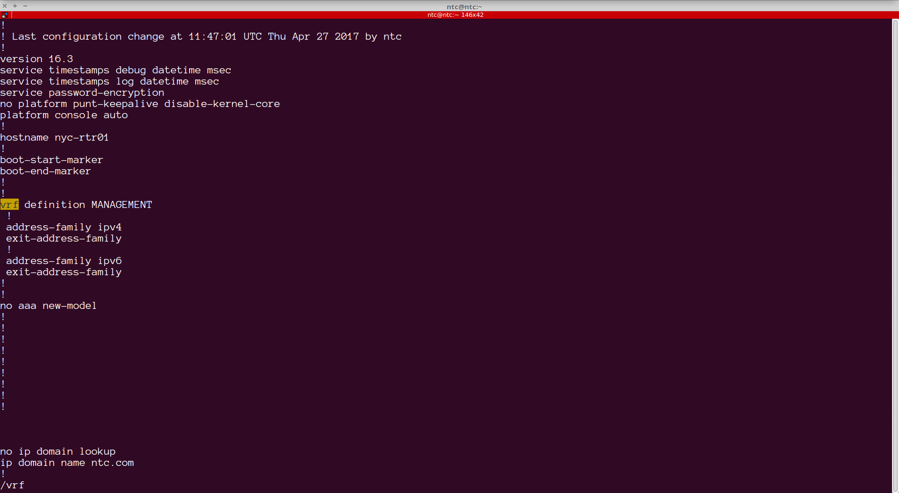
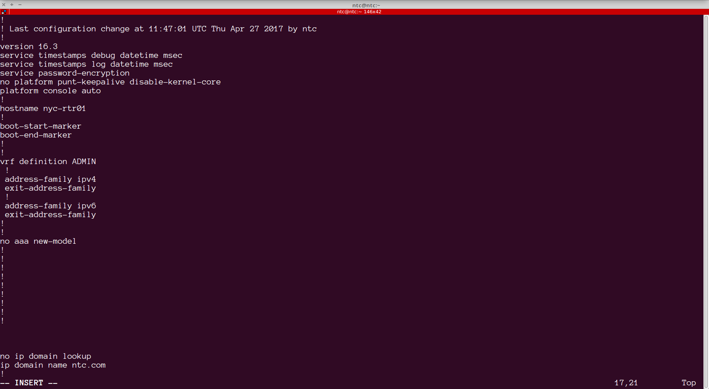
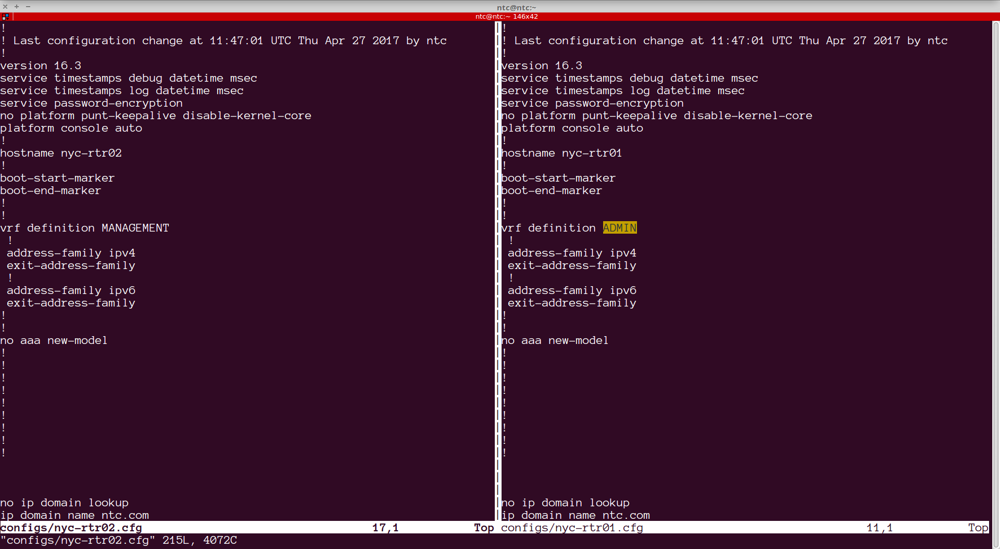
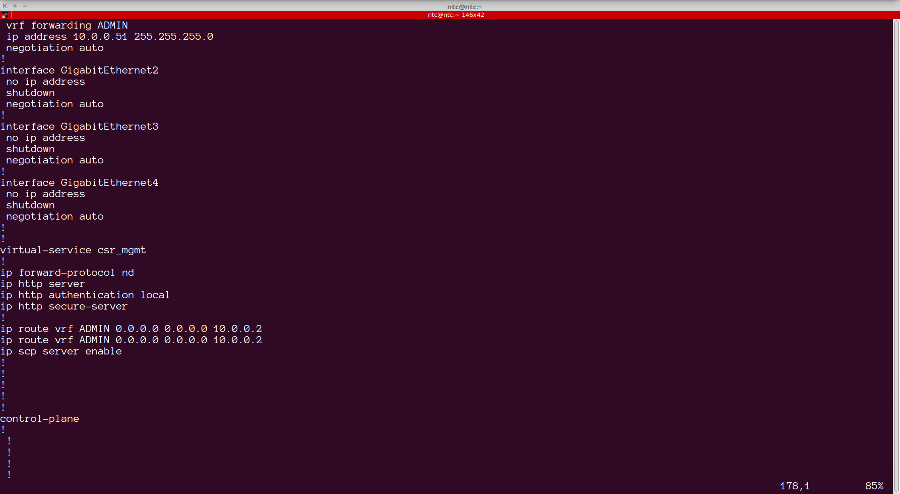
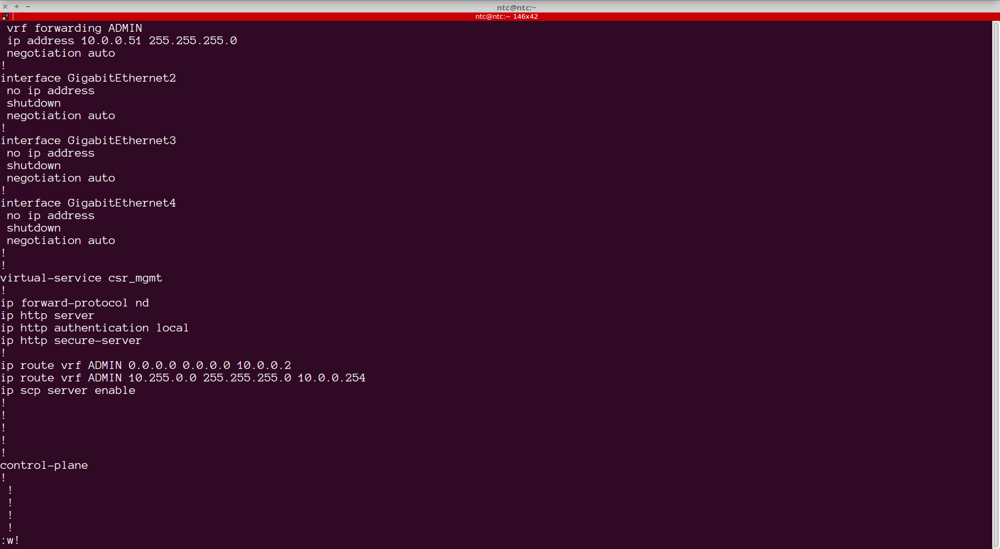
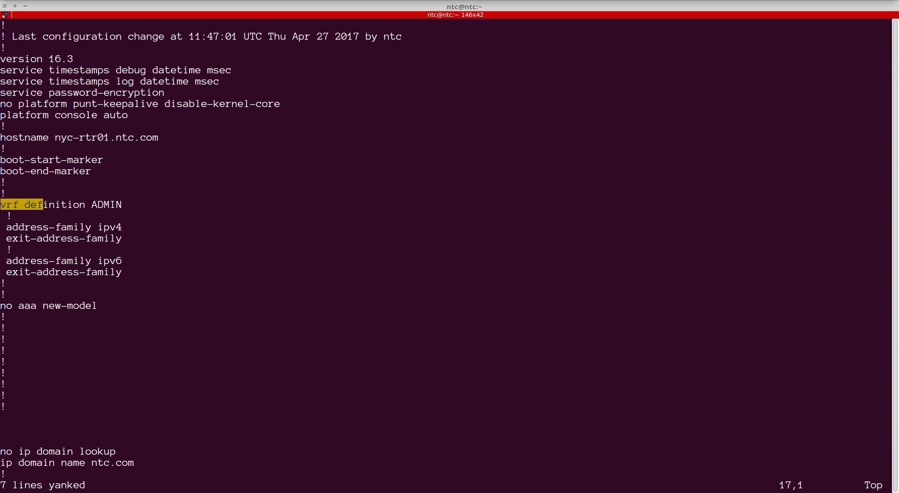
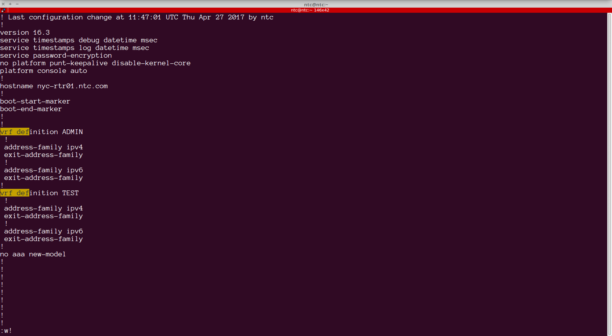

## Lab 6 - Using the vi/vim editor


The vi editor comes pre-installed on **every** *nix installation. Modern OS'es incorporate the `vim` or "vi improved" editor. In this lab we will work with `vim`.

`vim` is a very powerful, context-based, text editor and one can spend weeks learning about it. Our goal here is to introduce the most commonly used features, laying the foundation.


### Task 1 - Opening a file, basic navigation, closing a file 

##### Step 1 

Use `vim` to open the file `./configs/nyc-rtr01.cfg`

```
[ntc@ntc ~]$ vim configs/nyc-rtr01.cfg
```


##### Step 2

Use the `h, j, k and l` keys to move the cursor `left, up, down and right`. While you may also use the `arrow` keys, using the recommended keys allow for maximum efficiency while editing files, allowing the hands to be in the "home" position most of the time.


##### Step 3

Use the `w` key to move the cursor forward by one word at a time. 


Use the `b` key to move the cursor backward one word at a time.


Use the `$` key to move the cursor to the end of a line.


Use the `^` key to move the cursor to the beginning of a line.


##### Step 4

Exit the file. Type the `ESC` key. This will tell the editor that the context is being changed. Now type the `:` key. Now your cursor will be blinking at the bottom of the file. Type the `q` or `q!`(force) keys to exit the file.
 `vim` has been subjected to ( an unfairly) number of jokes about leaving users stranded after opening a file. 


### Task 2 - Line numbers, beginning and end of file

##### Step 1 


From the command prompt type `vim`. This will open vim with the default welcome message. With `vim` open, reopen the `configs/nyc-rtr01.cfg` file. Type the `ESC` key followed by `:e` and then type the path to the file:


```
~                                                                                                                                 
~                                                                                                                                 
~                                                                                                                                 
:e configs/nyc-rtr01.cfg

```


Type enter to open the file.


##### Step 2


Display line numbers within the buffer. Type the `ESC-:` key combination followed by `set numbers`. You can also use the short form `se nu` to achieve the same.


```
      1 !
      2 ! Last configuration change at 11:47:01 UTC Thu Apr 27 2017 by ntc
      3 !
      4 version 16.3
      5 service timestamps debug datetime msec
      6 service timestamps log datetime msec
      7 service password-encryption
      8 no platform punt-keepalive disable-kernel-core
      9 platform console auto
     10 !
     .
     .
     .
     .
     .
     .
     .
     .
     <output truncated for readability>
     35 !
     36 
     37 
     38 
     39 no ip domain lookup
:se nu

```


##### Step 3

Now go to line `177`.  Type `ESC-:177` to go to line 177


##### Step 4

Go back to line 1 by typing `ESC-:1`


##### Step  5

To go to the very last line of the file in `vim` type `SHIFT-g`.


##### Step 6

Using the navigation keys from Task 1, locate the line containing `hostname` within the configuration file. Type the `i` key to enter into the insert mode and update the hostname to `nyc-rtr01.ntc.com`

> When you are in insert mode, you cannot use the `hjkl` navigation keys to move around.


##### Step 7

Save the changes. Do this by using the following key combination: `ESC-:w`

> `ESC` will take it out of the insert mode and then `:w` will write the buffer


##### Step 8

Use the `x` key to delete characters from the file. Using `x`, delete the line containing the version 


##### Step 9

Use the `u` key to undo changes. Using `u`, restore the line containing the version.

> `CTRL-r` lets you redo an edit. Try alternating between `u` and `CTRL-r`

### Task 3 - Finding and replacing 

##### Step 1

Use the `find` to go to the vrf configuration of the file. You can do that by  typing `ESC-/vrf def`




This will take you to:


```
     17 vrf definition MANAGEMENT
     18  !
     19  address-family ipv4
     20  exit-address-family
     21  !
     22  address-family ipv6
     23  exit-address-family
     24 !
     25 !

```

This is matching a pattern. Let's try another pattern to reinforce the idea.

> You can use regex patterns to search.

##### Step 2


Go back to the top of the file. Then search for `MANAGEMENT`. It takes you to the first match. then type `n`. It will take you to the next match of the pattern. Keep pressing `n` will cycle through each match.


##### Step 3

Go back to the top of the file and search for `MANAGMENT`. It takes you to the first match. We will replace this occurrence of the word `MANAGEMENT` with the word `ADMIN`. Use the key combination `cw` - representing `Change Word`. This will change vi's to edit mode. Go ahead and type the change.




##### Step 4

Save the change. Saving changes in vim requires the user to exit the edit mode (Using the `ESC` key). Type the `:w` command to save the buffer.


##### Step 5

Change all associated configurations of `MANAGEMENT` to `ADMIN`.  For this search and replace all occurrences of the word `MANAGEMENT` with `ADMIN`.  Use the following key combination to achieve this: `ESC-:%s/MANAGEMENT/ADMIN/g`


Confirm the change by searching for the word `MANAGEMENT` - There should be no matches.


> The `/g` replaces the word "globally" within the file.


##### Step 6

Save and quit the file. You can combine this by using the key combination `ESC-:wq`. 

> A common pattern is to use `ESC-:wq!`


### Task 4 - Multiple buffers, copy/cut/paste

##### Step 1 

With `configs/nyc-rtr01.cfg` open in vim, open a second file, `configs/nyc-rtr02.cfg`. You can do this by using the key combination `ESC-:sp configs/nyc-rtr02.cfg` (for horizontal split) or `ESC-:vsp configs/nyc-rtr02.cfg` (for vertical split)




This allows you to work with 2 or more files simultaneously.

##### Step 2

To jump from one file to another, use the key combination `CTRL-ww`.


##### Step 3

Close the second buffer by switching focus to it and issuing the `ESC-:q` command.


##### Step 4

To `copy` a line, use the `yy` key combination. This will "yank" the line. To paste it use the `p` key. Use the search to locate the static route configuration within the file. `ip route vrf ADMIN 0.0.0.0 0.0.0.0 10.0.0.2`
With the cursor place on this line, press they `yy` key to yank it followed by the `p` key. This will duplicate the line.




##### Step 5

Edit this new line to add a new route to 10.255.0.0/24 using the gateway 10.0.0.254, using the ADMIN vrf.

Save the file.




##### Step 6

To copy more than one line at a time, you can specify the number of lines followed by the `yy` key combination. 




Copy and paste the vrf definition for the `ADMIN` vrf (7 lines, therefore use `7 yy`). Then modify it to create a new vrf called `TEST`. Save the file.




##### Step 7

Use the `dd` key combination in lieu of `yy` for "cutting" instead of pasting. `dd` is also used to delete lines from a file. Delete the new route added  in step 4.

Save the file.


##### Step 8 - Challenge task

Using `vsp` open `nyc-rtr02.cfg` in a separate window. **Cut** the vrf configuration from `nyc-rtr01.cfg` and paste it into `nyc-rtr02.cfg`
