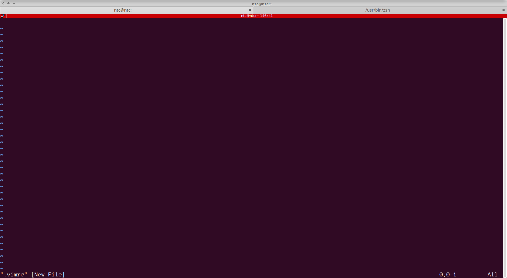
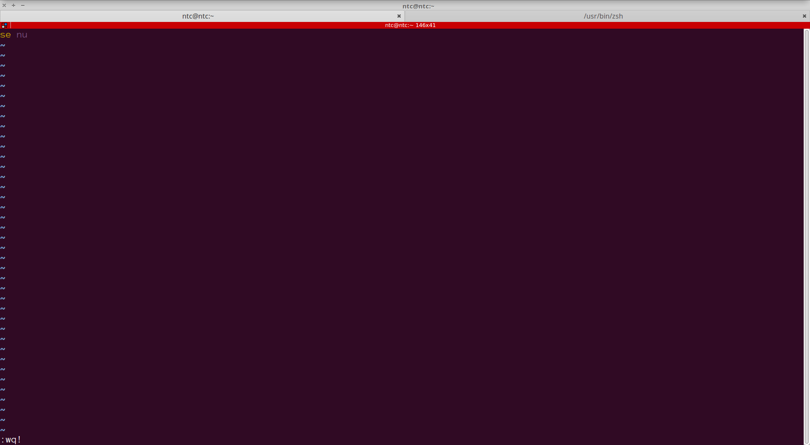
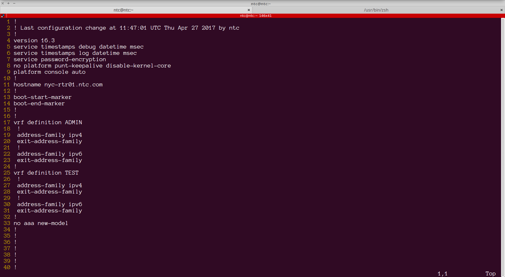
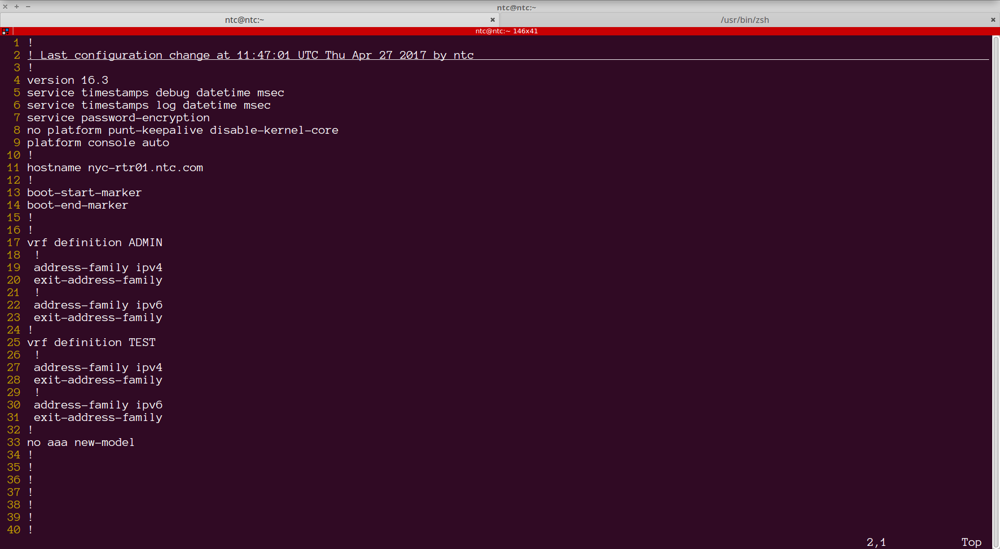
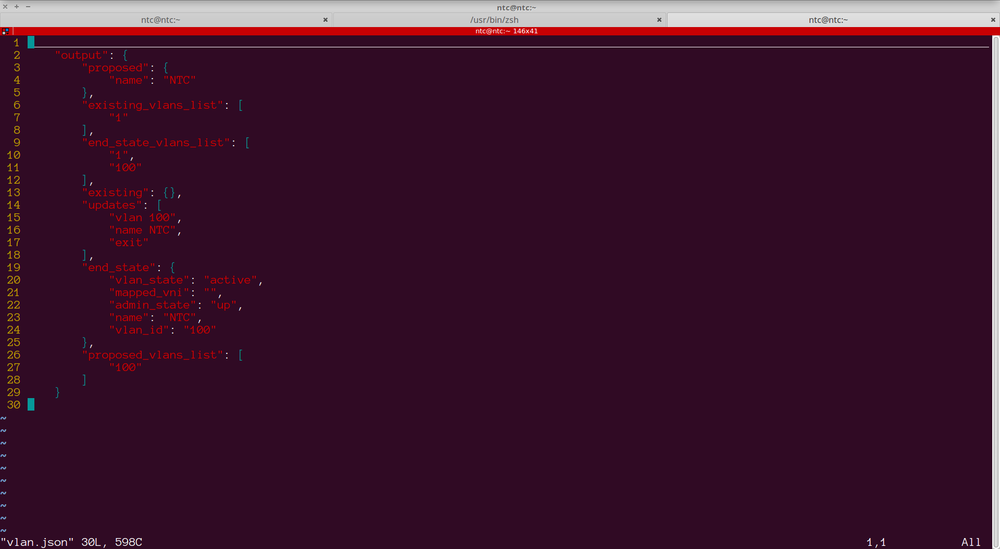
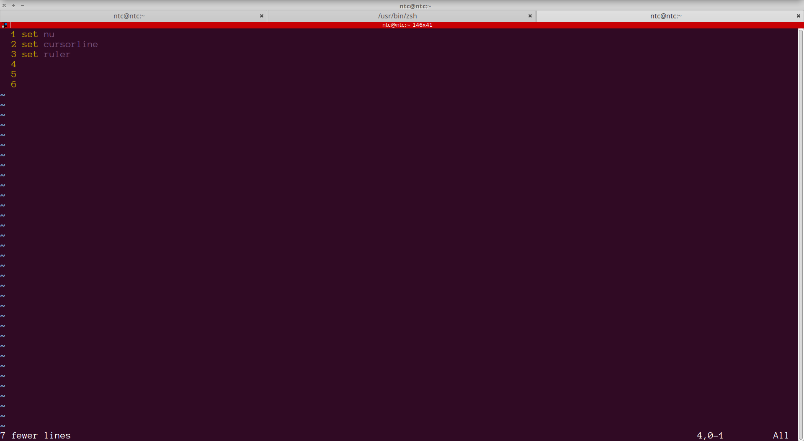
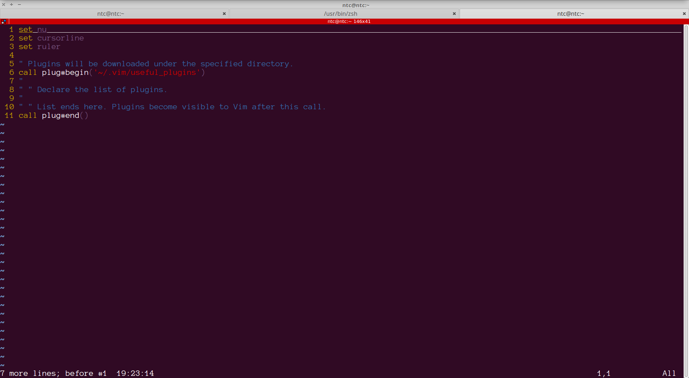
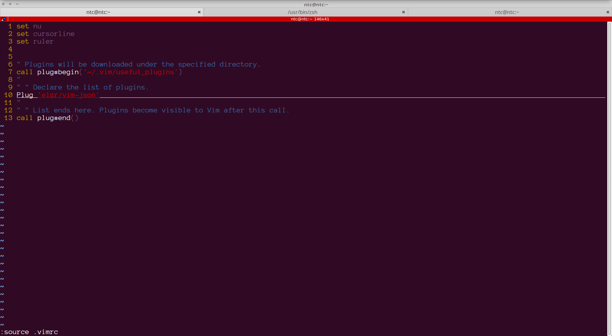
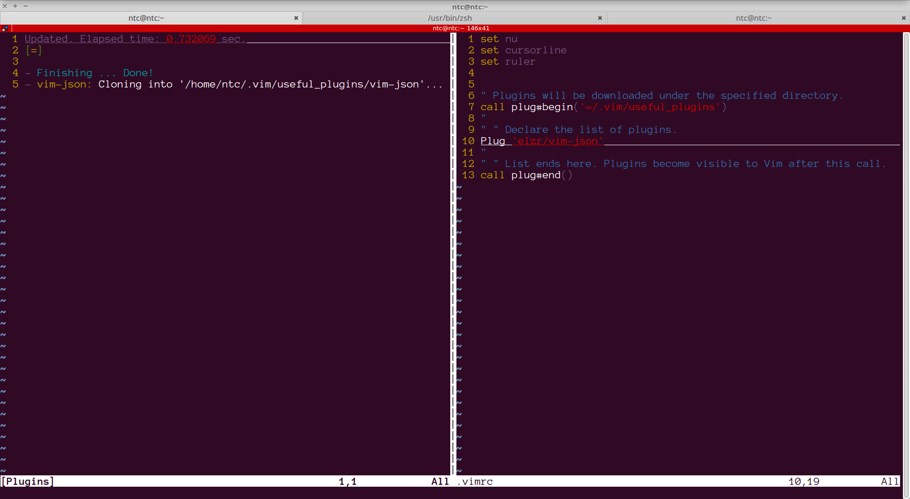
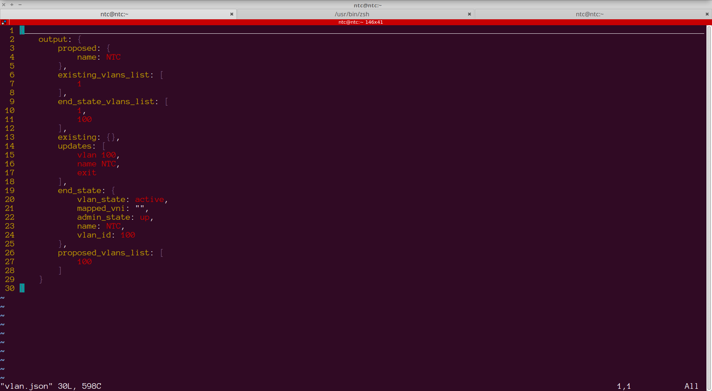

## Lab 7 - Configuring vim and managing plugins

In this lab, you will learn how to configure the `.vimrc` file for basic requirements. You will also learn how to work with plugins using the `vim-plug` plugin manager.


### Task 1 - Understanding the .vimrc file

The `.vimrc` file is a hidden file placed in the home directory of a user. The `rc` stands for `run commands`. The .vimrc can therefore be treated as an `initialization script` that controls the behavior of the editor.

##### Step 1 

Check if a `.vimrc` already exists. Issue the `ls -ltra` command from within the home directory to check if this file exists:

```
[ntc@ntc ~]$ ls -ltra
total 60
-rw-r--r--. 1 ntc  ntc   231 Dec  6  2016 .bashrc
-rw-r--r--. 1 ntc  ntc   193 Dec  6  2016 .bash_profile
-rw-r--r--. 1 ntc  ntc    18 Dec  6  2016 .bash_logout
drwxr-xr-x. 4 root root   32 Dec 21 16:37 ..
-rw-rw-r--. 1 ntc  ntc    40 Jan 22 19:48 .gitconfig
-rw-------. 1 ntc  ntc    41 Jan 22 19:56 .lesshst
drwx------. 3 ntc  ntc    24 Jan 23 16:59 .config
drwxrwxr-x. 7 ntc  ntc   119 Jan 23 17:00 .vagrant.d
drwxrwxr-x. 3 ntc  ntc    45 Jan 23 17:02 VirtualBoxVMs
-rw-rw-r--. 1 ntc  ntc     0 Jan 25 16:01 test
-rw-rw-r--. 1 ntc  ntc     0 Jan 25 16:06 error
-rw-rw-r--. 1 ntc  ntc   225 Jan 25 16:11 output
-rw-rw-r--. 1 ntc  ntc    92 Jan 25 17:20 greetings.txt
-rw-rw-r--. 1 ntc  ntc     2 Jan 25 18:00 file_count.txt
drwxrwxr-x. 3 ntc  ntc    50 Jan 26 11:03 tux
-rw-rw-r--. 1 ntc  ntc   109 Jan 26 19:34 change_notes.txt
-rw-rw-r--. 1 ntc  ntc   108 Jan 29 16:19 ios_config_template.txt
-rw-------. 1 ntc  ntc  6316 Feb  5 16:03 .bash_history
-rw-------. 1 ntc  ntc  5384 Feb  5 16:04 .viminfo
drwxrwxr-x. 3 ntc  ntc   110 Feb  5 16:04 configs
drwx------. 7 ntc  ntc  4096 Feb  5 16:04 .
[ntc@ntc ~]$ 

```


##### Step 2

Use vim to create this file by typing `vim .vimrc`





##### Step 3

In the previous lab, we enabled line numbers by using the `set nu` editor command. Add this to your `~/.vimrc` file. This will ensure that line numbers always show up when you open a file.



Save and quit.

##### Step 4

Test this out, by opening `~/configs/nyc-rtr01.cfg`:




##### Step 5

Add the `set cursorline` command to `.virmrc`. This is a useful command that highlights the line being edited.


```
  1 set nu
  2 set cursorline       
```

Save and quit. 


##### Step 6

Test this out, by opening `~/configs/nyc-rtr01.cfg`:


> Notice that when you navigate the file, you get a visual indication about the line being edited.


##### Step 7

As a final customization, add the `set ruler` command within `.vimrc`. This command adds a status bar on the bottom right of the screen. It will indicate the row and column number you are editing. In addition, it functions as a scrollbar that gives an indication as to where you are within the file.

```
  1 set nu       
  2 set cursorline
  3 set ruler
  4 

```

Save and quit


##### Step 8

Test this out, by opening `~/configs/nyc-rtr01.cfg`:




> Notice that when you navigate the file, you get details on the bottom right corner of the file.


### Task 2 - Using plugins

As seen in the previous task, the .vimrc can be an effective configuration file for managing the appearance and behavior of vim. This can however get quite tricky and complex to maintain with a lot of customization. There are many prewritten files that ease management called plugins.

A Vim plugin is a set of Vimscript files that are laid out in a certain directory structure. Before plugin managers became popular, Vim plugins were usually distributed as tarballs. Users would manually download the file and extract it in a single directory called ~/.vim, and Vim would load the files under the directory during startup.

In this task we will learn how to use some common plugins and use one of the most popular plugin managers to manage them.

##### Step 1

Install the `vim-plug` plugin manager. This step can be achieved by copying and pasting the following command 

```
curl  -x http://proxy.ntc.com:8080-fLo ~/.vim/autoload/plug.vim --create-dirs \
    https://raw.githubusercontent.com/junegunn/vim-plug/master/plug.vim
```

This command is creating a hidden directory called `.vim` within your home directory and sub-directory `autoload`. Within this, it is copying the `plug.vim` file from the github site to that newly created directory.


```
[ntc@ntc ~]$ tree .vim
.vim
└── autoload
    └── plug.vim

1 directory, 1 file
[ntc@ntc ~]$ 

```


##### Step 2

Create a directory called `useful_plugins` under the `.vim` directory. We will install our plugins here:

```


[ntc@ntc ~]$ mkdir .vim/useful_plugins
[ntc@ntc ~]$ 
[ntc@ntc ~]$ tree .vim
.vim
├── autoload
│   └── plug.vim
└── useful_plugins

2 directories, 1 file

```


##### Step 3

Before installing any plugin, open the `vlan.json` file present within the home directory:



Observe that there is no syntax highlighting.


##### Step 2

With vim-plug, you declare the list of plugins you want to use in your Vim configuration file, namely the `.vimrc` file. Open this file.




##### Step 3

Add the list of plugins to the .vimrc file. The list of plugins should start with `call plug#begin(PLUGIN_DIRECTORY)` and end with `call plug#end()`. Here `PLUGIN_DIRECTORY` is the directory we created in **Step 2**.  Let's add the following lines into our vimrc file:

```
  5 " Plugins will be downloaded under the specified directory.
  6 call plug#begin('~/.vim/useful_plugins')
  7 "
  8 " " Declare the list of plugins.
  9 "
 10 " " List ends here. Plugins become visible to Vim after this call.
 11 call plug#end()

```



>Note: Commented lines begin with the `"` punctuation. 


##### Step 4

Add a `json` plugin.

```
  6 " Plugins will be downloaded under the specified directory.
  7 call plug#begin('~/.vim/useful_plugins')
  8 "
  9 " " Declare the list of plugins.
 10 Plug 'elzr/vim-json'                                                  
 11 "
 12 " " List ends here. Plugins become visible to Vim after this call.
 13 call plug#end()

```

 
Save the file.


##### Step 5

Source the file (This is equivalent to exiting .vimrc and opening vim again to reread the contents of .vimrc).





##### Step 6
Now  you are ready to actually install the plugin. This is done by typing `ESC-:PlugInstall`




Save and exit the file.


##### Step 7

All the plugin manager really does is download the plugin and install it in the correct path. You can verify this by running the `tree` command as follows:

```
[ntc@ntc ~]$ tree .vim
.vim
├── autoload
│   └── plug.vim
└── useful_plugins
    └── vim-json
        ├── ftdetect
        │   └── json.vim
        ├── ftplugin
        │   └── json.vim
        ├── indent
        │   └── json.vim
        ├── jsonl-test.jsonl
        ├── jsonp-test.jsonp
        ├── json-test.json
        ├── license.md
        ├── readme.md
        └── syntax
            └── json.vim

7 directories, 10 files
[ntc@ntc ~]$ 

```


##### Step 8


Now, reopen the `vlan.json` file in vim.




> Observe the syntax highlighting.


##### Step 9

Challenge step: Install the `[Zenburn](http://kippura.org/zenburnpage/)` colorscheme plugin for vim. The "Plug" required for this is "vim-scripts/Zenburn"

```
Scroll down for solution...


1. In the .vimrc file add the following line:
    
    Plug 'vim-scripts/Zenburn'    

2. Source the .vimrc file


3. Execute the "PlugInstall" command


4. Save and exit


```

