## Lab 8 - Whitespace, indentation and visual mode editing

Python and YAML are some of the common tools of the trade when it comes to network automation. Both these are very sensitive to indentation (TABs vs SPACES too). In this lab we will focus on some ways to handle this within vim. Additionally, you will learn how to accomplish a key editing task - executing the same action on multiple lines (For instance commenting out a block of code). 


### Task 1 - Identifying whitespaces

##### Step 1 

Using `vim` open the existing file called the `whitespace.data`  within the home directory. 

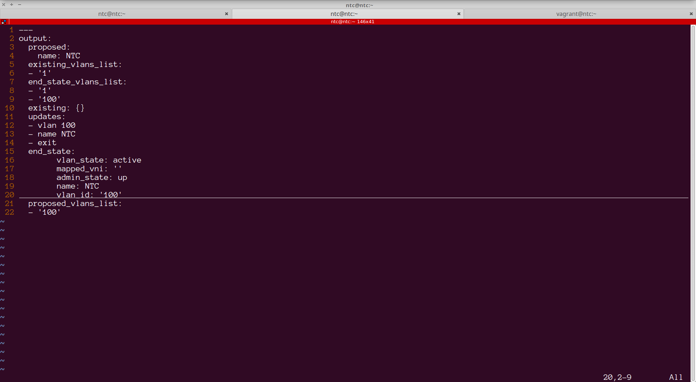


Simply looking at the contents, visually you can tell that there are some white spaces within the file. However, are you able to identify which of these are `tabs` and which are `spaces`? What about trailing spaces?

##### Step 2

In Vim, 'list' is a boolean option that defaults to off. If 'list' is on, whitespace characters are made visible. The 'listchars' option can be used to customize the way whitespace characters are shown. The default displays "^I" for each tab, and "$" at each EOL (end of line, so trailing whitespace can be seen). The command `:set list` displays whitespace, while `:set nolist` displays normally. Use this command to see the whitespace within the file.

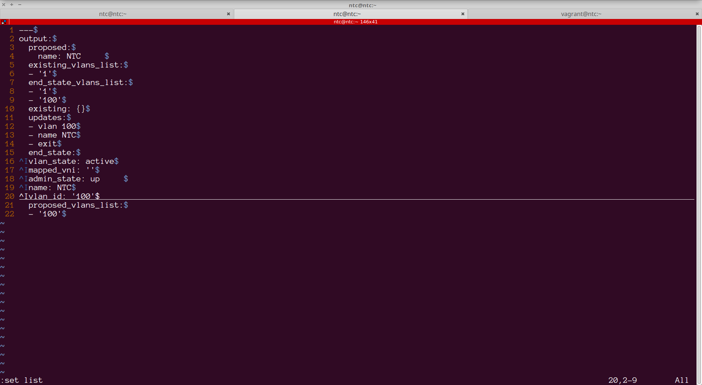

Pay attention to lines lines 4 and 18 to observe the trailing spaces.

`^I` highlights the `tabs` within the file.


##### Step 3

Use standard vi navigation commands to remove the trailing spaces and replace the tabs to spaces.

Save and exit the file.


### Task 2 - Visual mode editing 

##### Step 1 

Open the `vlan.yml` file present within the home directory in vim.

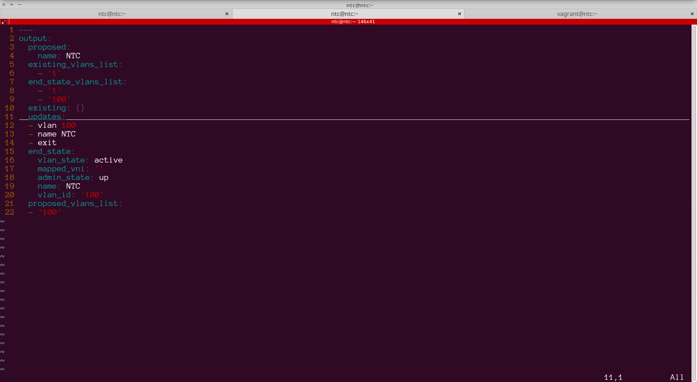

Look at the `updates` key. The values are not indented correctly. They should be 4 spaces from the left edge rather than the current 2 spaces.


##### Step 2
Move your cursor to the first row that needs to be indented. Then type `SHIFT-v` (Upper case 'v'). This will highlight the row. Typing `j` 3 times will select the 3 rows that need to be corrected.

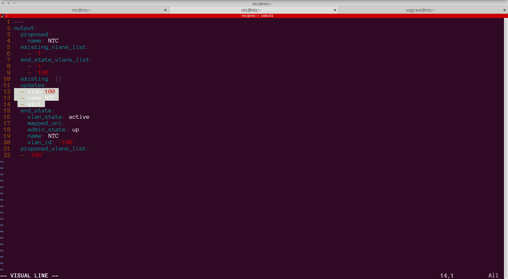


##### Step 3
Now type `:`. This will move the cursor to the bottom of the window.

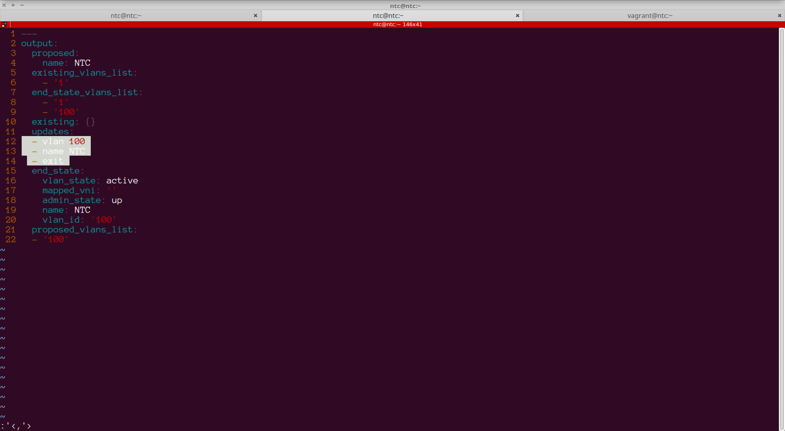


##### Step 4

Here type `le 4`. This will indent these lines from the left edge by 4 spaces:

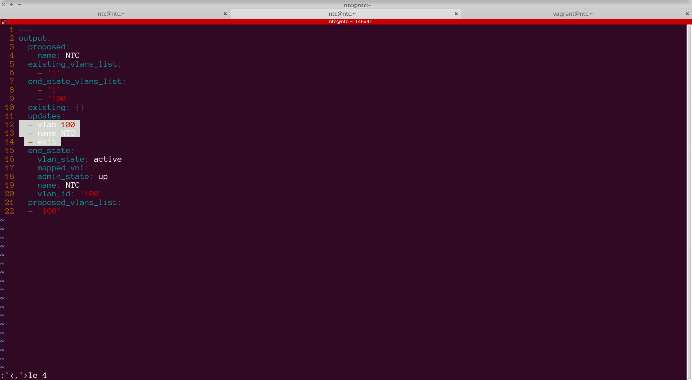


##### Step 5


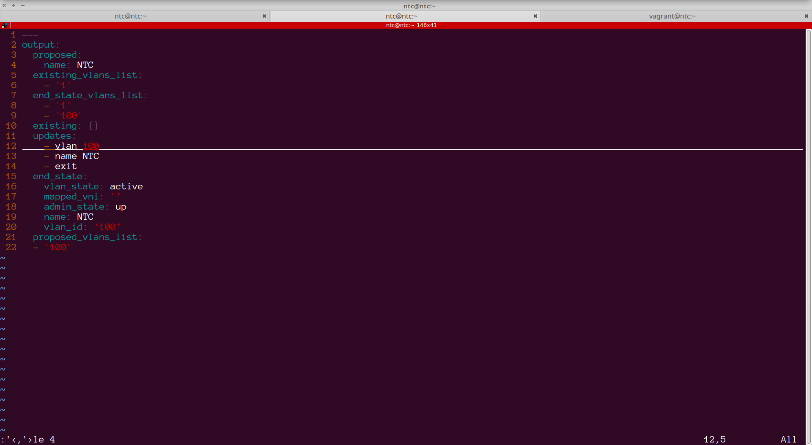


##### Step 4

Save and exit the file.


### Task 3 - Commenting a block of code

##### Step 1 

Open the `vlan.yml` file in vim.

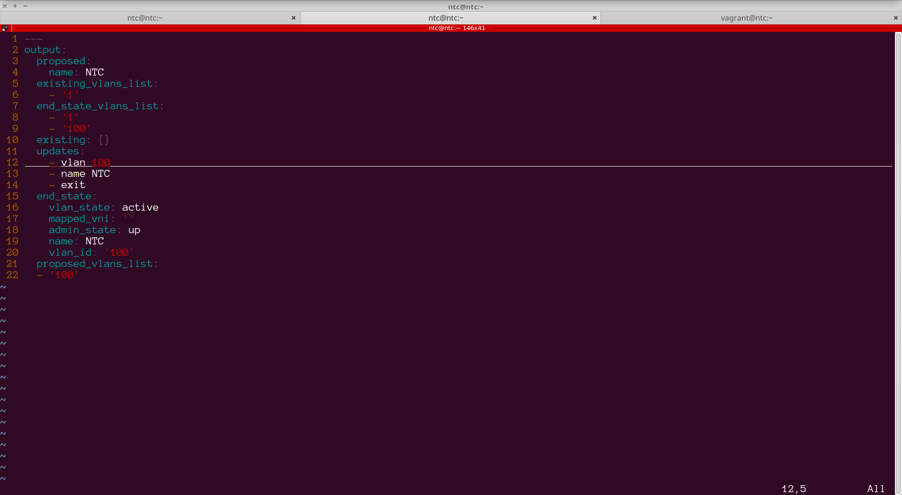


##### Step 2

Our objective is to comment out `end_state` and all the properties under it:

```
 15   end_state:
 16     vlan_state: active
 17     mapped_vni: ''
 18     admin_state: up     
 19     name: NTC
 20     vlan_id: '100'

```

> YAML files are commented by placing a `#` in front of the line that needs to be commented.


##### Step 3

Place the cursor on line 15 (the line containing `end_state`). Press the `CTRL-v` to start a "rectangular block selection". Then press `j` to select the lines that need to be commented out. In this case, all the way to line 20, inclusive.

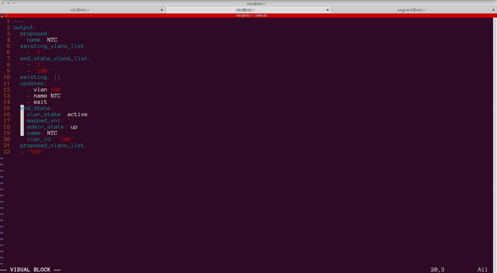


##### Step 4
Now press `SHIFT-i` (Upper case 'i') to enter insert mode. Then type the `#` or comment character followed by the `ESC` key.

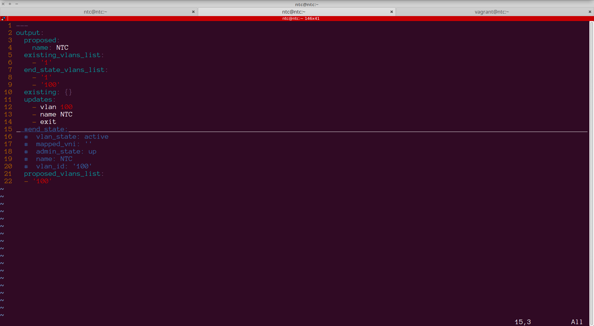


##### Step 5

Save and exit the file.


### Task 4 - Un-commenting a block of code

##### Step 1 

Reopen the `vlans.yml` in vim. 


##### Step 2

Navigate to the first `#` of the commented block of code (line 15) and start the rectangular visual block by typing `CTRL-v`. Using the `j` key, extend the selection to line 20, inclusive.


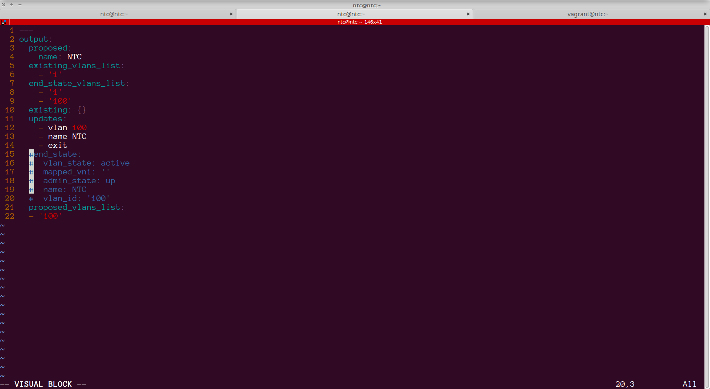


##### Step 3

Press `x`. This will now delete the selection, which in our case was all the `#` characters:


##### Step 4

Save and exit the file.

