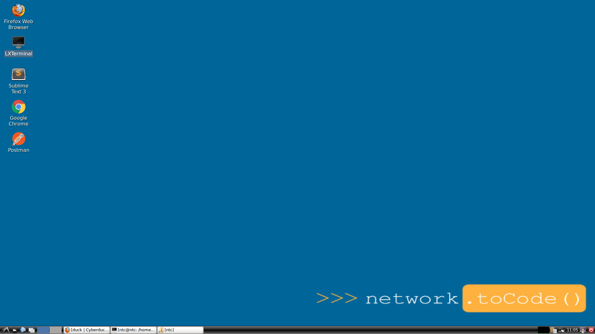
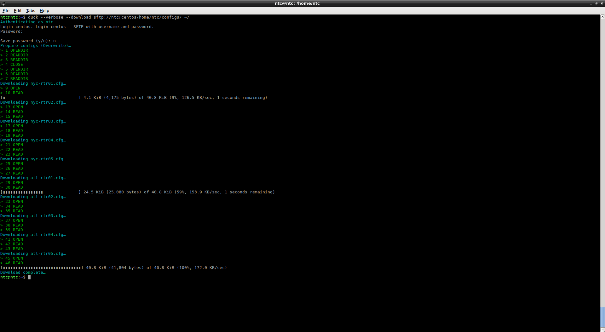
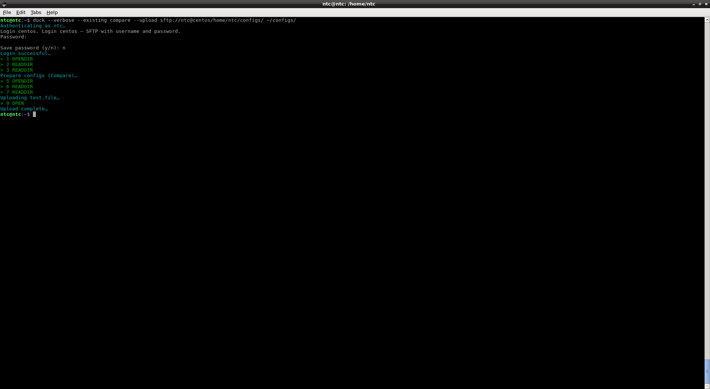
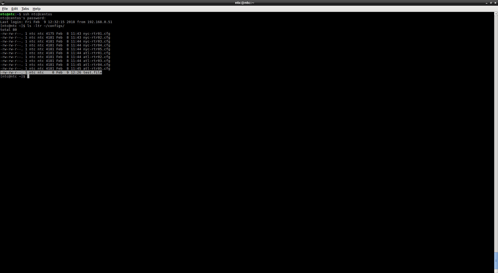
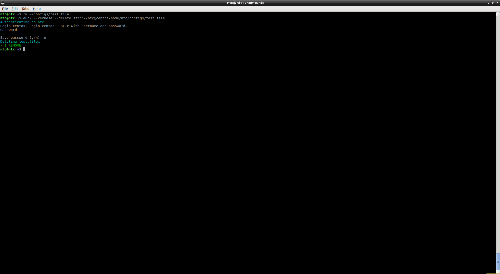
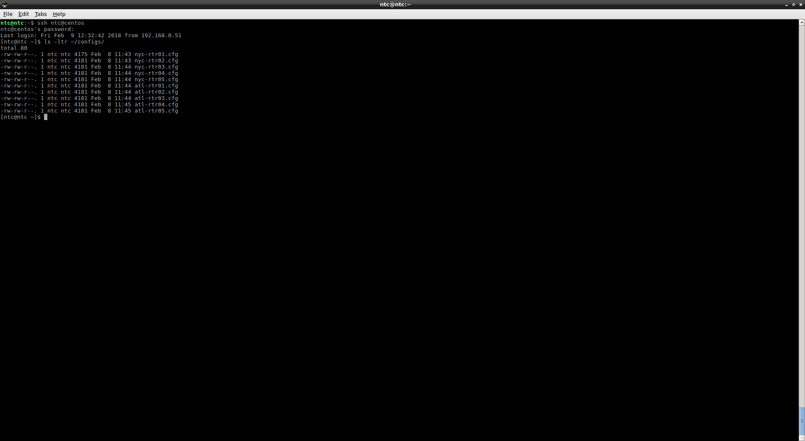

## Lab 9 - Using Cyberduck

Cyberduck is a tool that allows you to manage files remotely using a SFTP, along with other protocols.  Cyberduck offers a command line tool named `duck` that is available for Linux, OS X, and Windows.  For this lab we will be focusing on accessing files on our remote CentOS box from the Ubuntu jumphost using the `duck` CLI tool.


### Task 1 - Managing files using Cyberduck 


##### Step 1

Open the `LXTerminal` application from your **jumphost** desktop.



This will present you with a terminal window.


##### Step 2 

We want to download the `/home/ntc/configs/` directory from the `centos` host onto the Ubuntu jumphost so that the files are available locally.

To perform this task we will run the following command:

`duck --verbose --download sftp://ntc@centos/home/ntc/configs/ ~/`

> After running this command you will be prompted for the ntc user password.  Do not save this password when asked.

> We have spelled out the command options during this lab.  You will see in the help section that there are short form options as well.  We are also running commands in verbose mode so that we can see all command output.  Verbose mode is not required. 

You will see the following output as the directory is copied over:




##### Step 3

Now we will add a new file named `test.file` to the `~/configs/` directory.

```bash
cd ~/configs/
touch test.file
cd ~/
```

You can now view the contents of the `~/configs/` folder and see that there is a new file named `test.file`.


##### Step 4

We will now upload this new file to the remote `centos` host.

`duck --verbose --existing compare --upload sftp://ntc@centos/home/ntc/configs/ ~/configs/`



> You will see that two changes have been made from the previous command.  We have added the `existing` option as well as replaced the `download` option with `upload` as well as adjusting the paths.  The `existing` options tells `duck` that if any of the files in out local `configs` directory exist in the remote `configs` directory they should be compared for changes.  If the files have been changed locally, then upload the changed files.  If no changes have been made, skip.


##### Step 5

Now verify that the new file exists on the remote `centos` host.

SSH into the remote host and list the files in the `~/configs/` directory.

```bash
ssh ntc@centos
ls -ltr ~/configs/
```

You will see that the `test.file` file now exists on the remote host.  



You can now exit the remote host.

```bash
exit
```


##### Step 6

Now delete `test.file` on your local jumphost, delete it on the remote `centos` host using `duck`, and verify the change on the remote `centos` host.

```bash
rm ~/configs/test.file
duck --verbose --delete sftp://ntc@centos/home/ntc/configs/test.file
```



```bash
ssh ntc@centos
ls -ltr ~/configs/
```


