## Lab 10 - Using the Sublime Text editor


Sublime Text is a cross platform graphical text editing tool.  There are install packages available for Windows, Mac, and *nix.

Sublime Text is a very powerful application with a very large plugin ecosystem.  It is highly extensible and customizable.  In this lab we will go over the basic features of Sublime Text 3 so that you are familiar with using the tool.

### Task 1 - Opening a file, basic navigation, closing a file 


##### Step 1 

Use `Sublime Text` to open the file `./configs/nyc-rtr01.cfg`

Open the `Sublime Text 3` application from your **jumphost** desktop.

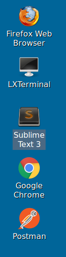

To open the file use the `File` menu followed by the `Open File...` option.

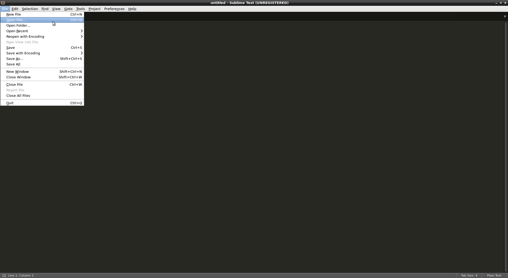

Navigate to the `configs` directory by selecting the `ntc` folder followed by the `configs` folder.

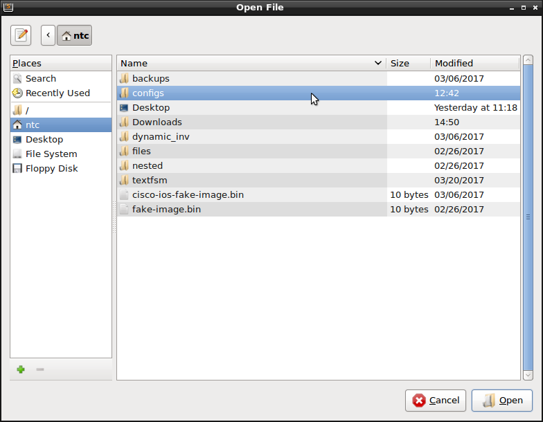

Then select the file `nyc-rtr01.cfg`.

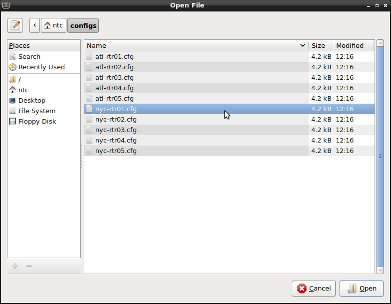


##### Step 2

Scroll through the document using either the mouse, arrows, or Page Up/Dwon buttons.  Sublime Text reacts in much the same way as other modern graphical text editors.


##### Step 3

Exit the file. 

You can exit the file by using `Ctrl+W` on the keyboard or by clicking the `X` on the file tab within Sublime Text.


### Task 2 - Beginning and end of file


##### Step 1 

You will need to reopen the `nyc-rtr01.cfg` file.

If you are continuing from Task 1 you can easily reopen `nyc-rtr01.cfg` (the last file you had open) by using the following key combination `Shift+Ctrl+T`

If you have opened other files, reopen `nyc-rtr01.cfg` using the method described in Task 1 - Step 1.


##### Step 2

Now go to line `177`.  Type `Ctrl+G`.  This will bring up a small context window containing `:`.  Just type `177` and hit `Enter` to go to line 177


##### Step 3

Go back to line 1 by entering the GoTo context using `Ctrl+G` and typing `1` then hitting `Enter`.


##### Step 4

To go to the very last line of the file type `Ctrl+End`.

> If your keyboard does not have an `End` key you may have to use the `Ctrl+Fn+Right Arrow` to accomplish this.


##### Step 5

Using the navigation keys from Task 1, locate the line containing `hostname` within the configuration file.  Change the hostname back to `nyc-rtr01`

> This is just to show how Sublime Text behaves in many the same ways as other GUI driven text editing applications.


##### Step 6

Save the changes. This can be done using the key combination `Ctrl-S` or by using the menu and selecting File > Save.

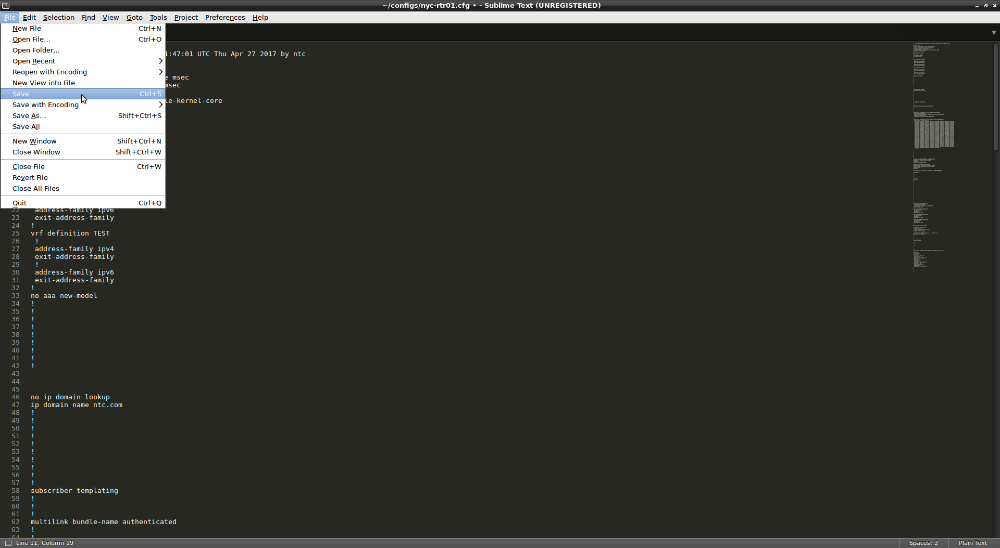


##### Step 7

Use the `Delete` key to delete characters from the file. Using `Delete`, delete the line containing the version 

> `Ctrl-X` will delete the entire line.


##### Step 8

Use the key combination `Ctrl-Z` to undo changes. Using `Ctrl-Z`, restore the line containing the version.


### Task 3 - Finding and replacing 


##### Step 1

Use the `find` to go to the vrf configuration of the file. You can do that by  typing `ESC-/vrf def`

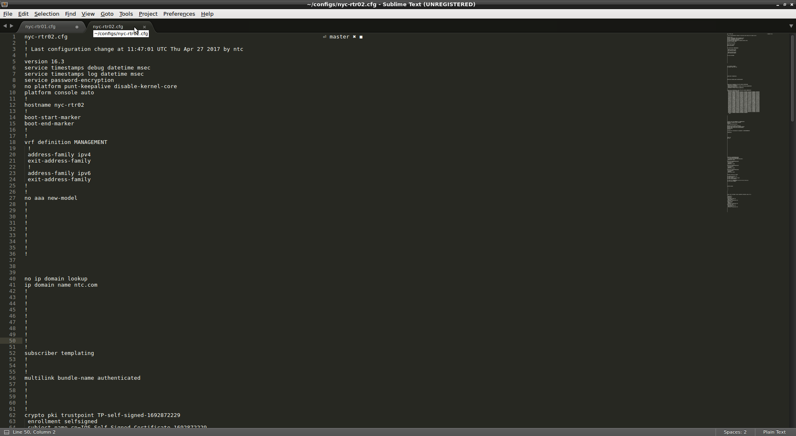


This will take you to:


```
     17 vrf definition ADMIN
     18  !
     19  address-family ipv4
     20  exit-address-family
     21  !
     22  address-family ipv6
     23  exit-address-family
     24 !
```

AS you will see, `Sublime Text` will highlight the active match while placing a box around other matches within the text.

This is matching a pattern. Let's try another pattern to reinforce the idea.

> If you would like to search using a regular expression just type `Ctrl-F` followed by `Alt-R` to change to Regular Expression mode.


##### Step 2

Go back to the top of the file. Then search for `ADMIN`. It takes you to the first match. then hit `Enter`. It will take you to the next match of the pattern. Keep pressing `Enter` to cycle through each match.


##### Step 3

Now we will search for a word and then replace the word.  To search and replace we will open the `Replace...` dialog by either using `Ctrl+H` selecting the menu items `Find` > `Replace...`

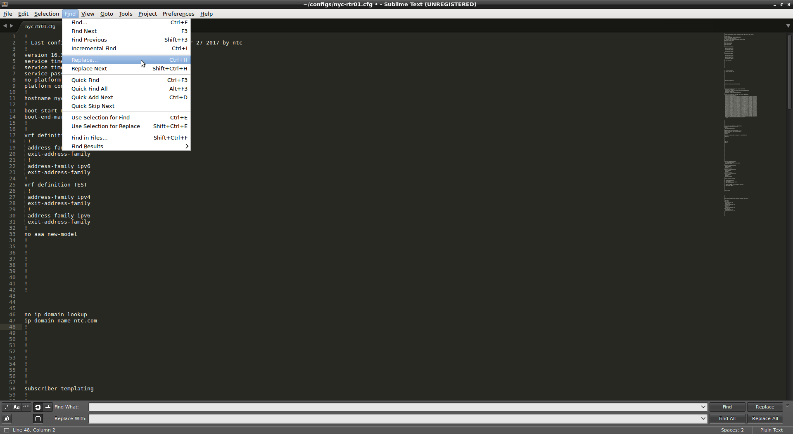

Go back to the top of the file, open the `Replace...` dialog and enter `ADMIN` into the top field labeled `Find`. It takes you to the first match (`Line 17`). We will replace this occurrence of the word `ADMIN` with the word `MANAGEMENT`. Enter `MANAGEMENT` into the field labeled `Replace`.  You can then use `Ctrl+Shift+H` or click `Replace` to perform the replace action.

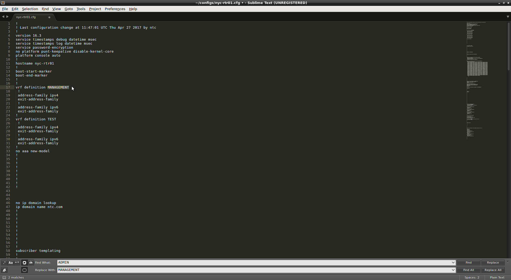

After performing the replace action you will be taken to the next match.


##### Step 4

Save the change


##### Step 5

Change all associated configurations of `ADMIN` to `MANAGEMENT`.  For this search and replace all occurrences of the word `ADMIN` with `MANAGEMENT`.

To achieve this from within the `Replace...` dialog you can either use `Ctrl+Alt+Enter` or press the `Relace All` button.

Confirm the change by searching for the word `ADMIN` - There should be no matches.

You can close the `Replace...` dialob box using the `X` in the upper right hand corner of the dialog box, or by using the `Escape` key while actively in one of the dialog box fields.


##### Step 6

Save and exit the file.  You can do this by using `Ctrl+S` and the `Ctrl+W` or you can use the menu to close the file after saving.


### Task 4 - Tabbed Files, copy/cut/paste


##### Step 1 

With `configs/nyc-rtr01.cfg` open in Sublime Text, open a second file, `configs/nyc-rtr02.cfg`. You can open a second file using the same method that was used to open the first file.  The files will be stacked in tabs.


This allows you to work with 2 or more files simultaneously.


##### Step 2

To jump from one file to another, use the key combination `Ctrl+Tab`.


##### Step 3

Close the second buffer by switching focus to it and issuing the `Ctrl-W` command or closing it from the menu whilt the tab is active.


##### Step 4

To `copy` a line, use the `Ctrl+C` key combination with the cursor at the beginning of the line. This will "yank" the line. To paste it use the `Ctrl+V` key combination. Use the search to locate the static route configuration within the file. `ip route vrf MANAGEMENT 0.0.0.0 0.0.0.0 10.0.0.2`
With the cursor place at the begining of this line, press `Ctl+C` key to yank it followed by `Ctrl+V`. This will duplicate the line.

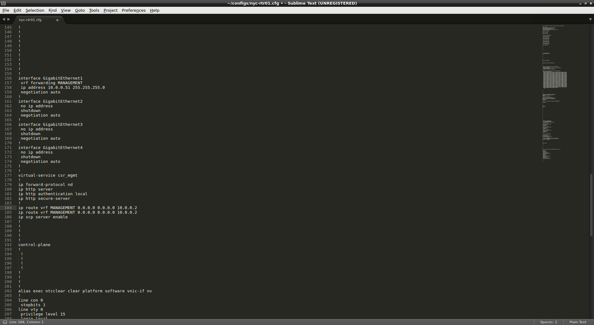


##### Step 5

Edit this new line to add a new route to `10.255.0.0/24` using the gateway `10.0.0.254`, using the `MANAGEMENT` vrf.

Save the file.

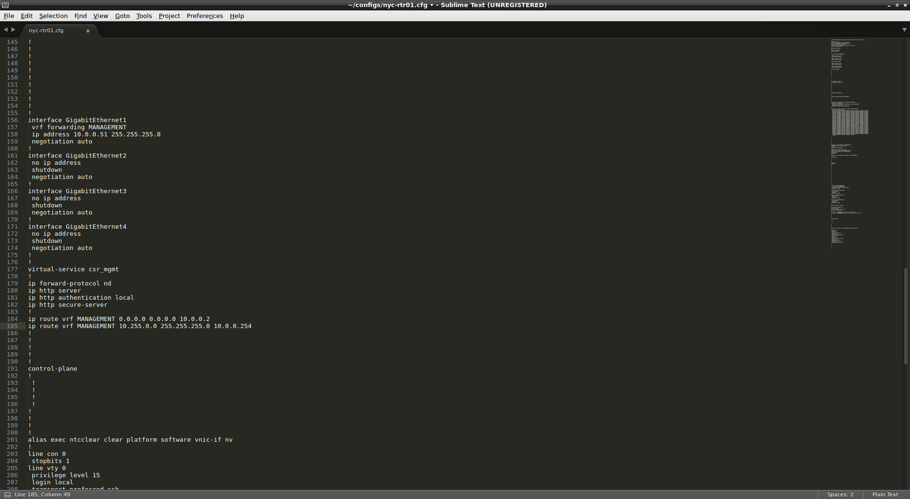


##### Step 6

To copy more than one line at a time, place your cursor at the beginning of the first line to copy and use `Shift+Down Arrow` to select all desired lines and then press `Ctrl+C`. 


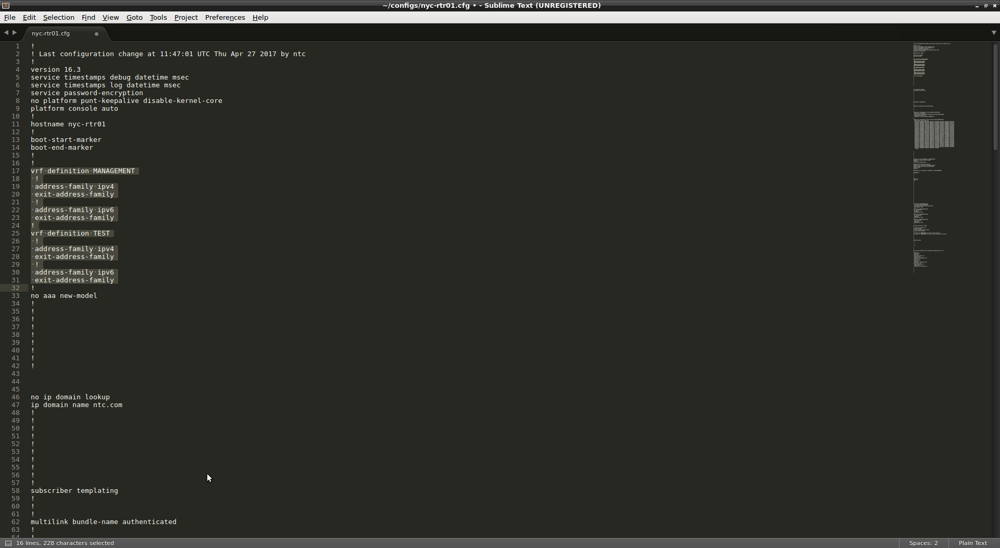

To paste, place the cursor in the desired location and press `Ctrl+V`

Copy and paste the vrf definition for the `TEST` vrf. Then modify it to create a new vrf called `TEST_2`. Save the file.

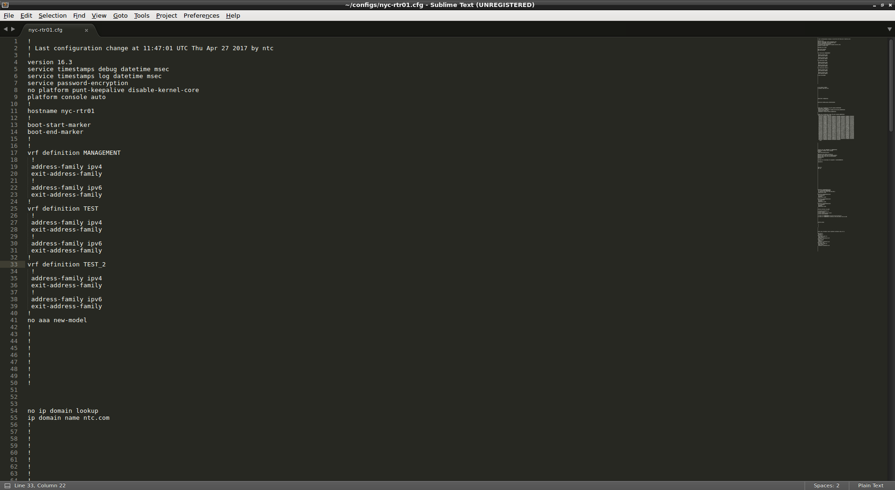

Use the `Ctrl+X` key combination in lieu of `Ctrl+C` for "cutting" instead of "copying".


##### Step 7

`Shift+Ctrl+K` is used to delete lines from a file. Delete the new route added  in step 4.

Save the file and then use `duck`, from Lab 9, to push the changes to the `centos` host.

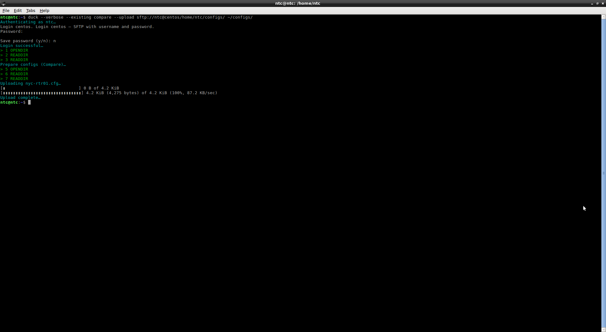

