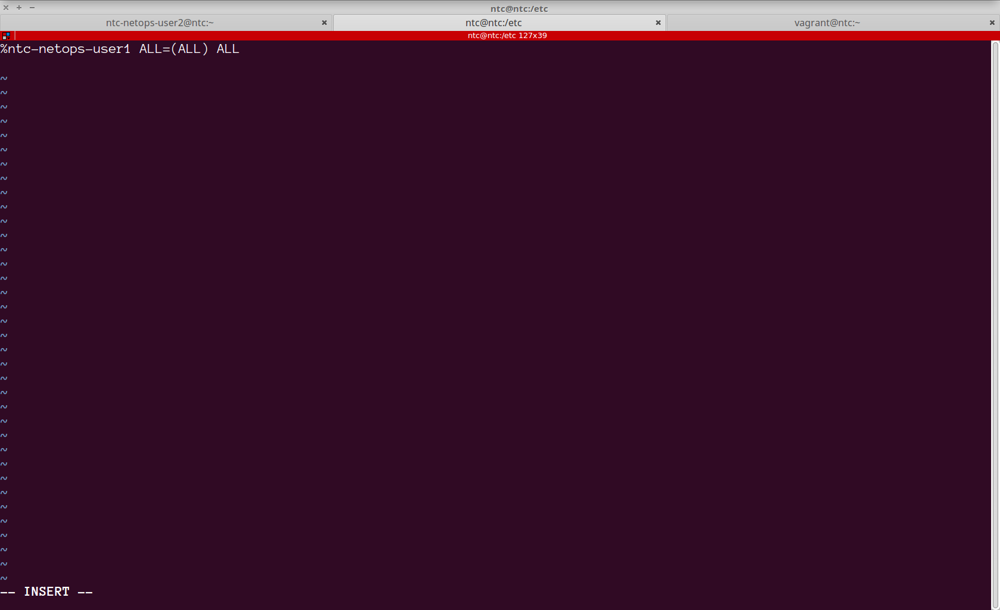
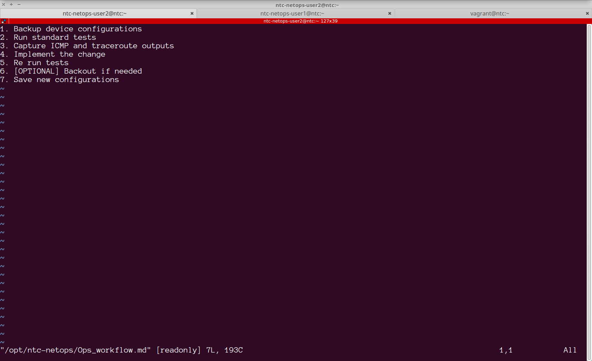
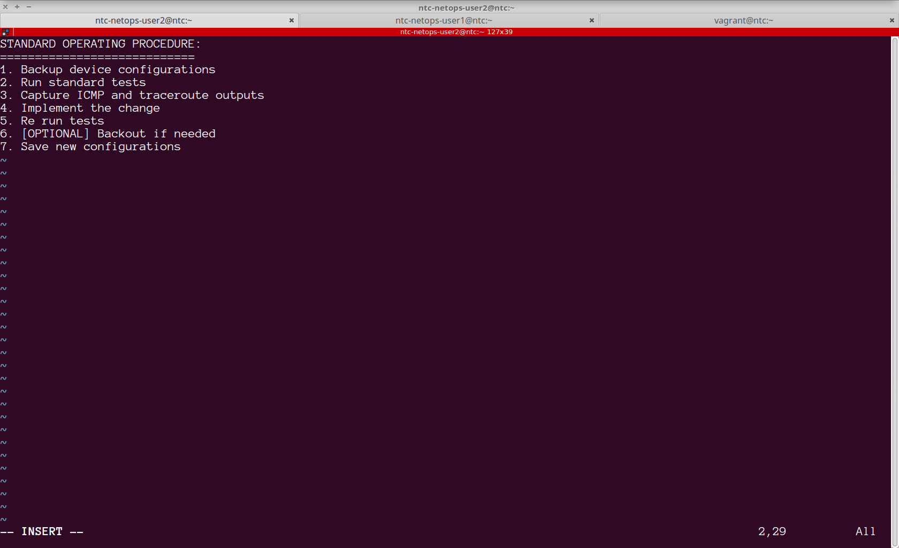

## Lab 11 - User Administration 

In this lab you will understand how to add and remove users, create groups, control permissions and elevate user permissions in Linux


### Task 1 - Adding a user

##### Step 1 

The `ntc` user has superuser or root privileges. This means, commands that are normally not allowed to be executed by a regular user can be invoked by a privileged user by invoking it using a `sudo` command.  

Test it out by first issuing the following command:

```
[ntc@ntc ~]$ ls /root
ls: cannot open directory /root: Permission denied
[ntc@ntc ~]$ 

```


##### Step 2

Retry this command by prefixing it with a `sudo` command:

```
[ntc@ntc ~]$ sudo ls /root/
[sudo] password for ntc: 
anaconda-ks.cfg  original-ks.cfg
[ntc@ntc ~]$ 

```


> Enter your ntc user account's password when prompted. For our labs this should be `ntc123`


##### Step 3

Now add a user called `ntc-netops-user1` using the `useradd` command. Be sure to look up the man pages of the command to understand the different options.

```
[ntc@ntc ~]$ sudo useradd -m ntc-netops-user1
[ntc@ntc ~]$ 

```

> The `-m` flag will ensure that the home directory is created for the user under /home, using the user name as the directory name.


##### Step 4

Next create a password for this user using the `passwd` command. Remember that you can only invoke this command with the `sudo` command.

> Since this is a non-production environment, use `test123` as the password.

```
[ntc@ntc ~]$ sudo passwd ntc-netops-user1
Changing password for user ntc-netops-user1.
New password: 
BAD PASSWORD: The password fails the dictionary check - it is too simplistic/systematic
Retype new password: 
passwd: all authentication tokens updated successfully.
[ntc@ntc ~]$ 
```


##### Step 5

To validate that the user has been created, try logging in as this user. You can do this from within your current login (as user ntc) using the `su` or "switch user" command. 

> You do not need to escalate privileges using sudo in this case because you are simply logging in as another user and will be challenged to log in.

```
[ntc@ntc ~]$ su - ntc-netops-user1
Password: 
Last login: Tue Feb  6 03:06:34 UTC 2018 on pts/2
[ntc-netops-user1@ntc ~]$ 
[ntc-netops-user1@ntc ~]$ 
[ntc-netops-user1@ntc ~]$ 

```

> When prompted, enter the password created in the previous step.


##### Step 6

Exit this shell by typing the `exit` command or using the key-combination `CTRL-d`.

```
[ntc-netops-user1@ntc ~]$ 
[ntc-netops-user1@ntc ~]$ logout
[ntc@ntc ~]$ 

```


##### Step 7

When you created a new user along with a password, this is recorded in the `/etc/passwd` file. Use the `cat` command to view this file and look for the entry associated with the new user:

```
[ntc@ntc ~]$ cat /etc/passwd
root:x:0:0:root:/root:/bin/bash
bin:x:1:1:bin:/bin:/sbin/nologin
daemon:x:2:2:daemon:/sbin:/sbin/nologin
adm:x:3:4:adm:/var/adm:/sbin/nologin
lp:x:4:7:lp:/var/spool/lpd:/sbin/nologin
sync:x:5:0:sync:/sbin:/bin/sync
.
.
.
.

<output truncated for readability>
.
.
.
.
colord:x:995:990:User for colord:/var/lib/colord:/sbin/nologin
gdm:x:42:42::/var/lib/gdm:/sbin/nologin
testuser:x:1002:1002::/home/testuser:/bin/bash
ntc-netops-user1:x:1003:1003::/home/ntc-netops-user1:/bin/bash
[ntc@ntc ~]$ 

```


##### Step 8

Use the `man 5 passwd` command to read about the `/etc/passwd` file.  This file is field separated using the `:` characters into the following fields:

 username | password | uid | gid | description | home dir | shell 
---|---|---|---|---|---|---


### Task 2 - Groups

By default when a new user is added, a group by the same name is created and the user is added to that group. In this task we will create a new group called `netops` and add multiple users to this group. Additionally you will learn about file and directory permissions.


##### Step 1

The `groups` command is used to check what groups a user is currently a member off. Use this command to see the group memberships of `ntc` and `ntc-netops-user1`:

```
[ntc@ntc ~]$ groups ntc
ntc : ntc
[ntc@ntc ~]$ groups ntc-netops-user1
ntc-netops-user1 : ntc-netops-user1
[ntc@ntc ~]$ 
```

##### Step 2

Create a new group called `ntc-netops` using the `groupadd` command. Use the man pages to understand the options available.

```
[ntc@ntc ~]$ sudo groupadd ntc-netops
[sudo] password for ntc: 
[ntc@ntc ~]$ 
```


##### Step 3

Add the `ntc-netops-user1` to this newly created group. For this, use the `usermod` command:

```
[ntc@ntc ~]$ sudo usermod -a -G ntc-netops ntc-netops-user1 
[ntc@ntc ~]$ 
```

> The `-a` flag will append the user to the list of groups specified using `-G` in addition to the group already associated with the user.


##### Step 4

Confirm the group membership for ntc-netops-user1 using the `groups` command:

```
[ntc@ntc ~]$ groups ntc-netops-user1 
ntc-netops-user1 : ntc-netops-user1 ntc-netops
[ntc@ntc ~]$ 
```
The user now belongs to both the `ntc-netops` and `ntc-netops-user1` groups.


### Task 3 - Add 2 new users to the group


##### Step 1 

Add 2 new users: `ntc-netops-user2` and `ntc-netops-user3` to the group `ntc-netops`. Group associations can be made during the user creation phase itself.

```
[ntc@ntc ~]$ sudo useradd -m ntc-netops-user2 -G ntc-netops
[ntc@ntc ~]$ groups ntc-netops-user2
ntc-netops-user2 : ntc-netops-user2 ntc-netops
[ntc@ntc ~]$ 
[ntc@ntc ~]$ sudo useradd -m ntc-netops-user3 -G ntc-netops
[ntc@ntc ~]$ groups ntc-netops-user3
ntc-netops-user3 : ntc-netops-user3 ntc-netops
[ntc@ntc ~]$ 

```


##### Step 2
Assign passwords to both the newly created users: (Use `test123`)

```
[ntc@ntc ~]$ sudo passwd ntc-netops-user2
Changing password for user ntc-netops-user2.
New password: 
BAD PASSWORD: The password fails the dictionary check - it is too simplistic/systematic
Retype new password: 
passwd: all authentication tokens updated successfully.
[ntc@ntc ~]$ sudo passwd ntc-netops-user3
Changing password for user ntc-netops-user3.
New password: 
BAD PASSWORD: The password fails the dictionary check - it is too simplistic/systematic
Retype new password: 
passwd: all authentication tokens updated successfully.
[ntc@ntc ~]$ 

```


> Login and verify the new user accounts.


### Task 4 - Adding a privileged user 

The `sudo` of "Superuser do" command allows an authorized account to perform actions reserved for the `root` or `admin` user. In this task, you will add `ntc-netops-user1` as a sudo enabled privileged user.

##### Step 1 

The sudoers policy is controlled by the configuration specified within `/etc/sudoers` file. Use the man command to review the help on `sudoers`


```
[ntc@ntc etc]$ man sudoers
[ntc@ntc etc]$ 

```

> From the man pages: **The policy is driven by the /etc/sudoers file**


##### Step 2

The sudoers file is typically modified using the `visudo` command. Go ahead and type this command on the terminal.

```
[ntc@ntc etc]$ sudo visudo

```

The file contains :


```
## Sudoers allows particular users to run various commands as
## the root user, without needing the root password.
##
## Examples are provided at the bottom of the file for collections
## of related commands,
.
.
.
.
.
<output truncated for readability>
.
## Next comes the main part: which users can run what software on
## which machines (the sudoers file can be shared between multiple
## systems).
## Syntax:
##
##      user    MACHINE=COMMANDS
##
## The COMMANDS section may have other options added to it.
##
## Allow root to run any commands anywhere
root    ALL=(ALL)       ALL

## Allows members of the 'sys' group to run networking, software,
.
.
.
.
.
<output truncated for readability>
## Read drop-in files from /etc/sudoers.d (the # here does not mean a comment)
#includedir /etc/sudoers.d


```

> Quit this file, as you would vim.

##### Step 3 

The last couple of lines in the file point us to the directory `/etc/sudoers.d` where custom sudoer settings are managed. Go ahead and execute `ls -l` on this directory:

```
[ntc@ntc etc]$ sudo ls -l /etc/sudoers.d/
[sudo] password for ntc: 
total 8
-r--r-----. 1 root root 20 Dec 21 16:42 ntc
[ntc@ntc etc]$ 

```

> As you can see, the ntc user's sudo permissions themselves are governed within.


##### Step 4

Go ahead and use the `cat` command to view the contents of the `ntc` file.

```
[ntc@ntc etc]$ sudo cat /etc/sudoers.d/ntc
%ntc ALL=(ALL) ALL 
[ntc@ntc etc]$ 

```
> This is a simplistic configuration where the `ntc` user has been given all permissions to all available commands on the box.


##### Step 5

Using the above as template, use the `visudo` command to create a new file called `ntc-netops-user1` 

```
[ntc@ntc etc]$ sudo visudo -f /etc/sudoers.d/ntc-netops-user1
[ntc@ntc etc]$ 
```

This command will open a `vim` window, within which you can add the configuration as follows:




##### Step 6

Save and quit this file as you would in vim.


##### Step 7

Now it's time to test out the changes. Using the `su` command, login as `ntc-netops-user1`.


```
[ntc@ntc etc]$ su - ntc-netops-user1
Password: 
Last login: Tue Feb  6 05:13:40 UTC 2018 on pts/2
[ntc-netops-user1@ntc ~]$ 

```


##### Step 8

Using the `sudo` command, create a new directory `/opt/ntc-netops/`. This will be the shared directory for the netops users.


```
[ntc-netops-user1@ntc ~]$ sudo mkdir -p /opt/ntc-netops

We trust you have received the usual lecture from the local System
Administrator. It usually boils down to these three things:

    #1) Respect the privacy of others.
    #2) Think before you type.
    #3) With great power comes great responsibility.

[sudo] password for ntc-netops-user1: 
[ntc-netops-user1@ntc ~]$ 

```

> Note the warning as a sudoer. 

##### Step 9

Confirm that the new directory has been created.


```
[ntc-netops-user1@ntc ~]$ ls -ltr /opt/
total 0
drwxr-xr-x. 2 root root  6 Feb  6 05:25 ntc-netops
[ntc-netops-user1@ntc ~]$ 

```


### Task 5 - File Permissions

Every file in Unix has the following attributes: 

 - **Owner permissions** − The owner's permissions determine what actions the owner of the file can perform on the file. 

 - **Group permissions** − The group's permissions determine what actions a user, who is a member of the group that a file belongs to, can perform on the file.

 - **Other (world) permissions** − The permissions for others indicate what action all other users can perform on the file.
 
 The actions typically are Read(r), Write(w) and eXecute(x). 


##### Step 1

In the previous task you created a directory called `/opt/ntc-netops`. Review the output of the directory listing :

```
[ntc-netops-user1@ntc ~]$ ls -ltr /opt/
total 0
drwxr-xr-x. 2 root root  6 Feb  6 05:25 ntc-netops
[ntc-netops-user1@ntc ~]$ 

```

> The output indicates that the `owner` and `group` of this directory (subdirectories and files within as well) are root.

> Only the root `user` has permissions to write into this directory whereas members of the root `group` have permissions to read and traverse the directory.


##### Step 2

Let's go ahead and change the owner and group of this directory to be `ntc-netops-user1` and `ntc-netops`. Use the `chown` command to do this. The `-R` flag can be used to ensure that owner and group for all recursive subdirectories and files are also updated:

```
[ntc-netops-user1@ntc ~]$ sudo chown -R  ntc-netops-user1:ntc-netops /opt/ntc-netops/
[sudo] password for ntc-netops-user1: 
[ntc-netops-user1@ntc ~]$ ls -l /opt
total 0
drwxr-xr-x. 2 ntc-netops-user1 ntc-netops  6 Feb  6 05:25 ntc-netops

```


##### Step 3

Using the `cat` command create a file called `/opt/ntc-netops/Ops_workflow.md` that contains the following text:

```
1. Backup device configurations
2. Run standard tests 
3. Capture ICMP and traceroute outputs
4. Implement the change
5. Re run tests
6. [OPTIONAL] Backout if needed
7. Save new configurations
```

```
[ntc-netops-user1@ntc ~]$ cat > /opt/ntc-netops/Ops_workflow.md
1. Backup device configurations
2. Run standard tests 
3. Capture ICMP and traceroute outputs
4. Implement the change
5. Re run tests
6. [OPTIONAL] Backout if needed
7. Save new configurations
[ntc-netops-user1@ntc ~]$ 

```


##### Step 4

Check the file permissions of this file by using the `ls -l` command.

```
[ntc-netops-user1@ntc ~]$ ls -l /opt/ntc-netops
total 4
-rw-rw-r--. 1 ntc-netops-user1 ntc-netops-user1 193 Feb  6 05:17 Ops_workflow.md
[ntc-netops-user1@ntc ~]$ 

```

> This file is world/Other readable but can be edited only by the `ntc-netops-user1` user or group


##### Step 5

In another window log in as `ntc-netops-user2` (login as ntc and then use the `su` command)

```
[ntc@ntc ~]$ su - ntc-netops-user2
Password: 
Last login: Tue Feb  6 04:45:19 UTC 2018 on pts/2
[ntc-netops-user2@ntc ~]$ 

```


##### Step 5

Using `vim` open the file created by `ntc-netops-user1` in the preceding steps.




> Note: This file is readonly!


##### Step 6

Since users that belong to `ntc-netops` should have permissions to edit this file, the file's group ownership should be modified. Switch back to the terminal where you are logged in as `ntc-netops-user1` and execute the `chgrp` command:

```
[ntc-netops-user1@ntc ~]$ chgrp ntc-netops /opt/ntc-netops/Ops_workflow.md 
[ntc-netops-user1@ntc ~]$ 
```

> Note: No sudo is needed here since the file is owned by the ntc-netops-user1 user.

```
[ntc-netops-user1@ntc ~]$ ls -l /opt/ntc-netops/
total 4
-rw-rw-r--. 1 ntc-netops-user1 ntc-netops 193 Feb  6 07:35 Ops_workflow.md
[ntc-netops-user1@ntc ~]$ 

```


##### Step 7

Once again, as `ntc-netops-user2`, try to edit the file using vim. Insert a title for the document and call it `STANDARD OPERATING PROCEDURE`:




##### Step 8

Save and quit the file


##### Step 9

Currently this file is world readable. To ensure that only members of the `ntc-netops` group can view and edit this file, remove the read permissions for `o` or "Others". File permissions are controlled using the `chmod` command:


```
[ntc-netops-user1@ntc ~]$ chmod o-r /opt/ntc-netops/Ops_workflow.md 
[ntc-netops-user1@ntc ~]$ 
[ntc-netops-user1@ntc ~]$ ls -l /opt/ntc-netops/
total 4
-rw-rw----. 1 ntc-netops-user1 ntc-netops 252 Feb  6 07:44 Ops_workflow.md
[ntc-netops-user1@ntc ~]$ 
```


##### Step 10

Login as the `ntc` user and try to view the contents of `/opt/ntc-netops/Ops_workflow.md` . Use the `more` command for this step.

```
[ntc@ntc ~]$ 
[ntc@ntc ~]$ more /opt/ntc-netops/Ops_workflow.md 
/opt/ntc-netops/Ops_workflow.md: Permission denied
[ntc@ntc ~]$ 
[ntc@ntc ~]$ 
[ntc@ntc ~]$ 
```

