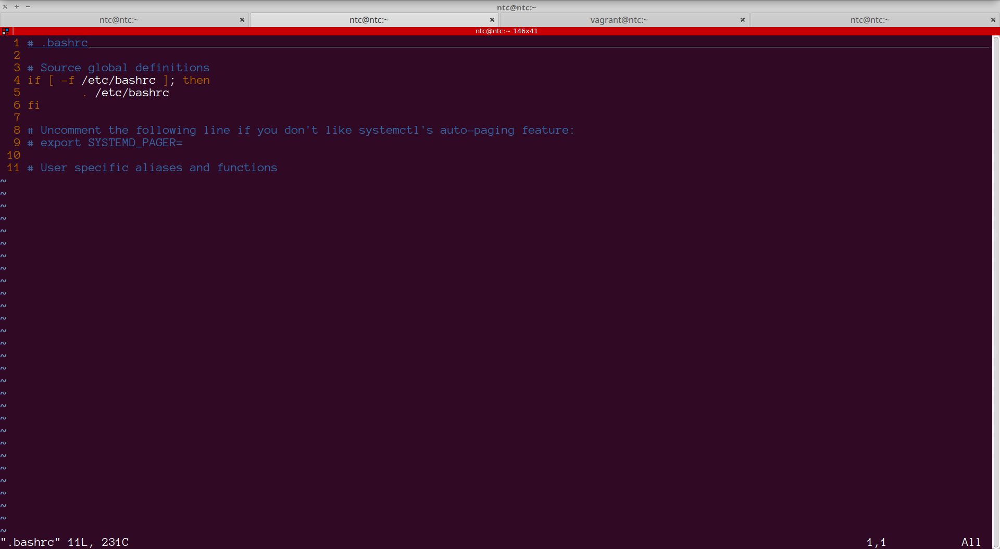
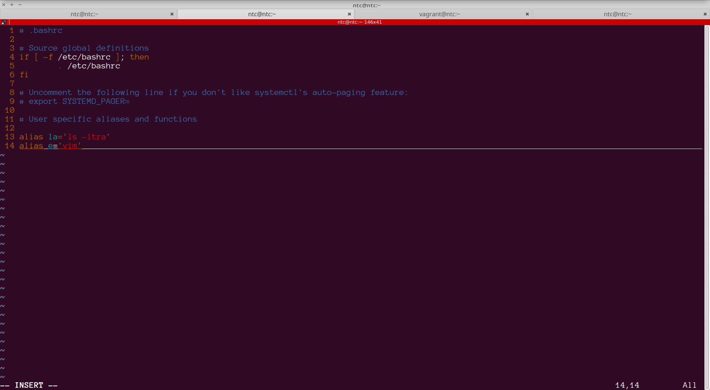
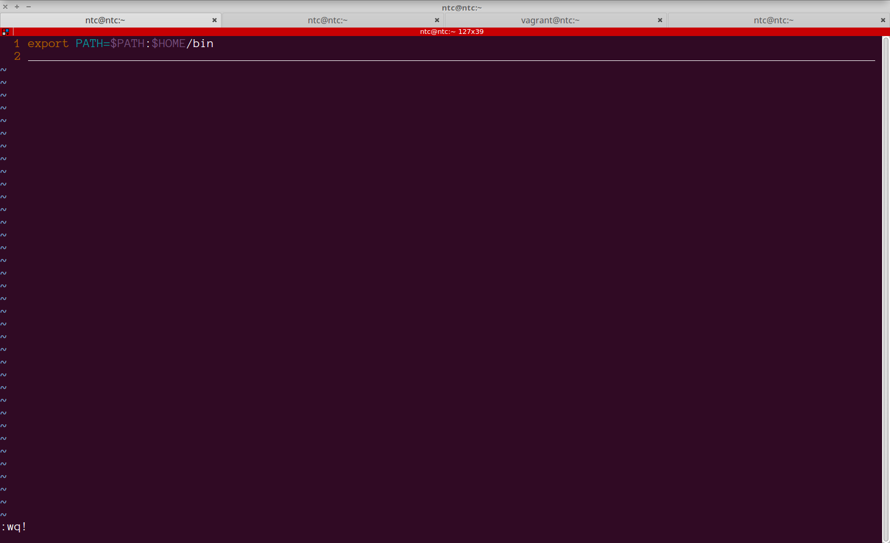

## Lab 12 - Aliases, environment variables and the BASH shell

In this lab we will learn about aliases and how to use them to make our tasks easy. This lab will introduce you to environment variables, their lifetime and durability within the shell.


### Task 1 - Aliases

##### Step 1 

Create an alias using the `alias` command to create a shortcut `e` for editor. Typing `e` should open up vim.


```
[ntc@ntc ~]$ alias e='vim'
```

Now try typing `e`. This should open vim. You can also open a file to edit like:

```
[ntc@ntc ~]$ e configs/nyc-rtr01.cfg 
```


##### Step 2

Create another alias `la`. This should produce the output of `ls -ltra`


##### Step 3

Execute the `alias` command. This should give you a list of all available aliases for the shell:

```
[ntc@ntc ~]$ alias
alias e='vim'
alias egrep='egrep --color=auto'
alias fgrep='fgrep --color=auto'
alias grep='grep --color=auto'
alias l.='ls -d .* --color=auto'
alias la='ls -ltra'
alias ll='ls -l --color=auto'
alias ls='ls --color=auto'
alias vi='vim'
alias which='alias | /usr/bin/which --tty-only --read-alias --show-dot --show-tilde'
[ntc@ntc ~]$ 

```

> Notice how `vi` is an alias for `vim`

### Task 2 - Environment variables

Environment variables are available to all programs executed within the user shell. 

##### Step 1 

Use the `which` command to identify the location of the `Python` program.


```
[ntc@ntc ~]$ which python
/bin/python
[ntc@ntc ~]$
```

How does the shell know which directories to look for the Python program?


##### Step 2

It relies on the environment variable called `PATH`. To see the directories in the default `path`, use the `echo` command to print it out:

```
[ntc@ntc ~]$ echo $PATH
/usr/local/bin:/bin:/usr/bin:/usr/local/sbin:/usr/sbin
[ntc@ntc ~]$ 
```

> The system "binaries" are typically stored in these directories.


##### Step 3

Challenge Task: print the environment variables `PWD` and `HOME`

> Issue the `env` command in the terminal. This will display the list of environment variables available to you.

##### Step 4

What if you wanted to write a script that needs to be available in the path? Go ahead and create a `bin` directory within the ntc users' home directory.

```
[ntc@ntc ~]$ pwd
/home/ntc
[ntc@ntc ~]$ 
[ntc@ntc ~]$ mkdir bin
```


##### Step 5

In order to include files from your local bin directory to be available in the search path, modify the default `PATH` variable to include this directory.

```
[ntc@ntc ~]$ PATH=$PATH:$HOME/bin
[ntc@ntc ~]$ export PATH
[ntc@ntc ~]$ echo $PATH
/usr/local/bin:/bin:/usr/bin:/usr/local/sbin:/usr/sbin:/home/ntc/bin
[ntc@ntc ~]$
```


##### Step 6

Test this by `touching` a file in `/home/ntc/bin` called `ntc.exe`, updating it's permissions to be an executable,  and then running a `which ntc.exe`

```
[ntc@ntc ~]$ cd bin
[ntc@ntc bin]$ pwd
/home/ntc/bin
[ntc@ntc bin]$ touch ntc.exe 
[ntc@ntc bin]$ chmod +x ntc.exe 
[ntc@ntc bin]$ 

```

```

[ntc@ntc bin]$ cd
[ntc@ntc ~]$ 

```

```

[ntc@ntc ~]$ pwd
/home/ntc
[ntc@ntc ~]$ which ntc.exe
~/bin/ntc.exe
[ntc@ntc ~]$ 

```


### Task 3 - The .bashrc and .bash_profile scripts

The `.bash_profile` and `.bashrc` scripts are hidden files within the home directory of the user. The `.bash_profile` script is always executed at login and the `.bashrc` is always executed when a new shell invocation occurs (regardless of login - for instance, simply running `/bin/bash`)

Therefore these files are excellent locations to store values that should be available to the user at each login and or at each shell invocation.

##### Step 1 

Using another terminal window, login to the Linux host as `ntc`. Try editing a file using `e`. What happens?

```
[ntc@ntc ~]$ e
-bash: e: command not found
[ntc@ntc ~]$ 


```

How about `la`?

This is because the alias we created in the previous step has a life only within that invocation of the user shell. 


##### Step 2

In this same terminal, execute the `which ntc.exe` command. 

```
[ntc@ntc ~]$ which ntc.exe
/usr/bin/which: no ntc.exe in (/usr/local/bin:/bin:/usr/bin:/usr/local/sbin:/usr/sbin)
[ntc@ntc ~]$ 

```


> The local `bin` directory appears missing from the `PATH` variable.


##### Step 3

In order to persist aliases and environment variables across logins and shells, we can place them in the `.bash_profile` or the `.bashrc` files respectively.

Use vim to open the `.bashrc` file in the home directory. 




> This file loads the global defaults from /etc/bashrc followed by user specific commands.


##### Step 4

Add lines in this file for the aliases we created in the first task:




Save and exit the file.

##### Step 5

Now, login using a new terminal and execute the `alias` command.

```
[ntc@ntc ~]$ alias
alias e='vim'
alias egrep='egrep --color=auto'
alias fgrep='fgrep --color=auto'
alias grep='grep --color=auto'
alias l.='ls -d .* --color=auto'
alias la='ls -ltra'
alias ll='ls -l --color=auto'
alias ls='ls --color=auto'
alias vi='vim'
alias which='alias | /usr/bin/which --tty-only --read-alias --show-dot --show-tilde'
[ntc@ntc ~]$ 

```

> As you can see, the aliases we added to `.bashrc` are present.


##### Step 6

Switch back to the first terminal. Try executing the `la` alias here.


```
[ntc@ntc ~]$ la
-bash: la: command not found
[ntc@ntc ~]$ 

```

> This command fails here even though we just populated .bashrc because, the .bashrc is sourced only when a shell is invoked.


##### Step 7

To manually execute the `.bashrc` file use the `source` command within this terminal:

```
[ntc@ntc ~]$ source .bashrc 
[ntc@ntc ~]$ la
total 88
-rw-r--r--.  1 ntc  ntc    18 Dec  6  2016 .bash_logout
-rw-rw-r--.  1 ntc  ntc    40 Jan 22 19:48 .gitconfig
-rw-------.  1 ntc  ntc    41 Jan 22 19:56 .lesshst
drwx------.  3 ntc  ntc    24 Jan 23 16:59 .config
drwxrwxr-x.  7 ntc  ntc   119 Jan 23 17:00 .vagrant.d
drwxrwxr-x.  3 ntc  ntc    45 Jan 23 17:02 VirtualBoxVMs
-rw-rw-r--.  1 ntc  ntc     0 Jan 25 16:01 test
-rw-rw-r--.  1 ntc  ntc     0 Jan 25 16:06 error
-rw-rw-r--.  1 ntc  ntc   225 Jan 25 16:11 output
-rw-rw-r--.  1 ntc  ntc    92 Jan 25 17:20 greetings.txt
-rw-rw-r--.  1 ntc  ntc     2 Jan 25 18:00 file_count.txt
drwxrwxr-x.  3 ntc  ntc    50 Jan 26 11:03 tux
-rw-rw-r--.  1 ntc  ntc   109 Jan 26 19:34 change_notes.txt
-rw-rw-r--.  1 ntc  ntc   108 Jan 29 16:19 ios_config_template.txt
-rw-rw-r--.  1 ntc  ntc   598 Feb  5 16:03 vlan.json
.
.
.
.
.
<output truncated for readability>
```


##### Step 8

The `.bash_profile` is invoked at every new login for a given user. Open this file using vim and save your environment variable (PATH) within this file.

> If this file does not exist, you can create it.



Save and quit this file.

##### Step 9


Use the source command to invoke the `.bash_profile` or login from a new terminal to automatically invoke it. Ensure that the updated path is now available by printing the variable to screen.

```
[ntc@ntc ~]$ echo $PATH
/usr/local/bin:/bin:/usr/bin:/usr/local/sbin:/usr/sbin
[ntc@ntc ~]$ 

```

```

[ntc@ntc ~]$ source .bash_profile 
[ntc@ntc ~]$ echo $PATH
/usr/local/bin:/bin:/usr/bin:/usr/local/sbin:/usr/sbin:/home/ntc/bin
[ntc@ntc ~]$ 

```


