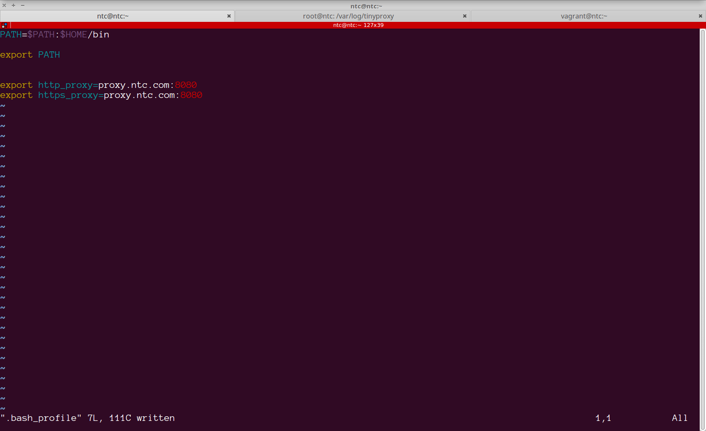
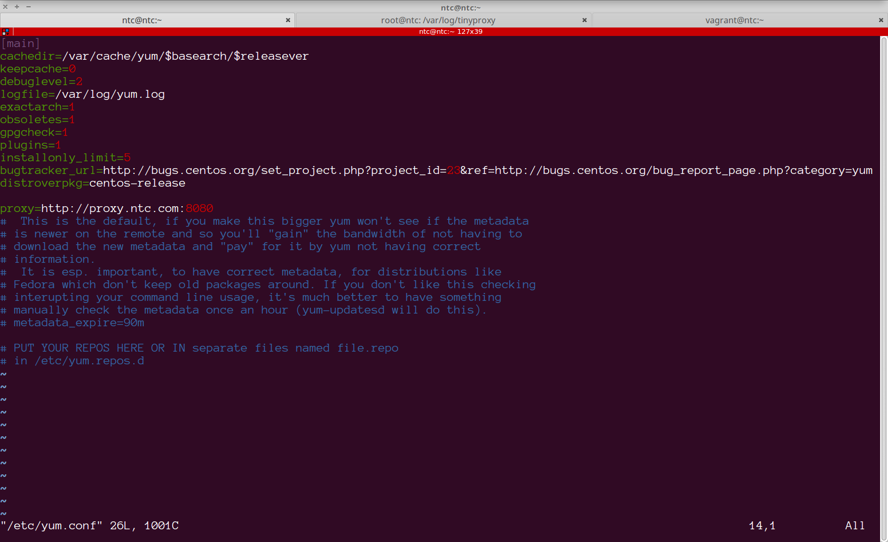

## Lab - Package Management

In this lab you will learn how to check for installed software, install, upgrade and delete the necessary packages. In this lab focus will only be on the application lifecycle on CentOS operating system (Also applicable to Fedora and Red Hat)


### Task 1 - Enable access to public repositories

Most enterprises use a HTTP/HTTPS proxy to enforce access policies to the internet. For a Linux terminal program to access the internet (for instance to do software updates) from the shell, you will need to enable the `HTTP_PROXY` and `HTTPS_PROXY` environment variables.


##### Step 1

Try to execute a `curl` request to access `http://networktocode.com` from the command line:

```
[ntc@ntc ~]$ curl http://networktocode.com
curl: (6) Could not resolve host: networktocode.com; Unknown error
[ntc@ntc ~]$
```


##### Step 2

Set the proxy environment variable to point to `proxy.ntc.com:8080`

```
[ntc@ntc ~]$ export http_proxy=proxy.ntc.com:8080
[ntc@ntc ~]$ export https_proxy=proxy.ntc.com:8080

```


##### Step 3

Now retry the curl command from step 1

```
[ntc@ntc ~]$ curl http://networktocode.com
<!DOCTYPE html>
<html lang="en-US" prefix="og: http://ogp.me/ns#">
<head>
<meta charset="UTF-8">
<meta name="viewport" content="width=device-width, initial-scale=1">
<link rel="icon" type="image/png" href="http://dizzain.us/network-code/wp-content/uploads/2016/05/favicon.png" />
<style type="text/css"> body a, body a:hover { color: #2a79bf; } .service-icon i, header .navbar-nav .dropdown.open .dropdown-toggle, .active-category, .post-gallery-title, .comment-navigation .current, .contact-social-icons a, .countup-circle { color: #2a79bf!important; } .service-icon, .service-line, .service-line-bottom, .current-menu-item a, .current_page_parent a, blockquote, header .navbar-nav .dropdown.open .dropdown-toggle, .co

.
.
.
.
.
<output truncated for readability>
```


##### Step 4

Add these variables to the `.bash_profile`




### Task 2 - Updating yum.conf with proxy details

`yum` is the package management tool used in CentOS. Package manager commands are invoked by the super user. The proxy settings we made in the previous task will only be applicable to the `ntc` user. This task will help you understand centralized proxy configurations for applications.

##### Step 1

Now that we have validated external connectivity using the proxy, we can go ahead and use the `yum` tool to manage packages on the machine. Invoke `sudo` to edit the `/etc/yum.conf` file and add the proxy configuration within.


```
[ntc@ntc ~]$ sudo vim /etc/yum.conf

```



Save and exit the file


##### Step 2

Execute the `yum list updates` command. This will query the public repositories and give a list of updated software:

```
[ntc@ntc ~]$ sudo yum list updates
[sudo] password for ntc:
Loaded plugins: fastestmirror, langpacks
base                                                                                                    | 3.6 kB  00:00:00
extras                                                                                                  | 3.4 kB  00:00:00
updates                                                                                                 | 3.4 kB  00:00:00
(1/4): base/7/x86_64/group_gz                                                                           | 156 kB  00:00:00
(2/4): extras/7/x86_64/primary_db                                                                       | 166 kB  00:00:00
(3/4): updates/7/x86_64/primary_db                                                                      | 6.0 MB  00:00:01
(4/4): base/7/x86_64/primary_db                                                                         | 5.7 MB  00:00:01
Determining fastest mirrors
* base: bay.uchicago.edu
* extras: centos-distro.1gservers.com
* updates: centos-distro.cavecreek.net
Updated Packages
NetworkManager.x86_64                                               1:1.8.0-11.el7_4                                    updates
NetworkManager-adsl.x86_64                                          1:1.8.0-11.el7_4                                    updates
NetworkManager-bluetooth.x86_64                                     1:1.8.0-11.el7_4                                    updates
NetworkManager-glib.x86_64                                          1:1.8.0-11.el7_4                                    updates
NetworkManager-libnm.x86_64                                         1:1.8.0-11.el7_4                                    updates
NetworkManager-libreswan.x86_64                                     1.2.4-2.el7                                         base
NetworkManager-libreswan-gnome.x86_64                               1.2.4-2.el7                                         base
.
.
.
.
.
<output truncated for readability>
```


##### Step 3

Use the `yum check-update` command to find whether updates exists for software already installed on the system:

```
[ntc@ntc ~]$ sudo yum check-update
[sudo] password for ntc:
Loaded plugins: fastestmirror, langpacks
Loading mirror speeds from cached hostfile
* base: bay.uchicago.edu
* extras: centos-distro.1gservers.com
* updates: centos-distro.cavecreek.net

NetworkManager.x86_64                                              1:1.8.0-11.el7_4                                   updates
NetworkManager-adsl.x86_64                                         1:1.8.0-11.el7_4                                   updates
NetworkManager-bluetooth.x86_64                                    1:1.8.0-11.el7_4                                   updates
NetworkManager-glib.x86_64                                         1:1.8.0-11.el7_4                                   updates
NetworkManager-libnm.x86_64                                        1:1.8.0-11.el7_4                                   updates
NetworkManager-libreswan.x86_64                                    1.2.4-2.el7                                        base
NetworkManager-libreswan-gnome.x86_64                              1.2.4-2.el7                                        base
NetworkManager-team.x86_64                                         1:1.8.0-11.el7_4                                   updates
NetworkManager-tui.x86_64                                          1:1.8.0-11.el7_4                                   updates
NetworkManager-wifi.x86_64                                         1:1.8.0-11.el7_4
.
.
.
.
.
<output truncated for readability>
```


##### Step 4

Install all updates by issuing the `yum update` command:

```
[ntc@ntc ~]$ sudo yum update
Loaded plugins: fastestmirror, langpacks
Loading mirror speeds from cached hostfile
* base: bay.uchicago.edu
* extras: centos-distro.1gservers.com
* updates: centos-distro.cavecreek.net
Resolving Dependencies
--> Running transaction check
---> Package NetworkManager.x86_64 1:1.4.0-12.el7 will be obsoleted
---> Package NetworkManager.x86_64 1:1.8.0-11.el7_4 will be obsoleting
.
.
.
.
.
<output truncated for readability>
---> Package libstdc++.i686 0:4.8.5-16.el7_4.1 will be installed
--> Finished Dependency Resolution

Dependencies Resolved

===============================================================================================================================
Package                                          Arch          Version                                   Repository      Size
===============================================================================================================================
Installing:
NetworkManager                                   x86_64        1:1.8.0-11.el7_4                          updates        1.6 M
replacing  NetworkManager.x86_64 1:1.4.0-12.el7
NetworkManager-ppp                               x86_64        1:1.8.0-11.el7_4                          updates        157 k
replacing  NetworkManager.x86_64 1:1.4.0-12.el7
grub2                                            x86_64        1:2.02-0.65.el7.centos.2                  updates         29 k
.
.
.
.
.
<output truncated for readability>
zlib                                             i686          1.2.7-17.el7                              base            91 k

Transaction Summary
===============================================================================================================================
Install   13 Packages (+76 Dependent packages)
Upgrade  728 Packages

Total download size: 786 M
Is this ok [y/d/N]:

```

> Answer `y` at the prompt. The process will proceed and take a few minutes to complete.


> Note: You can update specific software by specifying the exact package that should be updated:

```
#Example:
$ sudo yum update httpd
```

##### Step 5

If you would like to see  all currently installed packages, use the `yum list installed` command:

```
[ntc@ntc ~]$yum list installed
Loaded plugins: fastestmirror, priorities
Loading mirror speeds from cached hostfile
* base: mirror.dal10.us.leaseweb.net
* epel: mirror.umd.edu
* extras: dallas.tx.mirror.xygenhosting.com
* updates: mirror.tzulo.com
Installed Packages
GConf2.x86_64                                            3.2.6-8.el7                                           @base
GeoIP.x86_64                                             1.5.0-11.el7                                          @anaconda
ImageMagick.x86_64                                       6.7.8.9-15.el7_2                                      @base
ModemManager-glib.x86_64                                 1.6.0-2.el7                                           @base
NetworkManager.x86_64                                    1:1.8.0-11.el7_4                                      @updates
NetworkManager-glib.x86_64                               1:1.8.0-11.el7_4                                      @updates
NetworkManager-libnm.x86_64                              1:1.8.0-11.el7_4                                      @updates
NetworkManager-ppp.x86_64                                1:1.8.0-11.el7_4                                      @updates
NetworkManager-team.x86_64                               1:1.8.0-11.el7_4                                      @updates
.
.
.
.
.
<output truncated for readability>
```


##### Step 6

To check if a particular package is installed, specify the package name in the `yum list installed` command:

```
[ntc@ntc ~]$sudo yum list installed python
Loaded plugins: fastestmirror, priorities
Loading mirror speeds from cached hostfile
* base: mirror.millry.co
* epel: mirror.cogentco.com
* extras: ftp.linux.ncsu.edu
* updates: repos-va.psychz.net
Installed Packages
python.x86_64                                                2.7.5-58.el7                                                 @base
[ntc@ntc ~]$

```


##### Step 7

To search for a package within the public repository, use the `yum search` command:


```
[ntc@ntc ~]$sudo yum search fortune
Loaded plugins: fastestmirror, priorities
Loading mirror speeds from cached hostfile
* base: mirrors.gigenet.com
* epel: mirror.cogentco.com
* extras: ftp.linux.ncsu.edu
* updates: repos-va.psychz.net
==================================================== N/S matched: fortune =====================================================
fortune-mod.x86_64 : A program which will display a fortune

Name and summary matches only, use "search all" for everything.
[ntc@ntc ~]$

```


##### Step 8

Go ahead and use yum to install `fortune`


```
[ntc@ntc ~]$sudo yum install fortune-mod.x86_64
Loaded plugins: fastestmirror, priorities
Loading mirror speeds from cached hostfile
* base: mirrors.gigenet.com
* epel: mirror.cogentco.com
* extras: ftp.linux.ncsu.edu
* updates: mirror.cloud-bricks.net
Resolving Dependencies
--> Running transaction check
---> Package fortune-mod.x86_64 0:1.99.1-17.el7 will be installed
--> Processing Dependency: librecode.so.0()(64bit) for package: fortune-mod-1.99.1-17.el7.x86_64
--> Running transaction check
---> Package recode.x86_64 0:3.6-38.el7 will be installed
--> Finished Dependency Resolution

Dependencies Resolved

===============================================================================================================================
Package                         Arch                       Version                             Repository                Size
===============================================================================================================================
Installing:
fortune-mod                     x86_64                     1.99.1-17.el7                       epel                     1.1 M
Installing for dependencies:
recode                          x86_64                     3.6-38.el7                          base                     718 k

Transaction Summary
===============================================================================================================================
Install  1 Package (+1 Dependent package)

Total download size: 1.8 M
Installed size: 4.9 M
Is this ok [y/d/N]: y
Downloading packages:
(1/2): recode-3.6-38.el7.x86_64.rpm                                                                     | 718 kB  00:00:00
(2/2): fortune-mod-1.99.1-17.el7.x86_64.rpm                                                             | 1.1 MB  00:00:01
-------------------------------------------------------------------------------------------------------------------------------
Total                                                                                          1.4 MB/s | 1.8 MB  00:00:01
Running transaction check
Running transaction test
Transaction test succeeded
Running transaction
Installing : recode-3.6-38.el7.x86_64                                                                                    1/2
Installing : fortune-mod-1.99.1-17.el7.x86_64                                                                            2/2
Verifying  : fortune-mod-1.99.1-17.el7.x86_64                                                                            1/2
Verifying  : recode-3.6-38.el7.x86_64                                                                                    2/2

Installed:
fortune-mod.x86_64 0:1.99.1-17.el7

Dependency Installed:
recode.x86_64 0:3.6-38.el7

Complete!
[ntc@ntc ~]$

```

> Fortune is a fun little program that generates random fortune cookie statements.

```
[ntc@ntc ~]$fortune
The future is a race between education and catastrophe.
-- H.G. Wells
[ntc@ntc ~]$

```


##### Step 9

`yum info` will give details about a package.

```
[ntc@ntc ~]$sudo yum info htop
Loaded plugins: fastestmirror, priorities
Loading mirror speeds from cached hostfile
* base: mirror.cc.columbia.edu
* epel: mirror.cogentco.com
* extras: ftp.linux.ncsu.edu
* updates: repos-va.psychz.net
Available Packages
Name        : htop
Arch        : x86_64
Version     : 2.0.2
Release     : 1.el7
Size        : 98 k
Repo        : epel/x86_64
Summary     : Interactive process viewer
URL         : http://hisham.hm/htop/
License     : GPL+
Description : htop is an interactive text-mode process viewer for Linux, similar to
: top(1).

[ntc@ntc ~]$

```


##### Step 10

If you are working with a file and would like to find out what software package that file belongs to, use the `whatprovides` option to query this. Now, use this option to find out what package provides the `tree` command. Also find what package uses the `yum.conf` file.

```
[ntc@ntc ~]$sudo yum whatprovides tree
Loaded plugins: fastestmirror, priorities
Loading mirror speeds from cached hostfile
* base: mirrors.gigenet.com
* epel: mirror.cogentco.com
* extras: ftp.linux.ncsu.edu
* updates: mirror.cloud-bricks.net
tree-1.6.0-10.el7.x86_64 : File system tree viewer
Repo        : base


tree-1.6.0-10.el7.x86_64 : File system tree viewer
Repo        : @base


[ntc@ntc ~]$

```


```
[ntc@ntc ~]$sudo yum whatprovides /etc/yum.conf
Loaded plugins: fastestmirror, priorities
Loading mirror speeds from cached hostfile
* base: mirrors.gigenet.com
* epel: mirror.cogentco.com
* extras: ftp.linux.ncsu.edu
* updates: repos-va.psychz.net
yum-3.4.3-154.el7.centos.noarch : RPM package installer/updater/manager
Repo        : base
Matched from:
Filename    : /etc/yum.conf


yum-3.4.3-154.el7.centos.1.noarch : RPM package installer/updater/manager
Repo        : updates
Matched from:
Filename    : /etc/yum.conf


yum-3.4.3-154.el7.centos.1.noarch : RPM package installer/updater/manager
Repo        : @updates
Matched from:
Filename    : /etc/yum.conf


[ntc@ntc ~]$

```


##### Step 11

To uninstall a package use the `yum remove` command. Use it to remove the `fortune` package.

```
[ntc@ntc ~]$sudo yum remove fortune-mod.x86_64
Loaded plugins: fastestmirror, priorities
Resolving Dependencies
--> Running transaction check
---> Package fortune-mod.x86_64 0:1.99.1-17.el7 will be erased
--> Finished Dependency Resolution

Dependencies Resolved

===============================================================================================================================
Package                         Arch                       Version                            Repository                 Size
===============================================================================================================================
Removing:
fortune-mod                     x86_64                     1.99.1-17.el7                      @epel                     2.8 M

Transaction Summary
===============================================================================================================================
Remove  1 Package

Installed size: 2.8 M
Is this ok [y/N]: y
Downloading packages:
Running transaction check
Running transaction test
Transaction test succeeded
Running transaction
Erasing    : fortune-mod-1.99.1-17.el7.x86_64                                                                            1/1
Verifying  : fortune-mod-1.99.1-17.el7.x86_64                                                                            1/1

Removed:
fortune-mod.x86_64 0:1.99.1-17.el7

Complete!
[ntc@ntc ~]$

```

