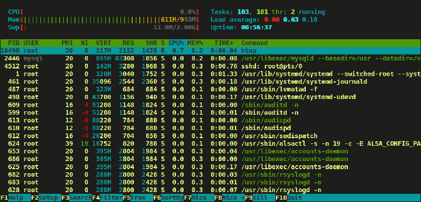

# Lab 15 Linux Systems Management

In this lab we will take a deeper dive into Linux systems management & built in commands.  For the tasks & steps below, assume that you have inherited a server/system with very few details.  This lab will help with common Linux systems administration & engineering tasks.  

### Task 1 - Identify System

##### Step 1 - Identify Distribution

At times it will be necessary to identify the type of server/system we are utilizing, especially in 'brownfield' environments.  Generally, all Linux distributions can utilize the same tools, applications, and processes, provided they are using the same processor.  However, each distribution has differences that must be accounted for when designing and implementing Linux solutions.  Package managers, compilers, dependencies, and package names are just some of the differences.  

Let's identify a few ways to identify the distribution:

> RHEL/CentOS: 

For simple release information, view the `/etc/redhat-release` file:

```
[ntc@ntc ~]$ cat /etc/redhat-release 
CentOS Linux release 7.4.1708 (Core)
```

Or, for more detail, we can issue the `cat /etc/*elease` command to return all the release files:

```
[ntc@ntc ~]$ cat /etc/*elease
CentOS Linux release 7.4.1708 (Core) 
NAME="CentOS Linux"
VERSION="7 (Core)"
ID="centos"
ID_LIKE="rhel fedora"
VERSION_ID="7"
PRETTY_NAME="CentOS Linux 7 (Core)"
ANSI_COLOR="0;31"
CPE_NAME="cpe:/o:centos:centos:7"
HOME_URL="https://www.centos.org/"
BUG_REPORT_URL="https://bugs.centos.org/"

CENTOS_MANTISBT_PROJECT="CentOS-7"
CENTOS_MANTISBT_PROJECT_VERSION="7"
REDHAT_SUPPORT_PRODUCT="centos"
REDHAT_SUPPORT_PRODUCT_VERSION="7"

CentOS Linux release 7.4.1708 (Core) 
CentOS Linux release 7.4.1708 (Core)
```

> Debian/Ubuntu:

Ubuntu/Debian differs when looking for the disbribution information.  There is a built in `lsb_release` command to provide simple distribution info:

```
ntc@ntc:~$ lsb_release -a
No LSB modules are available.
Distributor ID:	Ubuntu
Description:	Ubuntu 16.04.3 LTS
Release:	16.04
Codename:	xenial
```

You can also view the `/etc/lsb-release` file for this information:

```
ntc@ntc:~$ cat /etc/lsb-release 
DISTRIB_ID=Ubuntu
DISTRIB_RELEASE=16.04
DISTRIB_CODENAME=xenial
DISTRIB_DESCRIPTION="Ubuntu 16.04.3 LTS"
```

For detailed information viewing the matching `/etc/*elease` files will work:

```
ntc@ntc:~$ cat /etc/*elease
DISTRIB_ID=Ubuntu
DISTRIB_RELEASE=16.04
DISTRIB_CODENAME=xenial
DISTRIB_DESCRIPTION="Ubuntu 16.04.3 LTS"
NAME="Ubuntu"
VERSION="16.04.3 LTS (Xenial Xerus)"
ID=ubuntu
ID_LIKE=debian
PRETTY_NAME="Ubuntu 16.04.3 LTS"
VERSION_ID="16.04"
HOME_URL="http://www.ubuntu.com/"
SUPPORT_URL="http://help.ubuntu.com/"
BUG_REPORT_URL="http://bugs.launchpad.net/ubuntu/"
VERSION_CODENAME=xenial
UBUNTU_CODENAME=xenial
```

##### Step 2 - Identify Kernel

Identifying the Kernel is a bit more straightforward.  The commands are the same for RHEL/CentOS and Ubuntu/Debian:

> RHEL/CentOS:

The `uname -r` command will provide simple kernel information:

```
[ntc@ntc ~]$ uname -r
3.10.0-693.11.6.el7.x86_64
```

For more detail, view the `/proc/version` file:

```
[ntc@ntc ~]$ cat /proc/version
Linux version 3.10.0-693.11.6.el7.x86_64 (builder@kbuilder.dev.centos.org) (gcc version 4.8.5 20150623 (Red Hat 4.8.5-16) (GCC) ) #1 SMP Thu Jan 4 01:06:37 UTC 2018
```

> Debian/Ubuntu:

For simple kernel information, the `uname -r` command can be issued:

```
[ntc@ntc ~]$ cat /etc/redhat-release 
CentOS Linux release 7.4.1708 (Core)
```

Detailed information can be obtained by viewing the `/proc/version` file:

```
ntc@ntc:~$ cat /proc/version
Linux version 4.4.0-112-generic (buildd@lgw01-amd64-010) (gcc version 5.4.0 20160609 (Ubuntu 5.4.0-6ubuntu1~16.04.5) ) #135-Ubuntu SMP Fri Jan 19 11:48:36 UTC 2018
```

> Note: As seen above, the first step when logging into an unknown system could be to issue the `cat /etc/*elease/` command to identify the system & version

### Task 2 - Get CPU & Memory

Now that we have identified the distribution, let's view some additional information.  We will spend the next few steps in the `/proc` directory.

##### Step 1 - View CPU Information

To view the cpu information for the server, view the `~/proc/cpuinfo` file:

```
[ntc@ntc ~]$ cat /proc/cpuinfo
processor	: 0
vendor_id	: GenuineIntel
cpu family	: 6
model		: 158
model name	: Intel(R) Core(TM) i7-7700HQ CPU @ 2.80GHz
stepping	: 9
cpu MHz		: 2808.002
cache size	: 6144 KB
physical id	: 0
siblings	: 2
core id		: 0
cpu cores	: 2
apicid		: 0
initial apicid	: 0
fpu		: yes
fpu_exception	: yes
cpuid level	: 22
wp		: yes
flags		: fpu vme de pse tsc msr pae mce cx8 apic sep mtrr pge mca cmov pat pse36 clflush mmx fxsr sse sse2 ht syscall nx rdtscp lm constant_tsc rep_good nopl xtopology nonstop_tsc pni pclmulqdq ssse3 cx16 sse4_1 sse4_2 x2apic movbe popcnt aes xsave avx rdrand hypervisor lahf_lm abm 3dnowprefetch avx2 rdseed clflushopt
bogomips	: 5616.00
clflush size	: 64
cache_alignment	: 64
address sizes	: 39 bits physical, 48 bits virtual
power management:
```

Here we see details about the processor - the type, speed, cores etc... For each processor, this information would repeat in succession

##### Step 2 - View Memory Information

The `~/proc/meminfo` file contains memory information:

```
[ntc@ntc ~]$ cat /proc/meminfo 
MemTotal:        3881696 kB
MemFree:         3489816 kB
MemAvailable:    3526364 kB
Buffers:            2108 kB
Cached:           231576 kB
SwapCached:            0 kB
Active:           207288 kB
Inactive:          84088 kB
Active(anon):      57892 kB
Inactive(anon):     8324 kB
Active(file):     149396 kB
Inactive(file):    75764 kB
Unevictable:           0 kB
Mlocked:               0 kB
SwapTotal:       1572860 kB
SwapFree:        1572860 kB
Dirty:                 0 kB
Writeback:             0 kB
AnonPages:         57720 kB
Mapped:            24392 kB
Shmem:              8524 kB
Slab:              52020 kB
SReclaimable:      28188 kB
SUnreclaim:        23832 kB
KernelStack:        1872 kB
PageTables:         4292 kB
NFS_Unstable:          0 kB
Bounce:                0 kB
WritebackTmp:          0 kB
CommitLimit:     3513708 kB
Committed_AS:     321044 kB
VmallocTotal:   34359738367 kB
VmallocUsed:       11244 kB
VmallocChunk:   34359724412 kB
HardwareCorrupted:     0 kB
AnonHugePages:      6144 kB
HugePages_Total:       0
HugePages_Free:        0
HugePages_Rsvd:        0
HugePages_Surp:        0
Hugepagesize:       2048 kB
DirectMap4k:       53184 kB
DirectMap2M:     4141056 kB
```

Notice the first three lines - `MemTotal`, `MemFree`, and `MemAvailable`.  This gives us information about the memory on our server, and can help us diagnose any issues.  If we noticed that the `MemAvailable` was low, it would be necessary to investigate further.  

##### Step 3 - `vmstat`

We can also use a `vmstat` command to get more granular details on memory allocation

```
ntc@ntc ~]$ vmstat
procs -----------memory---------- ---swap-- -----io---- -system-- ------cpu-----
 r  b   swpd   free   buff  cache   si   so    bi    bo   in   cs us sy id wa st
 1  0      0 3489668   2108 283628    0    0     2     1    9    8  0  0 100  0  0
```

`vmstat` also provides some helpful options:

```
[ntc@ntc ~]$ vmstat -help

Usage:
 vmstat [options] [delay [count]]

Options:
 -a, --active           active/inactive memory
 -f, --forks            number of forks since boot
 -m, --slabs            slabinfo
 -n, --one-header       do not redisplay header
 -s, --stats            event counter statistics
 -d, --disk             disk statistics
 -D, --disk-sum         summarize disk statistics
 -p, --partition <dev>  partition specific statistics
 -S, --unit <char>      define display unit
 -w, --wide             wide output
 -t, --timestamp        show timestamp

 -h, --help     display this help and exit
 -V, --version  output version information and exit

[ntc@ntc ~]$ vmstat -s
      3881696 K total memory
       106268 K used memory
       207636 K active memory
        84100 K inactive memory
      3489692 K free memory
         2108 K buffer memory
       283628 K swap cache
      1572860 K total swap
            0 K used swap
      1572860 K free swap
          608 non-nice user cpu ticks
            2 nice user cpu ticks
         2451 system cpu ticks
     10129009 idle cpu ticks
          172 IO-wait cpu ticks
            0 IRQ cpu ticks
          229 softirq cpu ticks
            0 stolen cpu ticks
       163312 pages paged in
       106476 pages paged out
            0 pages swapped in
            0 pages swapped out
       960496 interrupts
       849863 CPU context switches
   1518016952 boot time
         9142 forks
```

Perhaps we'd like the information represented in mBs instead of kBs.  We can add a `-S (unit) m` flag:

```
[ntc@ntc ~]$ vmstat -S m
procs -----------memory---------- ---swap-- -----io---- -system-- ------cpu-----
 r  b   swpd   free   buff  cache   si   so    bi    bo   in   cs us sy id wa st
 1  0      0   3573      2    290    0    0     2     1   10    8  0  0 100  0  0
```

##### Step 4 - `free`

For a more human-readable format, we can use the built-in `free` command:

```
[ntc@ntc ~]$ free
              total        used        free      shared  buff/cache   available
Mem:        3881696      106240     3489700        8524      285756     3526300
Swap:       1572860           0     1572860
```

We can add the `-h` or "human-readable" flag to the `free` command:

```
[ntc@ntc ~]$ free -h
              total        used        free      shared  buff/cache   available
Mem:           3.7G        103M        3.3G        8.3M        279M        3.4G
Swap:          1.5G          0B        1.5G
```

##### Step 5 - `top` & `htop`

In the event that we determine an issue w/our memory allocation, or to take a closer look, we can use `top` or the more graphical `htop`

`top` & `htop` provide statistics of which applications are consuming resources on our server.  They can prove invaluable in diagnosing memory leaks, rogue/zombie processes, and other issues that can plague our Linux systems.

`top` is installed by default, and can be launched by issuing the `top` command:

```
[ntc@ntc ~]$ top

top - 05:59:51 up 14:37,  1 user,  load average: 0.00, 0.01, 0.05
Tasks:  96 total,   2 running,  94 sleeping,   0 stopped,   0 zombie
%Cpu(s):  0.0 us,  0.2 sy,  0.0 ni, 99.8 id,  0.0 wa,  0.0 hi,  0.0 si,  0.0 st
KiB Mem :  3881696 total,  3488304 free,   107008 used,   286384 buff/cache
KiB Swap:  1572860 total,  1572860 free,        0 used.  3525532 avail Mem 

  PID USER      PR  NI    VIRT    RES    SHR S  %CPU %MEM     TIME+ COMMAND                               
    1 root      20   0  128168   6840   4080 S   0.3  0.2   0:04.98 systemd                               
10688 ntc       20   0   57524   2172   1508 R   0.3  0.1   0:00.06 top                                   
    2 root      20   0       0      0      0 S   0.0  0.0   0:00.00 kthreadd                              
    3 root      20   0       0      0      0 S   0.0  0.0   0:00.29 ksoftirqd/0                           
    5 root       0 -20       0      0      0 S   0.0  0.0   0:00.00 kworker/0:0H                          
    6 root      20   0       0      0      0 S   0.0  0.0   0:00.00 kworker/u4:0                          
    7 root      rt   0       0      0      0 S   0.0  0.0   0:00.04 migration/0                           
    8 root      20   0       0      0      0 S   0.0  0.0   0:00.00 rcu_bh                                
    9 root      20   0       0      0      0 R   0.0  0.0   0:00.87 rcu_sched                             
   10 root      rt   0       0      0      0 S   0.0  0.0   0:00.51 watchdog/0                            
   11 root      rt   0       0      0      0 S   0.0  0.0   0:00.45 watchdog/1                            
   12 root      rt   0       0      0      0 S   0.0  0.0   0:00.01 migration/1                           
   13 root      20   0       0      0      0 S   0.0  0.0   0:00.01 ksoftirqd/1                           
   15 root       0 -20       0      0      0 S   0.0  0.0   0:00.00 kworker/1:0H                          
   17 root      20   0       0      0      0 S   0.0  0.0   0:00.00 kdevtmpfs                             
   18 root       0 -20       0      0      0 S   0.0  0.0   0:00.00 netns                                 
   19 root      20   0       0      0      0 S   0.0  0.0   0:00.02 khungtaskd                            
   20 root       0 -20       0      0      0 S   0.0  0.0   0:00.00 writeback                             
   21 root       0 -20       0      0      0 S   0.0  0.0   0:00.00 kintegrityd                           
   22 root       0 -20       0      0      0 S   0.0  0.0   0:00.00 bioset                                
   23 root       0 -20       0      0      0 S   0.0  0.0   0:00.00 kblockd                               
   24 root       0 -20       0      0      0 S   0.0  0.0   0:00.00 md                                    
   30 root      20   0       0      0      0 S   0.0  0.0   0:00.00 kswapd0                               
   31 root      25   5       0      0      0 S   0.0  0.0   0:00.00 ksmd                                  
   32 root      39  19       0      0      0 S   0.0  0.0   0:00.25 khugepaged                            
   33 root       0 -20       0      0      0 S   0.0  0.0   0:00.00 crypto                                
   41 root       0 -20       0      0      0 S   0.0  0.0   0:00.00 kthrotld                              
   42 root      20   0       0      0      0 S   0.0  0.0   0:00.11 kworker/u4:1                          
   43 root       0 -20       0      0      0 S   0.0  0.0   0:00.00 kmpath_rdacd                          
   44 root       0 -20       0      0      0 S   0.0  0.0   0:00.00 kpsmoused                             
   45 root       0 -20       0      0      0 S   0.0  0.0   0:00.00 ipv6_addrconf                         
   65 root       0 -20       0      0      0 S   0.0  0.0   0:00.00 deferwq                               
   98 root      20   0       0      0      0 S   0.0  0.0   0:00.02 kauditd                               
  237 root       0 -20       0      0      0 S   0.0  0.0   0:00.00 ata_sff                               
  241 root      20   0       0      0      0 S   0.0  0.0   0:00.00 scsi_eh_0                             
  242 root       0 -20       0      0      0 S   0.0  0.0   0:00.00 scsi_tmf_0                            
  243 root      20   0       0      0      0 S   0.0  0.0   0:00.00 scsi_eh_1                             
  244 root       0 -20       0      0      0 S   0.0  0.0   0:00.00 scsi_tmf_1                            
  266 root       0 -20       0      0      0 S   0.0  0.0   0:00.05 kworker/1:1H                          
  267 root       0 -20       0      0      0 S   0.0  0.0   0:00.14 kworker/0:1H                          
  327 root       0 -20       0      0      0 S   0.0  0.0   0:00.00 kdmflush                              
  328 root       0 -20       0      0      0 S   0.0  0.0   0:00.00 bioset                                
  339 root       0 -20       0      0      0 S   0.0  0.0   0:00.00 kdmflush                              
  340 root       0 -20       0      0      0 S   0.0  0.0   0:00.00 bioset                                
[ntc@ntc ~]$
```

> Note: `top` can be exited by typing `q`

`htop` is not included in most linux distributions.  But it can be installed via package management:

> For CentOS/RHEL, the `epel` repository must be installed

```
[ntc@ntc ~]$ sudo yum install -y epel-release
Loaded plugins: fastestmirror
[... snipped for brevity ...]
Installed:
  epel-release.noarch 0:7-9                                                                               
Complete!

[ntc@ntc ~]$ sudo yum install -y htop
Loaded plugins: fastestmirror
epel/x86_64/metalink
[... snipped for brevity ...]
Installed:
  htop.x86_64 0:2.0.2-1.el7                                                                               
Complete!
```

Then launch with `htop`:



> To quit, issue `q` or `F10`


