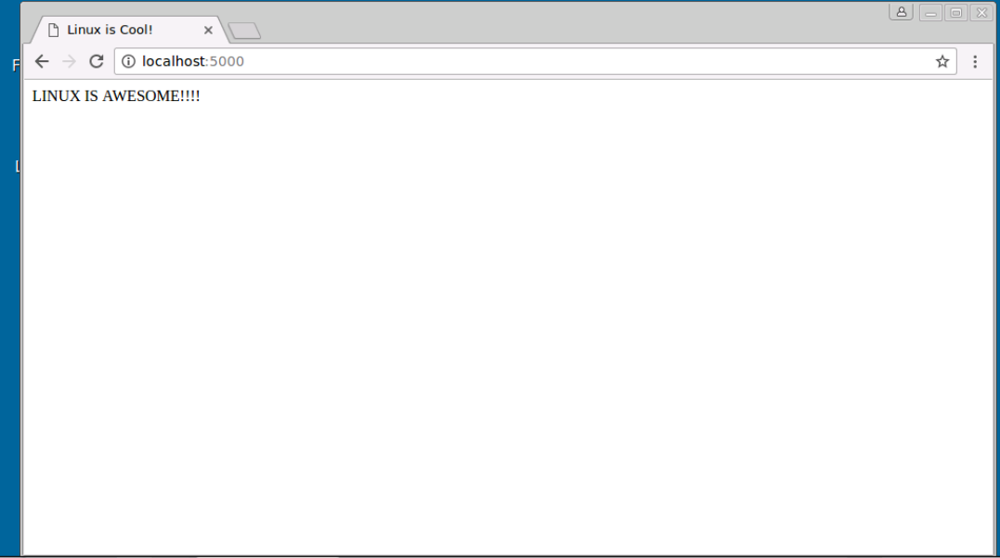

## Network Tools

In this lab we will start a basic webserver using python's [SimpleHTTPServer](https://docs.python.org/2/library/simplehttpserver.html) and analyze web requests using tcpdump

### Task 1 - Setup


##### Step 1 - Start Web Server

Start the webserver on the `centos` host that we will use for this testing.

```bash
[ntc@ntc ~]$ cd web
[ntc@ntc web]$ python server.py &
[1] 5738
[ntc@ntc web]$ Server at Port 5000
```

##### Step 4 - Verify Server

Open a browser on your **jumphost** and go to `http://centos:5000`



Now that our server is running, lets examine the traffic

### Task 2 - Network Traffic

#### Step 1 - `tcpdump`

To use `tcpdump` open a new session to your `centos` host and enter the following command:

```bash
[ntc@ntc ~]$ sudo tcpdump -i any port 5000
tcpdump: verbose output suppressed, use -v or -vv for full protocol decode
listening on any, link-type LINUX_SLL (Linux cooked), capture size 262144 bytes
```

Flags:
* `-i any` - listen on any interface
* `port 5000` - listen on port 5000

Refresh your browser to re-load the web page. Once complete, you should see the a similar output in your `tcpdump` terminal:

```bash
04:07:09.472875 IP gateway.49926 > ntc.webcache: Flags [S], seq 1082504705, win 65535, options [mss 1460], length 0
04:07:09.472922 IP ntc.webcache > gateway.49926: Flags [S.], seq 3544855645, ack 1082504706, win 29200, options [mss 1460], length 0
04:07:09.473021 IP gateway.49926 > ntc.webcache: Flags [.], ack 1, win 65535, length 0
04:07:09.473071 IP gateway.49926 > ntc.webcache: Flags [P.], seq 1:373, ack 1, win 65535, length 372: HTTP: GET / HTTP/1.1
04:07:09.473078 IP ntc.webcache > gateway.49926: Flags [.], ack 373, win 30016, length 0
04:07:09.474613 IP ntc.webcache > gateway.49926: Flags [P.], seq 1:18, ack 373, win 30016, length 17: HTTP: HTTP/1.0 200 OK
04:07:09.474790 IP gateway.49926 > ntc.webcache: Flags [.], ack 18, win 65535, length 0
04:07:09.474853 IP ntc.webcache > gateway.49926: Flags [P.], seq 18:55, ack 373, win 30016, length 37: HTTP
04:07:09.474936 IP gateway.49926 > ntc.webcache: Flags [.], ack 55, win 65535, length 0
04:07:09.475003 IP ntc.webcache > gateway.49926: Flags [P.], seq 55:92, ack 373, win 30016, length 37: HTTP
04:07:09.475087 IP gateway.49926 > ntc.webcache: Flags [.], ack 92, win 65535, length 0
04:07:09.475157 IP ntc.webcache > gateway.49926: Flags [P.], seq 92:117, ack 373, win 30016, length 25: HTTP
04:07:09.475241 IP gateway.49926 > ntc.webcache: Flags [.], ack 117, win 65535, length 0
04:07:09.475299 IP ntc.webcache > gateway.49926: Flags [P.], seq 117:137, ack 373, win 30016, length 20: HTTP
04:07:09.475378 IP gateway.49926 > ntc.webcache: Flags [.], ack 137, win 65535, length 0
```

> You can stop `tcpdump` by pressing `<CTRL>+c`

The output may differ, but this confirms that `tcpdump` is capturing on port 5000

We can use this output to view the HTTP sequence.  We could use this to diagnose any problems with our server

##### Step 2 - `tcpdump` options

Let's add some options to `tcpdump`

In the output above, we saw both sides of the HTTP conversation.  We can adjust the `tcpdump` output to show only `inbound` traffic:

```bash
[ntc@ntc ~]$ sudo tcpdump -i any src port 5000
tcpdump: verbose output suppressed, use -v or -vv for full protocol decode
listening on any, link-type LINUX_SLL (Linux cooked), capture size 262144 bytes
```

Refreshing our browser page should show this output:

```bash
04:16:01.352737 IP ntc.webcache > gateway.50326: Flags [S.], seq 440526229, ack 1145032706, win 29200, options [mss 1460], length 0
04:16:01.352830 IP ntc.webcache > gateway.50326: Flags [.], ack 399, win 30016, length 0
04:16:01.353818 IP ntc.webcache > gateway.50326: Flags [P.], seq 1:18, ack 399, win 30016, length 17: HTTP: HTTP/1.0 200 OK
04:16:01.354021 IP ntc.webcache > gateway.50326: Flags [P.], seq 18:117, ack 399, win 30016, length 99: HTTP
04:16:01.354131 IP ntc.webcache > gateway.50326: Flags [P.], seq 117:137, ack 399, win 30016, length 20: HTTP
04:16:01.354252 IP ntc.webcache > gateway.50326: Flags [P.], seq 137:183, ack 399, win 30016, length 46: HTTP
04:16:01.354353 IP ntc.webcache > gateway.50326: Flags [P.], seq 183:185, ack 399, win 30016, length 2: HTTP
04:16:01.354475 IP ntc.webcache > gateway.50326: Flags [P.], seq 185:282, ack 399, win 30016, length 97: HTTP
04:16:01.354621 IP ntc.webcache > gateway.50326: Flags [F.], seq 282, ack 399, win 30016, length 0
04:16:01.354682 IP ntc.webcache > gateway.50326: Flags [.], ack 400, win 30016, length 0
```

Notice that we are only seeing the incoming information to the webserver.

Let's change the `src` to `dest` & refresh browser:

```bash
sudo tcpdump -i any dst port 8080
tcpdump: verbose output suppressed, use -v or -vv for full protocol decode
listening on any, link-type LINUX_SLL (Linux cooked), capture size 262144 bytes
04:26:58.708730 IP gateway.50680 > ntc.webcache: Flags [S], seq 1221896705, win 65535, options [mss 1460], length 0
04:26:58.708858 IP gateway.50680 > ntc.webcache: Flags [.], ack 724467781, win 65535, length 0
04:26:58.708870 IP gateway.50680 > ntc.webcache: Flags [P.], seq 0:398, ack 1, win 65535, length 398: HTTP: GET / HTTP/1.1
04:26:58.710819 IP gateway.50680 > ntc.webcache: Flags [.], ack 18, win 65535, length 0
04:26:58.710925 IP gateway.50680 > ntc.webcache: Flags [.], ack 137, win 65535, length 0
04:26:58.711145 IP gateway.50680 > ntc.webcache: Flags [.], ack 185, win 65535, length 0
04:26:58.711280 IP gateway.50680 > ntc.webcache: Flags [.], ack 282, win 65535, length 0
04:26:58.711414 IP gateway.50680 > ntc.webcache: Flags [F.], seq 398, ack 282, win 65535, length 0
04:26:58.711438 IP gateway.50680 > ntc.webcache: Flags [F.], seq 398, ack 283, win 65535, length 0
```

`tcpdump` has *MANY* filtering options.  They can also be combined by appending `&&`.  `tcpdump` really shines when combined with a packet analyzer like [tshark](https://www.wireshark.org/docs/man-pages/tshark.html) or the GUI version - [Wireshark](https://www.wireshark.org/)

In order to use a packet analyzer, we must write the packets to a file.

> CHALLENGE 1: Using the filter(s) above, create a `tcpdump` command to write web traffic to two files: `inbound.pcap` and `outbound.pcap`

> CHALLENGE 2: Using `tcpdump` filters, create commands to capture on the host's IP AND destination port 5000