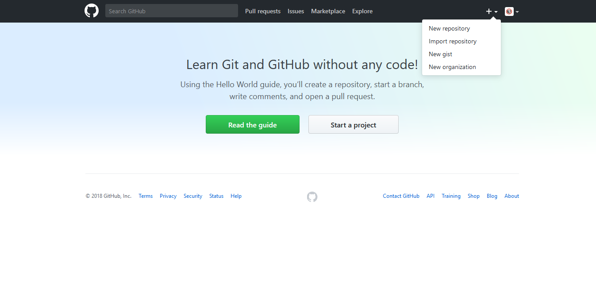
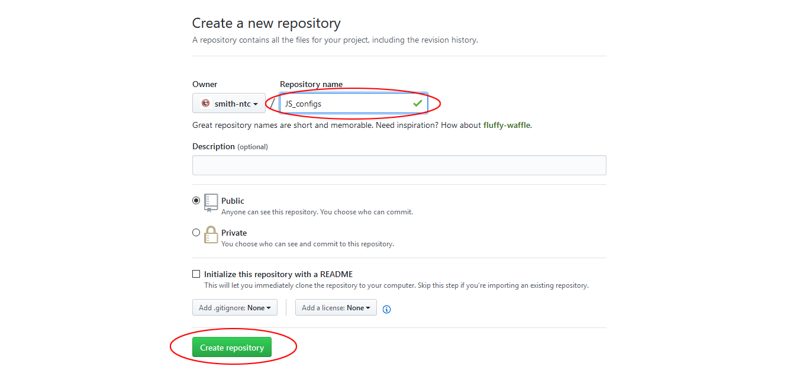

## Lab 3 - Start with GitHub

This lab will help you create a new repository on GitHub to be used as origin for your local repository.


### Task 1 - Create a GitHub repository


##### Step 1

Go to [https://github.com/](https://github.com/) and ensure you are logged into the service.

Start creating a new repository by clicking the `+` icon at the top right, then clicking the `New repository` option.




##### Step 2

Your new repository should be called `<student_first_initial><student_last_initial>_configs`.

After assigning the proper name to the repository, click the `Create repository` button.




### Task 2 - Configure the origin for local repository


##### Step 1

From the commad line on your **jumphost**, set the origin of your `~/config/` local repository based on the URL of the GitHub repository you have just created in the previous task.

> The address of your repo should be shown on your github page once you create the new, empty, repository.

```bash
ntc@ntc:configs (master)$ git remote add origin <GIT CLONE HTTPS LINK TO YOUR REPOSITORY>
ntc@ntc:configs (master)$
```


##### Step 2

Verify the configuration is properly set.

```bash
ntc@ntc:configs (master)$ git remote -v
origin  <GIT CLONE HTTPS LINK TO YOUR REPOSITORY> (fetch)
origin  <GIT CLONE HTTPS LINK TO YOUR REPOSITORY> (push)
```


##### Step 3

Push your local commits to origin.

```bash
ntc@ntc:configs (master)$ git push origin master
Username for 'https://github.com': <YOUR PUBLIC GITHUB USERNAME>
Password for 'https://<YOUR PUBLIC GITHUB USERNAME>@github.com':
Counting objects: 22, done.
Delta compression using up to 2 threads.
Compressing objects: 100% (22/22), done.
Writing objects: 100% (22/22), 4.45 KiB | 0 bytes/s, done.
Total 22 (delta 13), reused 0 (delta 0)
remote: Resolving deltas: 100% (13/13), done.
To <GIT CLONE HTTPS LINK TO YOUR REPOSITORY>
 * [new branch]      master -> master
```

Verify that your remote repository on GitHub contains all your local changes.  You can refresh the repository website to see the changes.