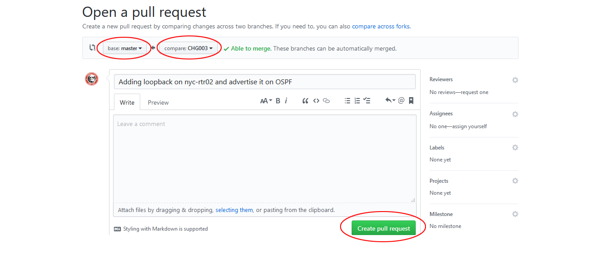

## Lab 8 - Pull Requests

### Task 1 - Create a PR

##### Step 1

In the `~/backup_configs/` directory on your **jumphost**, create a new branch called `CHG003`.

```bash
ntc@ntc:backup_configs (master)$ git checkout -b CHG003
Switched to a new branch 'CHG003'
ntc@ntc:backup_configs (CHG003)$
```


##### Step 2

Open `nyc-rtr02.cfg` and create and advertise Loopback 101 in OSPF.

```
<---omitted--->
!
interface Loopback101
 ip address 20.1.1.1 255.255.255.255
!
!
router ospf 100
 network 20.1.1.0 0.0.0.255 area 0
!
<---omitted--->
```


##### Step 3

Add and commit your latest changes.

```bash
ntc@ntc:backup_configs (CHG003)$ git commit -m "Adding loopback on nyc-rtr02 and advertise it on OSPF"
[CHG003 78db065] Adding loopback on nyc-rtr02 and advertise it on OSPF
 1 file changed, 6 insertions(+)
ntc@ntc:backup_configs (CHG003)$
```


##### Step 4

Push your branch upstream to GitHub.

```bash
ntc@ntc:backup_configs (CHG003)$ git push origin CHG003
Username for 'https://github.com': smith-ntc
Password for 'https://smith-ntc@github.com':
Counting objects: 3, done.
Delta compression using up to 2 threads.
Compressing objects: 100% (3/3), done.
Writing objects: 100% (3/3), 440 bytes | 0 bytes/s, done.
Total 3 (delta 2), reused 0 (delta 0)
remote: Resolving deltas: 100% (2/2), completed with 2 local objects.
To https://github.com/smith-ntc/JS_configs
 * [new branch]      CHG003 -> CHG003
ntc@ntc:backup_configs (CHG003)$
```


##### Step 5

Open the browser and go into your repository on GitHub.


GitHub will highlight the presence of a new branch and will ask to compare the new branch with another one. 

Click `Compare & pull request`.


##### Step 6

You can now choose which branches to compare. Select `master` as your base branch and `CHG03` as your compare branch.

Click `Create pull request`.



Contratulations! You have created your first PR!