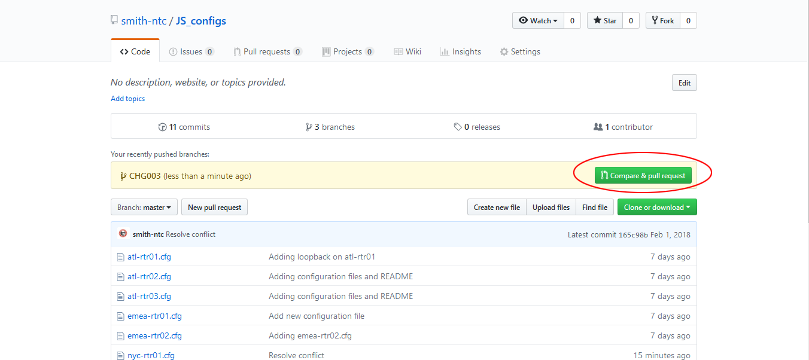
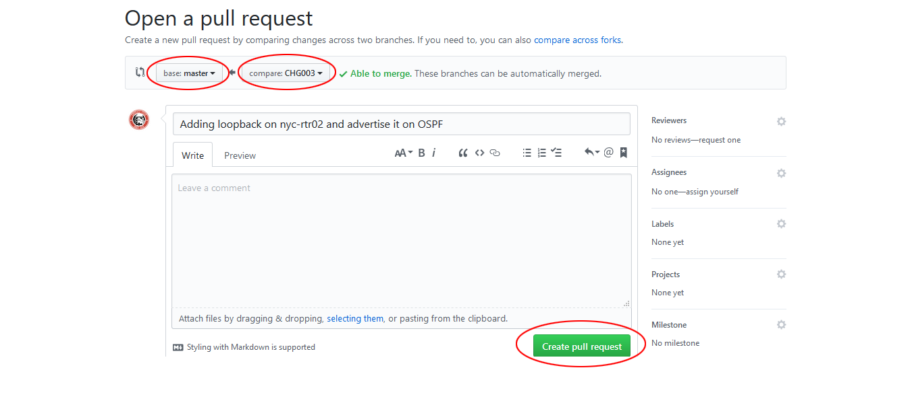
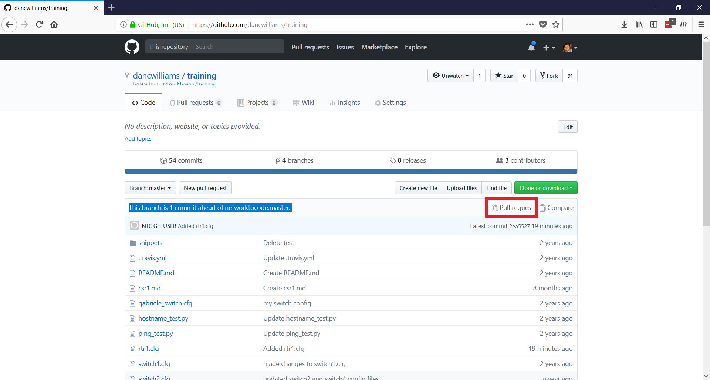
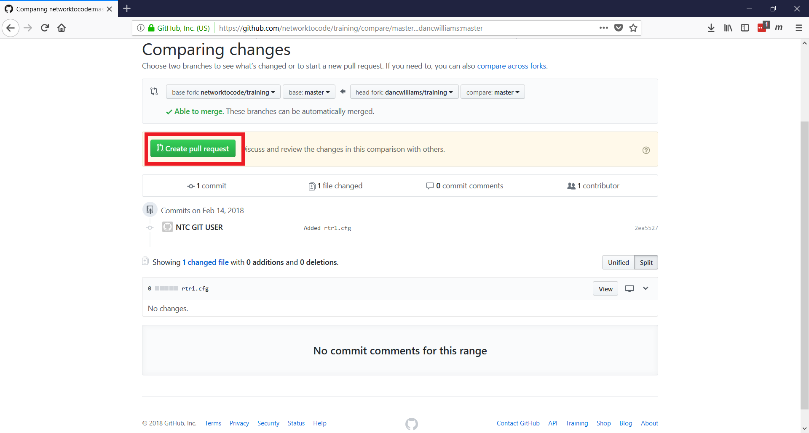
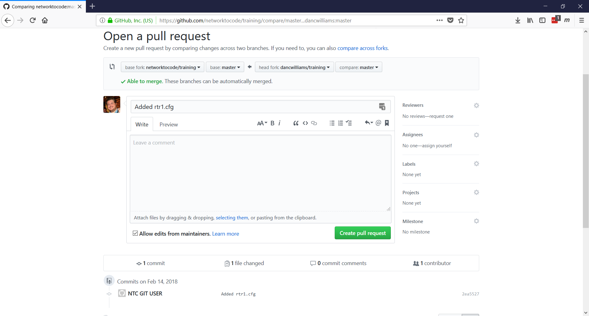
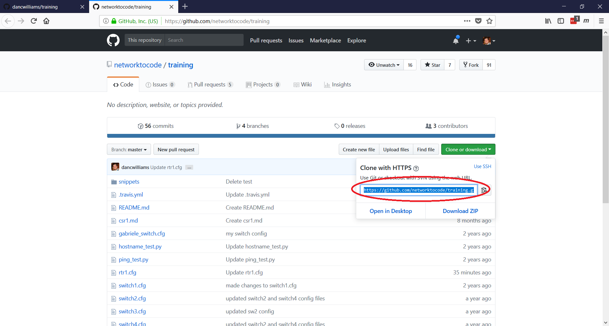
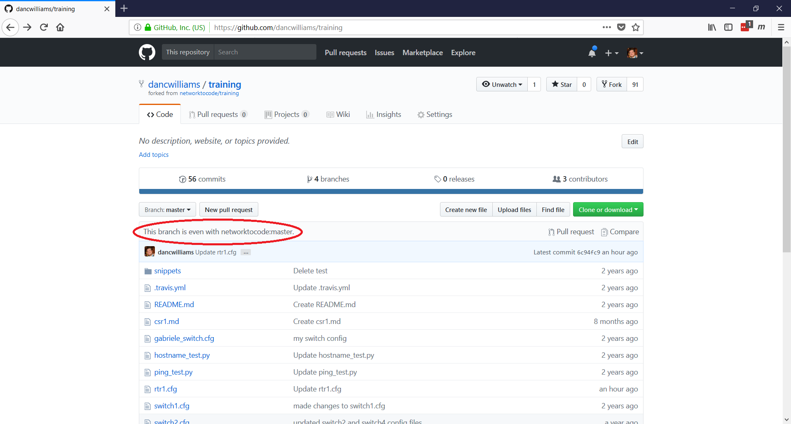

## Lab - Working with repos

### Task 1 - Create a PR

##### Step 1

In the `~/backup_configs/` directory on your **jumphost**, create a new branch called `CHG003`.

```bash
ntc@ntc:backup_configs (master)$ git checkout -b CHG003
Switched to a new branch 'CHG003'
ntc@ntc:backup_configs (CHG003)$
```


##### Step 2

Open `nyc-rtr02.cfg` and create and advertise Loopback 101 in OSPF.

```
<---omitted--->
!
interface Loopback101
 ip address 20.1.1.1 255.255.255.255
!
!
router ospf 100
 network 20.1.1.0 0.0.0.255 area 0
!
<---omitted--->
```


##### Step 3

Add and commit your latest changes.

```bash
ntc@ntc:backup_configs (CHG003)$ git commit -m "Adding loopback on nyc-rtr02 and advertise it on OSPF"
[CHG003 78db065] Adding loopback on nyc-rtr02 and advertise it on OSPF
 1 file changed, 6 insertions(+)
ntc@ntc:backup_configs (CHG003)$
```


##### Step 4

Push your branch upstream to GitHub.

```bash
ntc@ntc:backup_configs (CHG003)$ git push origin CHG003
Username for 'https://github.com': <YOUR PUBLIC GITHUB USERNAME>
Password for 'https://<YOUR PUBLIC GITHUB USERNAME>@github.com':
Counting objects: 3, done.
Delta compression using up to 2 threads.
Compressing objects: 100% (3/3), done.
Writing objects: 100% (3/3), 440 bytes | 0 bytes/s, done.
Total 3 (delta 2), reused 0 (delta 0)
remote: Resolving deltas: 100% (2/2), completed with 2 local objects.
To <GIT CLONE HTTPS LINK TO YOUR REPOSITORY>
 * [new branch]      CHG003 -> CHG003
ntc@ntc:backup_configs (CHG003)$
```


##### Step 5

Open the browser and go into your repository on GitHub.



GitHub will highlight the presence of a new branch and will ask to compare the new branch with another one. 

Click `Compare & pull request`.


##### Step 6

You can now choose which branches to compare. Select `master` as your base branch and `CHG03` as your compare branch.

Click `Create pull request`.



Contratulations! You have created your first PR!


### Task 2 - Clone Class Repo

##### Step 1

Navigate to the class repo:

[`https://github.com/networktocode/training`](https://github.com/networktocode/training)


##### Step 2

Fork this repo using to public GitHub account.  Use the `fork` button to fork the repo (see red rectangle).


##### Step 3

Once the repo has finished forking you will need to fork it to your **jumphost**.

To clone the repo you will need to use the `https` link provided on GitHub.

> See read box.  Click the `Use HTTPS` link to populate the `https` clone link.


Once you have the link you will use `git clone` from your home directory on the **jumphost** host.

> I am using my `https` clone link.  You will need to use the one you collected above.

```bash
ntc@ntc:~$ git clone https://github.com/<YOUR PUBLIC GITHUB USERNAME>/training.git
Cloning into 'training'...
remote: Counting objects: 150, done.
remote: Total 150 (delta 0), reused 0 (delta 0), pack-reused 150
Receiving objects: 100% (150/150), 28.20 KiB | 0 bytes/s, done.
Resolving deltas: 100% (56/56), done.
Checking connectivity... done.
```


##### Step 4

Once the repo has been cloned, investigate the contents of the directory.

```bash
ntc@ntc:~$ ls -ltr training/
total 48
-rw-rw-r-- 1 ntc ntc   94 Feb 14 19:12 README.md
-rw-rw-r-- 1 ntc ntc  539 Feb 14 19:12 csr1.md
-rw-rw-r-- 1 ntc ntc   72 Feb 14 19:12 switch6.cfg
-rw-rw-r-- 1 ntc ntc   17 Feb 14 19:12 switch5.cfg
-rw-rw-r-- 1 ntc ntc   98 Feb 14 19:12 switch4.cfg
-rw-rw-r-- 1 ntc ntc  403 Feb 14 19:12 switch3.cfg
-rw-rw-r-- 1 ntc ntc  269 Feb 14 19:12 switch2.cfg
-rw-rw-r-- 1 ntc ntc  323 Feb 14 19:12 switch1.cfg
drwxrwxr-x 2 ntc ntc 4096 Feb 14 19:12 snippets
-rw-rw-r-- 1 ntc ntc 1829 Feb 14 19:12 ping_test.py
-rw-rw-r-- 1 ntc ntc  715 Feb 14 19:12 hostname_test.py
-rw-rw-r-- 1 ntc ntc  147 Feb 14 19:12 gabriele_switch.cfg
```


##### Step 5

Make changes to the repo.  This can be adding a file or updating an existing file.

After making your changes commit the changes and push them to your GitHub repo.

> The output below is an example.  Feel free to be creative.

```bash
ntc@ntc:~$ cd training/
ntc@ntc:training (master)$ touch rtr1.cfg
ntc@ntc:training (master)$ 
ntc@ntc:training (master)$ git status
On branch master
Your branch is up-to-date with 'origin/master'.
Untracked files:
  (use "git add <file>..." to include in what will be committed)

        rtr1.cfg

nothing added to commit but untracked files present (use "git add" to track)
ntc@ntc:training (master)$ git add rtr1.cfg 
ntc@ntc:training (master)$ 
ntc@ntc:training (master)$ git commit -m "Added rtr1.cfg"
[master 2ea5527] Added rtr1.cfg
 1 file changed, 0 insertions(+), 0 deletions(-)
 create mode 100644 rtr1.cfg
ntc@ntc:training (master)$ 
ntc@ntc:training (master)$ git push
Username for 'https://github.com': <YOUR PUBLIC GITHUB USERNAME>
Password for 'https://<YOUR PUBLIC GITHUB USERNAME>@github.com': 
Counting objects: 3, done.
Delta compression using up to 8 threads.
Compressing objects: 100% (2/2), done.
Writing objects: 100% (3/3), 278 bytes | 0 bytes/s, done.
Total 3 (delta 1), reused 0 (delta 0)
remote: Resolving deltas: 100% (1/1), completed with 1 local object.
To https://github.com/<YOUR PUBLIC GITHUB USERNAME>/training.git
   d21c412..2ea5527  master -> master
```


##### Step 6

Now that your repo has been updated, create a pull request again the class repo.

On the repo GitHub site you will see that your repo is some number of commits ahead of the `networktocode:master` repo.


##### Step 7

Create a pull request to `networktocode:master` by clicking the `Pull Request` link.





After clicking `Create Pull Request` above you will be presented with a screen to give a summary and details around your pull request.  



After filling out your details click the final `Create Pull Request` button.  You will be taken to a screen that will show you the status of your newly created pull request!


### Task 3 - Maintaining a Fork

As you work on a fork of a project you may need to update your fork to accept changes made by others to the main project.

You can see how far behind the master your fork is by looking at GitHub (see red block).


we will review the [best practice method](https://help.github.com/articles/syncing-a-fork/#platform-linux) for keeping your fork up-to-date.

Add the original repo as a remote named `upstream`.

##### Step 1

Go to the original `training` repo and find the `https` clone address.

> The original repo is located at https://github.com/networktocode/training




##### Step 2

On your **jumphost** you will use this address to create a git remote named `upstream` within you `~/training/` folder.

> The remote name `upstream` can be anything, but `upstream` is used as best practice for this activity.

```bash
ntc@ntc:training (master)$ git remote -v
origin  https://github.com/<YOUR PUBLIC GITHUB USERNAME>/training.git (fetch)
origin  https://github.com/<YOUR PUBLIC GITHUB USERNAME>/training.git (push)
ntc@ntc:training (master)$ git remote add upstream https://github.com/networktocode/training.git
ntc@ntc:training (master)$ git remote -v
origin  https://github.com/<YOUR PUBLIC GITHUB USERNAME>/training.git (fetch)
origin  https://github.com/<YOUR PUBLIC GITHUB USERNAME>/training.git (push)
upstream        https://github.com/networktocode/training.git (fetch)
upstream        https://github.com/networktocode/training.git (push)
```

> The `git remote -v` is used to show a list of the remotes that are configured.


### Task 2

Perform actions to sync your lcoal fork with `upstream`.

##### Step 1

Now that `upstream` is configured we will perform a `fetch` from the `upstream`.  Fetch the branches and their respective commits from the upstream repository. Commits to `master` will be stored in a local branch, `upstream/master`.

```bash
ntc@ntc:training (master)$ git fetch upstream
remote: Counting objects: 4, done.
remote: Compressing objects: 100% (3/3), done.
remote: Total 4 (delta 0), reused 0 (delta 0), pack-reused 0
Unpacking objects: 100% (4/4), done.
From https://github.com/networktocode/training
 * [new branch]      add_vlan_20_30 -> upstream/add_vlan_20_30
 * [new branch]      master     -> upstream/master
 * [new branch]      new_config -> upstream/new_config
 * [new branch]      new_ping_test -> upstream/new_ping_test
 ```

##### Step 2

Make sure your local `master` branch is checked out.

```bash
 ntc@ntc:training (master)$ git checkout master
Already on 'master'
Your branch is up-to-date with 'origin/master'.
```

##### Step 3

Now merge the changes from `upstream/master` into your local `master` branch. This brings your fork's `master` branch into sync with the upstream repository, without losing your local changes.

```bash
ntc@ntc:training (master)$ git merge upstream/master
Updating 2ea5527..6c94fc9
Fast-forward
 rtr1.cfg | 1 +
 1 file changed, 1 insertion(+)
 ```

##### Step 4

 Now push your local repo to GitHub.

```bash
ntc@ntc:training (master)$ git push
Username for 'https://github.com': <YOUR PUBLIC GITHUB USERNAME>
Password for 'https://<YOUR PUBLIC GITHUB USERNAME>@github.com': 
Counting objects: 4, done.
Delta compression using up to 8 threads.
Compressing objects: 100% (3/3), done.
Writing objects: 100% (4/4), 1.29 KiB | 0 bytes/s, done.
Total 4 (delta 1), reused 0 (delta 0)
remote: Resolving deltas: 100% (1/1), completed with 1 local object.
To https://github.com/<YOUR PUBLIC GITHUB USERNAME>/training.git
   2ea5527..6c94fc9  master -> master
```


##### Step 5

Now check your GitHub site to see that your fork is even with the original.

> Depending on the pace of change in the original, you may not be even.



