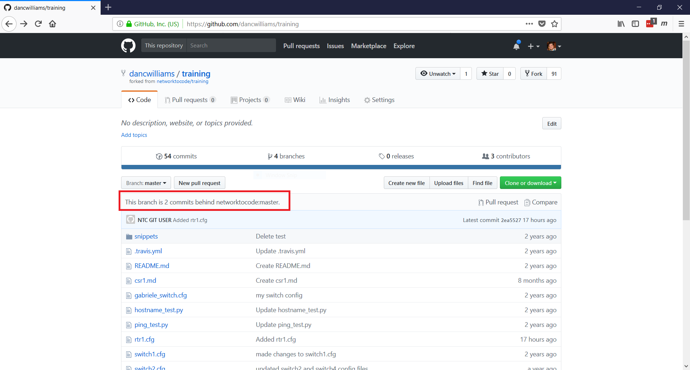
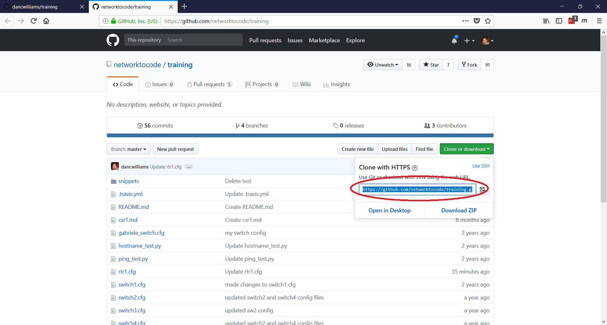

## Lab - Maintaining a Fork

As you work on a fork of a project you may need to update your fork to accept changes made by others to the main project.

You can see how far behind the master your fork is by looking at GitHub (see red block).



we will review the [best practice method](https://help.github.com/articles/syncing-a-fork/#platform-linux) for keeping your fork up-to-date.

### Task 1

Add the original repo as a remote named `upstream`.

##### Step 1

Go to the original `training` repo and find the `https` clone address.

> The original repo is located at https://github.com/networktocode/training




##### Step 2

On your **jumphost** you will use this address to create a git remote named `upstream` within you `~/training/` folder.

> The remote name `upstream` can be anything, but `upstream` is used as best practice for this activity.

```bash
ntc@ntc:training (master)$ git remote -v
origin  https://github.com/dancwilliams/training.git (fetch)
origin  https://github.com/dancwilliams/training.git (push)
ntc@ntc:training (master)$ git remote add upstream https://github.com/networktocode/training.git
ntc@ntc:training (master)$ git remote -v
origin  https://github.com/dancwilliams/training.git (fetch)
origin  https://github.com/dancwilliams/training.git (push)
upstream        https://github.com/networktocode/training.git (fetch)
upstream        https://github.com/networktocode/training.git (push)
```

> The `git remote -v` is used to show a list of the remotes that are configured.


### Task 2

Perform actions to sync your lcoal fork with `upstream`.

##### Step 1

Now that `upstream` is configured we will perform a `fetch` from the `upstream`.  Fetch the branches and their respective commits from the upstream repository. Commits to `master` will be stored in a local branch, `upstream/master`.

```bash
ntc@ntc:training (master)$ git fetch upstream
remote: Counting objects: 4, done.
remote: Compressing objects: 100% (3/3), done.
remote: Total 4 (delta 0), reused 0 (delta 0), pack-reused 0
Unpacking objects: 100% (4/4), done.
From https://github.com/networktocode/training
 * [new branch]      add_vlan_20_30 -> upstream/add_vlan_20_30
 * [new branch]      master     -> upstream/master
 * [new branch]      new_config -> upstream/new_config
 * [new branch]      new_ping_test -> upstream/new_ping_test
 ```

 ##### Step 2

 Make sure your local `master` branch is checked out.

 ```bash
 ntc@ntc:training (master)$ git checkout master
Already on 'master'
Your branch is up-to-date with 'origin/master'.
```

##### Step 3

Now merge the changes from `upstream/master` into your local `master` branch. This brings your fork's `master` branch into sync with the upstream repository, without losing your local changes.

```bash
ntc@ntc:training (master)$ git merge upstream/master
Updating 2ea5527..6c94fc9
Fast-forward
 rtr1.cfg | 1 +
 1 file changed, 1 insertion(+)
 ```

 ##### Step 4

 Now push your local repo to GitHub.

```bash
ntc@ntc:training (master)$ git push
Username for 'https://github.com': dancwilliams
Password for 'https://dancwilliams@github.com': 
Counting objects: 4, done.
Delta compression using up to 8 threads.
Compressing objects: 100% (3/3), done.
Writing objects: 100% (4/4), 1.29 KiB | 0 bytes/s, done.
Total 4 (delta 1), reused 0 (delta 0)
remote: Resolving deltas: 100% (1/1), completed with 1 local object.
To https://github.com/dancwilliams/training.git
   2ea5527..6c94fc9  master -> master
```


##### Step 5

Now check your GitHub site to see that your fork is even with the original.

> Depending on the pace of change in the original, you may not be even.


