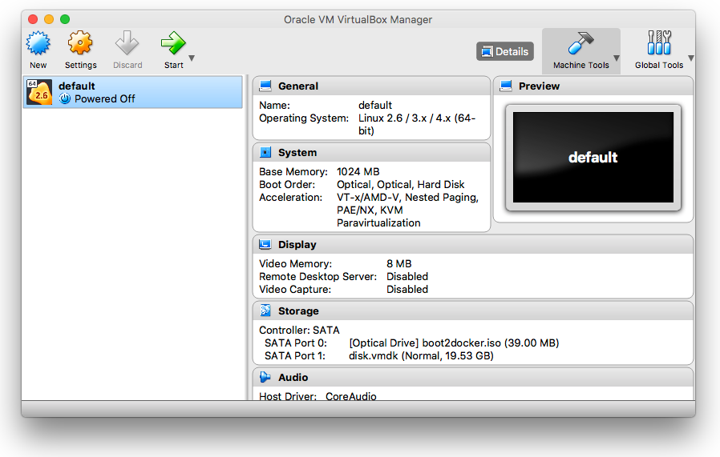
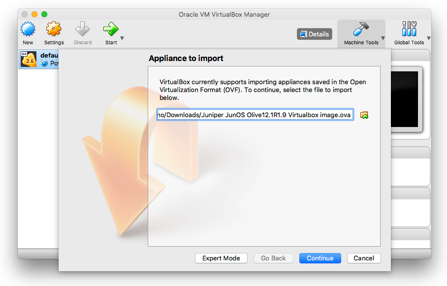
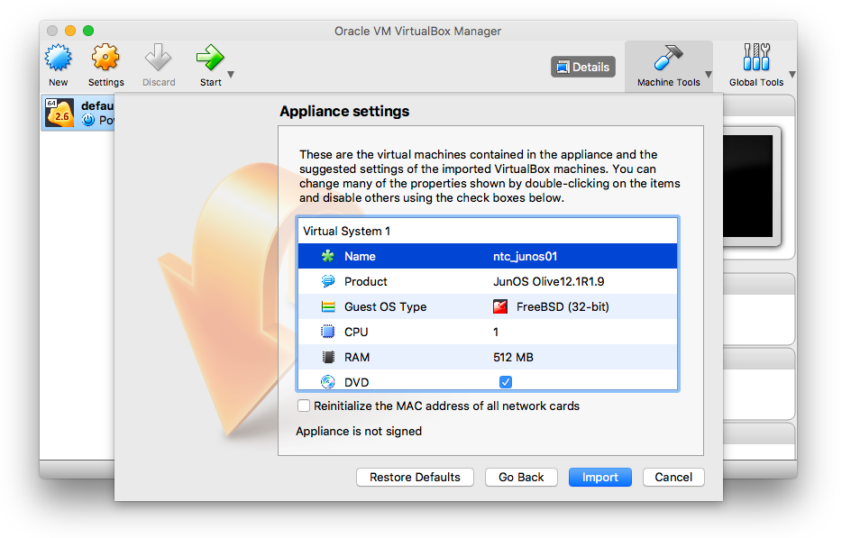
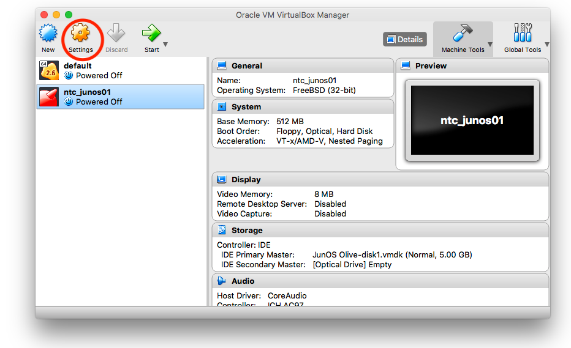
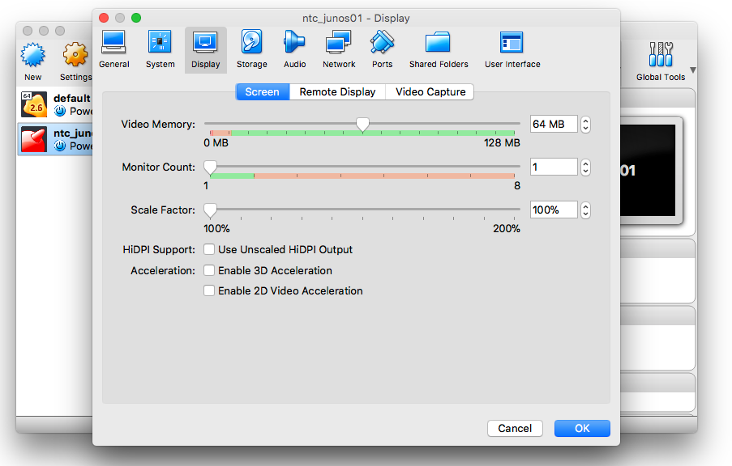
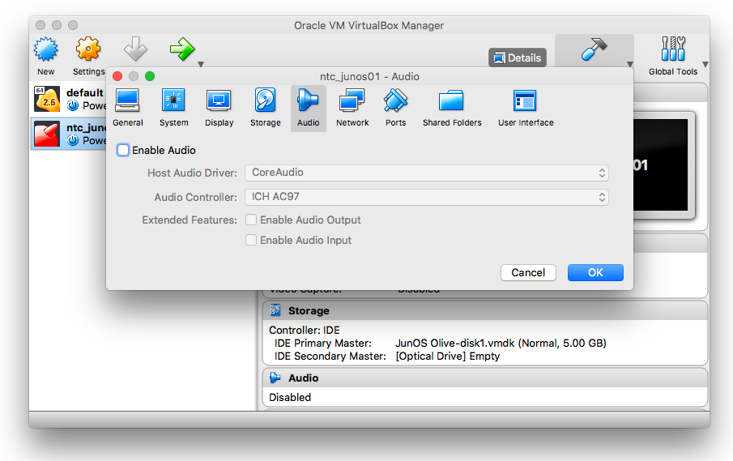
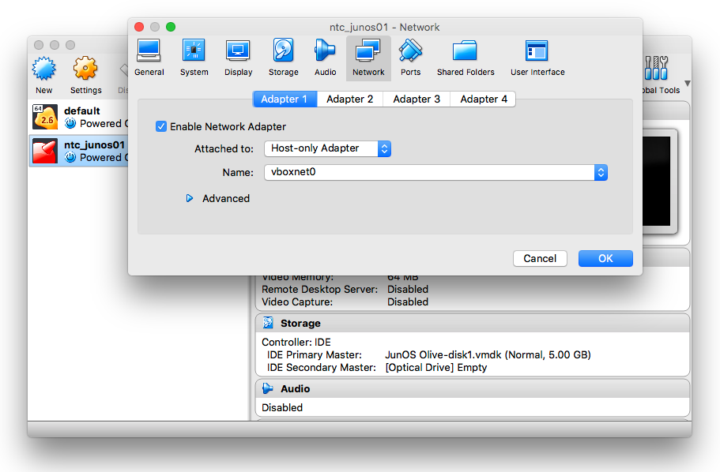
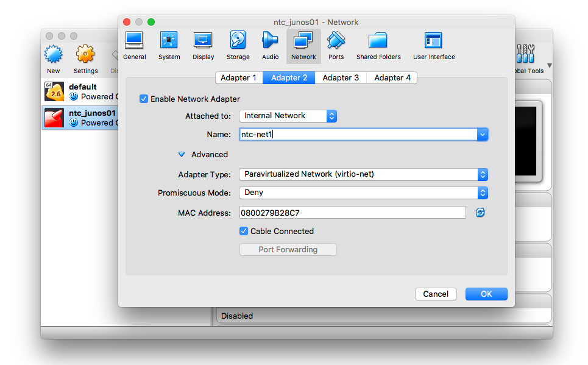
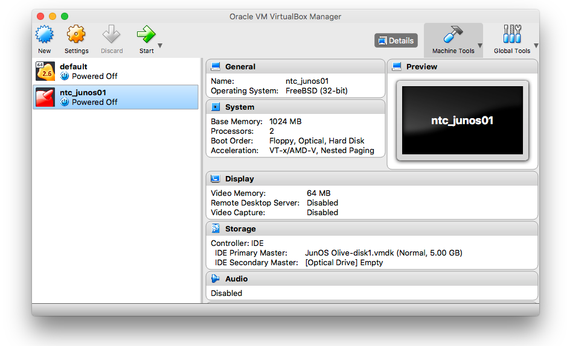

## Lab - Junos in  VirtualBox

### Task 1 - Junos

##### Step 1

Download the `JunOS Olive` image for virtualbox from [link](https://drive.google.com/drive/folders/1OQvC7qCFygTRXuR76xqt2fBovcgbOy_7?usp=sharing)

##### Step 2

Launch VirtualBox.



You will see a default image already created, but we are going to create new ones.

##### Step 3

Import the `JunOS Olive` image you downloaded by clicking `File` -> `Import appliance`. Search for the specified image and then click `Continue`.



##### Step 4

Change the default name to `ntc_junos01` and click `Import`.



##### Step 5

Now that you have created a new VM, we can configure it. Click the `Settings` button.



##### Step 6

Go to the `Display` pane and increase the video memory to 64 MB



##### Step 7

Go to the `Audio` pane and make sure the you disable audio.



##### Step 8

Move to the `Network` pane. Change the first adapter to `Host-Only Adapter`, this will be used to give SSH access to our VM.

Note: Mac users should see the `vboxnet0` interface, while windows users should see `VirtualBox Host-Only Ethernet Adapter`.



##### Step 9

Add 3 more `Internal Network` adapters. Name the networks ntc-net1, ntc-net2, & ntc-net3


##### Step 10

Start the VM by clicking `Start`



##### Step 11

When the boot is completed you will see the following prompt:

```
login:
```

Type `root` and press enter.

```
login: root

--- JUNOS 12.1R1.9 built 2012-03-24 12:52:33 UTC
root@root%
```

##### Step 12

Type `cli` to access the junos CLI.

```
root@root% cli
root@root>
```

##### Step 13

Enter the configuration mode by typing `configure`.

```
root@root> configure
Entering configuration mode

[edit]
root@root#
```

##### Step 14

Enter a basic configuration setting the hostname, the password (`ntc123`), the management address and ssh access.

```
set system host-name ntc_junos01
set system root-authentication plain-text-password
set system services ssh
set interfaces em0 unit 0 family inet address 192.168.56.2/24
commit and-quit
```

Note: `em0` IP address should be on the same network of the `vboxnet0` or `VirtualBox Host-Only Ethernet Adapter` interface from your local machine. Use `ifconfig` or `ipconfig` to figure it out.

```
[edit]
root@root# set system host-name ntc_junos01

[edit]
root@root# set system root-authentication plain-text-password
New password: ntc123
Retype new password: ntc123

[edit]
root@root# set system services ssh

[edit]
root@root# set interfaces em0 unit 0 family inet address 192.168.56.2/24

[edit]
root@root# commit and-quit
commit complete
Exiting configuration mode

root@ntc_junos01>

```

##### Step 15

Connect to the VM using SSH from your local machine.

```
$ ssh root@192.168.56.2

--- JUNOS 12.1R1.9 built 2012-03-24 12:52:33 UTC
root@ntc_junos01%
```
