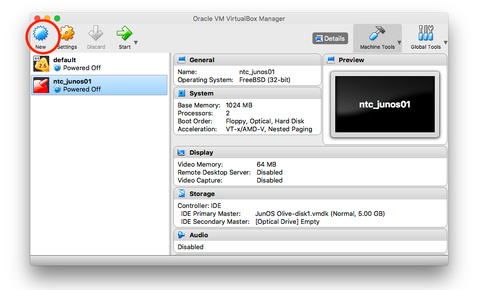
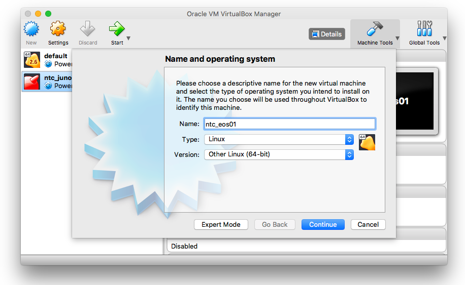
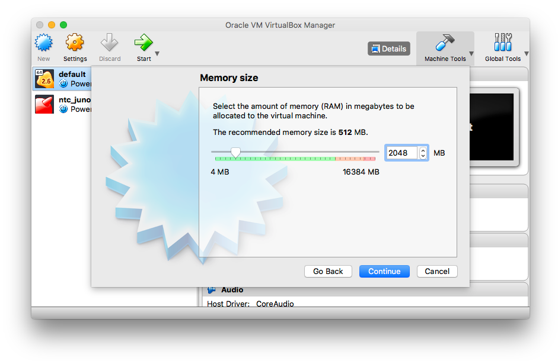
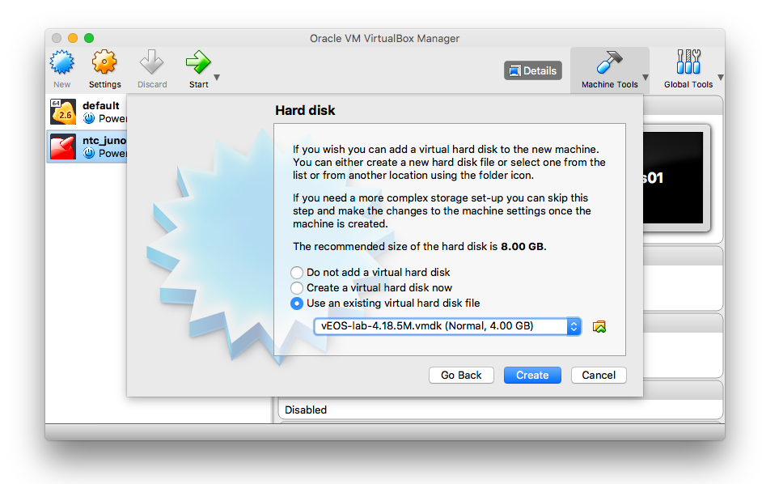
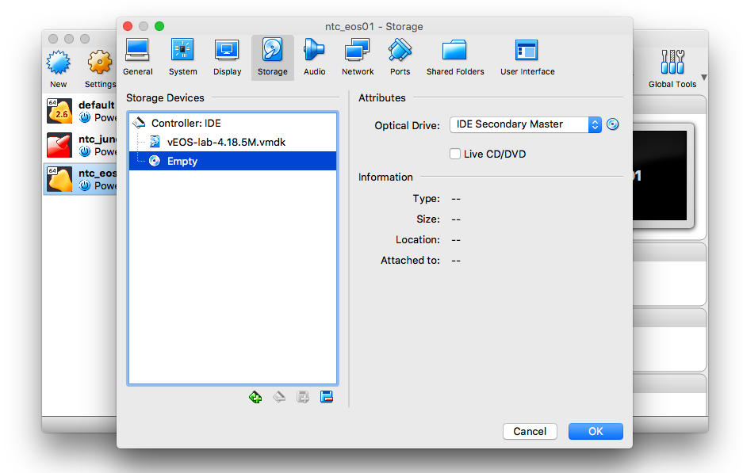
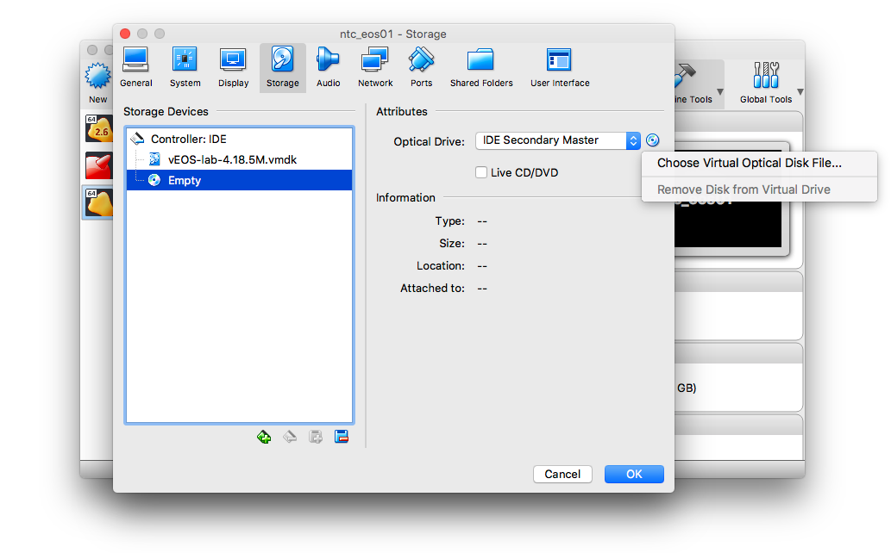
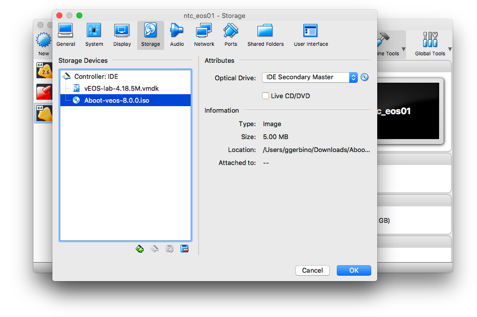
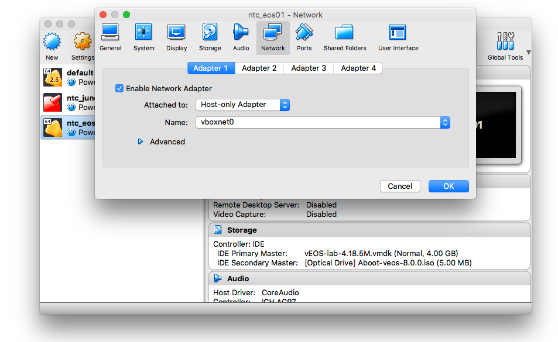

## Lab 3 - Arista

### Task 1 - Arista

##### Step 1

Download the `vEOS` and its `Aboot` images for virtualbox from [link](link).

##### Step 2

From VirtualBox, create a new VM by clicking `New`.



##### Step 3

Name the new VM as `ntc_eos01`, select `Linux` as type and `Other Linux (64-bit)` as version. Press `Continue`



##### Step 4

Increase the memory to 2 GB and press `Continue`.



##### Step 5

Select `Use an existing virtual hard disk file` and select the EOS disk you have just downloaded.



Press `Create`.

##### Step 6

Now that the new VM is created we can configure it. Click `Settings` and go to the `Storage` pane, make sure you have mounted the vEOS disk under `Controller: IDE` and click the `Empty` disk to highlight it.



##### Step 7

Now click the little disk sign to add a secondary storage device under.



Select the Aboot file you have downloaded earlier and click `Ok`.



##### Step 8

Move to the `Network` pane. Change the first adapter to `Host-Only Adapter`.

Note: Mac users should see the `vboxnet0` interface, while windows users should see `VirtualBox Host-Only Ethernet Adapter`.



##### Step 9

Add 3 more `Internal Network` adapters. Name the networks ntc-net1, ntc-net2, & ntc-net3


##### Step 10

Start the VM by clicking `Start`

##### Step 11

When the boot is completed you will see the following prompt:

```
localhost login:
```

Type `admin` and press enter.

```
localhost login: admin
localhost>
```

##### Step 12

Enter a basic configuration setting the hostname, the username and password and the management address.

Note: `Management 1` IP address should be on the same network of the `vboxnet0` or `VirtualBox Host-Only Ethernet Adapter` interface from your local machine. Use `ifconfig` or `ipconfig` to figure it out.

```
localhost>enable
localhost#conf t
localhost(config)#hostname ntc-eos01
ntc-eos01(config)#username ntc secret 0 ntc123
ntc-eos01(config)#ip routing
ntc-eos01(config)#int management 1
ntc-eos01(config-if-Ma1)#ip address 192.168.99.3/24
ntc-eos01(config-if-Ma1)#no shut
ntc-eos01(config)#copy run startup-config
Copy completed successfully.
ntc-eos01(config)#
```

##### Step 13

Connect to the VM using SSH from your local machine.

```
$ ssh ntc@192.168.99.3
Password:
ntc-eos01>
```
