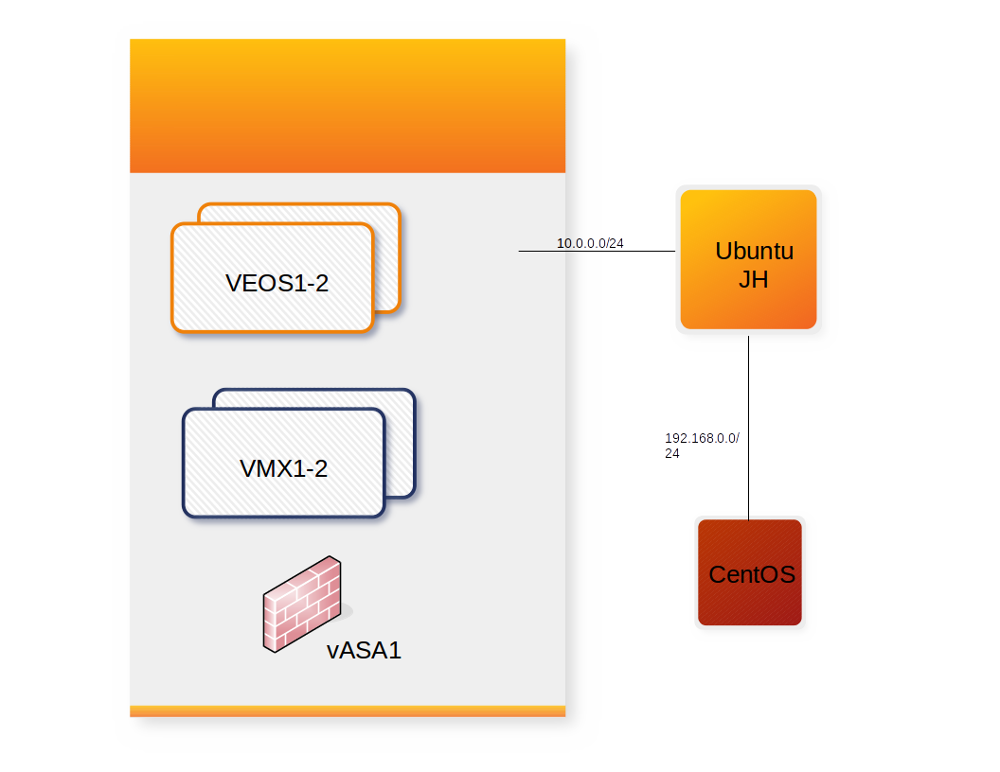

# Device Summary

| Hostname | Device | Management IP | Credentials | Access Method |
|----------|--------|---------------|-------------|---------------|
| ntc | Jump Host | 10.1.10.11 | ntc/ntc123 | RDP/SSH |
| centos | Linux VM | 192.68.0.52 | ntc/ntc123 | SSH |
| veos1 | Arista switch 1 | 10.0.0.10 | ntc/ntc123 | SSH/https/http |
| veos2 | Arista switch 2 | 10.0.0.11 | ntc/ntc123 | SSH/https/http |
| vmx1 | Juniper Router 1 | 10.0.0.12 | ntc/ntc123 | SSH |
| vmx2 | Juniper Router 2 | 10.0.0.13 | ntc/ntc123 | SSH |

### All hostnames are resolvable from the jump host.

### The Public IP address of the Jump Host will be provided to you.  This is how you will connect to everything else.

# Network Design 

